# Ablation Study: Understanding Model Components
> **Disclaimer:**
>
> This document contains my personal notes on the topic,
> compiled from publicly available documentation and various cited sources.
> The materials are intended for educational purposes, personal study, and reference.
> The content is dual-licensed:
> 1. **MIT License:** Applies to all code implementations (Swift, Mermaid, and other programming languages).
> 2. **Creative Commons Attribution 4.0 International License (CC BY 4.0):** Applies to all non-code content, including text, explanations, diagrams, and illustrations.
---

## 1. Introduction: What is an Ablation Study?

An Ablation Study is a common experimental technique used, particularly in machine learning and neuroscience, to understand the contribution of individual components or features within a complex system. The term "ablation" refers to the surgical removal of body tissue; analogously, in an ablation study, parts of a model or algorithm are systematically removed or disabled. By comparing the performance of the system *with* and *without* specific components, researchers can quantify the impact and importance of those components on the overall system behavior or performance.

In the context of machine learning, ablation studies are frequently used to analyze neural networks, feature sets, or algorithmic steps. They help justify architectural choices, debug models, and gain insights into which parts are most critical for achieving the observed performance.

----

## 2. The Process of Conducting an Ablation Study

Conducting an ablation study involves a methodical process of removing components and evaluating the impact.

**Steps:**

1.  **Establish Baseline:** Train and evaluate the complete, unmodified model on a relevant dataset and metric (e.g., accuracy, F1-score, loss). This serves as the reference point.
    *   Let baseline performance be $P_{full}$.
2.  **Identify Components:** Determine the components or features to be ablated. These could be:
    *   Layers in a neural network (e.g., removing a convolutional layer, attention mechanism).
    *   Specific features from the input data.
    *   Parts of a loss function.
    *   Specific algorithmic steps (e.g., a data augmentation technique).
3.  **Perform Ablation:** Systematically remove *one* component at a time (or sometimes combinations, though single removal is more common for clarity).
4.  **Retrain and Evaluate:** Train the ablated model from scratch (or sometimes fine-tune, depending on the context and component) and evaluate its performance ($P_{ablated}$) using the *same* dataset and metric as the baseline. Re-training is often crucial to ensure fair comparison, as components may interact during training.
5.  **Compare Performance:** Analyze the difference between $P_{full}$ and $P_{ablated}$.
    *   A significant drop in performance suggests the removed component was important.
    *   Little or no change might indicate the component was redundant or less critical *in that specific configuration*.
    *   An *increase* in performance (less common) might suggest the component was hindering the model (e.g., causing overfitting).
6.  **Repeat:** Repeat steps 3-5 for all identified components of interest.
7.  **Report Findings:** Summarize the results, often in a table, showing how performance changes as each component is removed.

```mermaid
---
title: "The Process of Conducting an Ablation Study"
author: "Cong Le"
version: "1.0"
license(s): "MIT, CC BY 4.0"
copyright: "Copyright (c) 2025 Cong Le. All Rights Reserved."
config:
  layout: elk
  look: handDrawn
  theme: dark
---
%%%%%%%% Mermaid version v11.4.1-b.14
%%%%%%%% Toggle theme value to `base` to activate the initilization below for the customized theme version.
%%%%%%%% Available curve styles include the following keywords:
%% basis, bumpX, bumpY, cardinal, catmullRom, linear, monotoneX, monotoneY, natural, step, stepAfter, stepBefore.
%%{
  init: {
    'flowchart': {'htmlLabels': true, 'curve': 'basis' },
    'fontFamily': 'Fantasy',
    'themeVariables': {
      'primaryColor': '#ffff',
      'primaryTextColor': '#2ff9',
      'primaryBorderColor': '#7c2',
      'lineColor': '#F8B229',
      'secondaryColor': '#006100',
      'tertiaryColor': '#fff'
    }
  }
}%%
flowchart TD
    A["Start"] --> B("Step 1: Establish Baseline: Train & Evaluate Full Model P<sub>full</sub>")
    B --> C{"Step 2: Identify Components <br> (Layers, Features, etc.)"}
    C --> D("Step 3: Select ONE Component <br> for Ablation")
    D --> E("Step 4: Remove Selected Component")
    E --> F("Step 5: Retrain & Evaluate <br> Ablated Model P<sub>ablated</sub>")
    F --> G("Step 6: Compare: P<sub>full</sub> vs P<sub>ablated</sub>")
    G --> H{"More Components <br> to Ablate?"}
    H -- Yes --> D
    H -- No --> I("Step 7: Report Findings: <br> Summarize Component Importance")
    I --> J["End"]

    style A fill:#2a2, stroke:#333, stroke-width:2px
    style J fill:#a22, stroke:#333, stroke-width:2px
    style B fill:#3498db, stroke:#fff
    style C fill:#9b59b6, stroke:#fff
    style D fill:#e67e22, stroke:#fff
    style E fill:#e74c3c, stroke:#fff
    style F fill:#f1c40f, stroke:#333
    style G fill:#1abc9c, stroke:#fff
    style H fill:#9b59b6, stroke:#fff
    style I fill:#34495e, stroke:#fff
    
```

----

## 3. Why Perform Ablation Studies? (Benefits)

Ablation studies offer several key benefits in model development and analysis:

*   **Understanding Component Contribution:** They provide quantitative evidence for the importance of different model parts. This helps answer questions like "Is this complex layer really necessary?" or "Which feature set contributes most to performance?".
*   **Justifying Model Complexity/Design:** Researchers can use ablation results to justify why certain components (e.g., specific layers, attention mechanisms, skip connections) were included in the final model architecture. If removing a component significantly degrades performance, its inclusion is well-justified.
*   **Debugging:** If a model isn't performing as expected, ablation can help pinpoint whether a specific component is faulty or hindering performance.
*   **Model Interpretability:** While not a full interpretability method, ablation studies offer insights into *how* the model works by showing the functional role of its parts.
*   **Feature Importance:** When applied to input features, ablation studies can help identify the most predictive features for the task.

```mermaid
---
title: "Why Perform Ablation Studies? (Benefits)"
author: "Cong Le"
version: "1.0"
license(s): "MIT, CC BY 4.0"
copyright: "Copyright (c) 2025 Cong Le. All Rights Reserved."
config:
  layout: elk
  look: handDrawn
  theme: dark
---
%%%%%%%% Mermaid version v11.4.1-b.14
%%%%%%%% Toggle theme value to `base` to activate the initilization below for the customized theme version.
%%%%%%%% Available curve styles include the following keywords:
%% basis, bumpX, bumpY, cardinal, catmullRom, linear, monotoneX, monotoneY, natural, step, stepAfter, stepBefore.
%%{
  init: {
    'graph': { 'htmlLabels': false, 'curve': 'linear' },
    'fontFamily': 'Arial, sans-serif',
    'themeVariables': {
      'primaryColor': '#ffff',
      'primaryTextColor': '#55ff',
      'primaryBorderColor': '#7c2',
      'lineColor': '#F8B229',
      'secondaryColor': '#006100',
      'tertiaryColor': '#fff'
    }
  }
}%%
graph LR
    subgraph Benefits["Benefits of Ablation Studies"]
        direction TB
        A("<b>Understand</b><br>Component<br>Contribution") -- Quantifies Impact --> A1("Answers: 'Is X needed?'")
        B("<b>Justify</b><br>Model Design &<br>Complexity") -- Provides Evidence --> B1("Supports including<br>complex B mechanisms")
        C("<b>Debug</b><br>Models") -- Pinpoints Issues --> C1("Identifies faulty or<br>hindering parts")
        D("<b>Improve</b><br>Interpretability<br>(Limited)") -- Shows Functional Role --> D1("Reveals *what* parts<br>do, not *how*")
        E("<b>Assess</b><br>Feature<br>Importance") -- Identifies Key Inputs --> E1("Highlights most<br>predictive features")
    end

    style Benefits fill:#111,stroke:#0a84ff,stroke-width:2px
    style A fill:#0a84ff, color:#fff, stroke:#fff
    style B fill:#0a84ff, color:#fff, stroke:#fff
    style C fill:#0a84ff, color:#fff, stroke:#fff
    style D fill:#0a84ff, color:#fff, stroke:#fff
    style E fill:#0a84ff, color:#fff, stroke:#fff
    style A1 fill:#5856d6, color:#fff, stroke:#fff
    style B1 fill:#5856d6, color:#fff, stroke:#fff
    style C1 fill:#5856d6, color:#fff, stroke:#fff
    style D1 fill:#5856d6, color:#fff, stroke:#fff
    style E1 fill:#5856d6, color:#fff, stroke:#fff
    
```

----

## 4. Common Examples in Machine Learning

Ablation studies are widely used across various ML domains:

*   **Computer Vision (CNNs):**
    *   Removing specific convolutional layers.
    *   Removing residual connections (e.g., in ResNet).
    *   Removing attention modules.
    *   Ablating data augmentation techniques (e.g., comparing performance with/without random cropping, flipping).
*   **Natural Language Processing (Transformers):**
    *   Removing layers from the encoder or decoder.
    *   Ablating multi-head attention (e.g., reducing the number of heads, removing it entirely).
    *   Removing positional encodings.
    *   Removing feed-forward network blocks.
*   **Feature Engineering:**
    *   Removing individual features or groups of features from the input dataset to see how performance changes.
*   **Reinforcement Learning:**
    *   Ablating components of the reward function.
    *   Removing parts of the network architecture used for the policy or value function.

**Example Scenario: Ablating a ResNet Block**

Imagine a simplified ResNet-like model: `Input -> Conv1 -> ResBlock -> Conv2 -> Output`.

1.  **Baseline:** Train the full model. Let Accuracy = $92\%$.
2.  **Ablation:** Remove the `ResBlock`, resulting in: `Input -> Conv1 -> Conv2 -> Output`.
3.  **Retrain/Evaluate:** Train this simpler model. Let Accuracy = $85\%$.
4.  **Conclusion:** The significant drop ($92\% \to 85\%$) suggests the `ResBlock` (likely the residual connection) was crucial for achieving the baseline performance, perhaps by mitigating vanishing gradients or enabling easier learning of identity mappings.

```mermaid
---
title: "Common Examples in Machine Learning"
author: "Cong Le"
version: "1.0"
license(s): "MIT, CC BY 4.0"
copyright: "Copyright (c) 2025 Cong Le. All Rights Reserved."
config:
  layout: elk
  look: handDrawn
  theme: dark
---
%%%%%%%% Mermaid version v11.4.1-b.14
%%%%%%%% Toggle theme value to `base` to activate the initilization below for the customized theme version.
%%%%%%%% Available curve styles include the following keywords:
%% basis, bumpX, bumpY, cardinal, catmullRom, linear, monotoneX, monotoneY, natural, step, stepAfter, stepBefore.
%%{
  init: {
    'graph': { 'htmlLabels': false, 'curve': 'linear' },
    'fontFamily': 'Fantasy',
    'themeVariables': {
      'primaryColor': '#ffff',
      'primaryTextColor': '#55ff',
      'primaryBorderColor': '#7c2',
      'lineColor': '#F8B229',
      'secondaryColor': '#006100',
      'tertiaryColor': '#fff'
    }
  }
}%%
graph TD
    subgraph Full_Model["Baseline Model (e.g., Simplified ResNet)"]
        direction LR
        A[Input] --> B(Conv1) --> C(ResBlock) --> D(Conv2) --> E[Output: 92% Acc]
    end
    subgraph Ablated_Model ["Ablated Model (ResBlock Removed)"]
        direction LR
        A2[Input] --> B2(Conv1) --> D2(Conv2) --> E2[Output: 85% Acc]
    end

    F["Compare Results"] --> G{"Performance Dropped Significantly?"}
    G -- Yes --> H("Conclusion:<br>ResBlock is important")
    G -- No --> I("Conclusion:<br>ResBlock might be redundant <br> or less critical in this setup")

    E --> F
    E2 --> F

    style Full_Model fill:#2c3e50, stroke:#1abc9c
    style Ablated_Model fill:#2c3e50, stroke:#e74c3c
    style C fill:#16a085, stroke:#fff
    style H fill:#27ae60, stroke:#fff, color:#fff
    style I fill:#f39c12, stroke:#fff, color:#333
    
```

-----

## 5. Limitations and Considerations

While valuable, ablation studies have limitations:

*   **Component Interactions:** Removing one component might change the behavior or importance of others in non-linear ways. The study primarily shows the impact of removal, not necessarily the isolated contribution in the original system.
*   **Computational Cost:** Retraining the model multiple times (once for each ablation) can be computationally expensive, especially for large models or datasets.
*   **Order Matters?** Sometimes the order of ablation might influence conclusions, although single-component ablations are standard. Ablating combinations grows the experimental space exponentially.
*   **Re-training Requirement:** Simply removing a component from a *trained* model and evaluating may not be fair, as the remaining components weren't trained to compensate for the missing part. Re-training (or extensive fine-tuning) is usually needed.
*   **Not Full Interpretability:** Ablation reveals *what* happens when a part is removed, but not the detailed internal workings or *why* a component behaves the way it does. Other interpretability techniques (like attention maps, SHAP values) are needed for deeper insights.

-----

## 6. Conclusion: Synthesizing the Concept

Ablation studies are a fundamental tool for understanding and validating complex machine learning models. By systematically dissecting the model and observing the consequences, researchers gain crucial insights into the functional significance of each part. While computationally demanding and not without limitations regarding component interactions, they provide essential evidence for justifying design choices and advancing model development.

---
**Licenses:**

- **MIT License:**   - Full text in [LICENSE](LICENSE) file.
- **Creative Commons Attribution 4.0 International:**  - Legal details in [LICENSE-CC-BY](LICENSE-CC-BY) and at [Creative Commons official site](http://creativecommons.org/licenses/by/4.0/).

---