> ⚠️🏗️🚧🦺🧱🪵🪨🪚🛠️👷
> 
> This is a working draft in progress
> 
> 
>
> gif image is provided by [Giphy](https://giphy.com)
> 
> ⚠️🏗️🚧🦺🧱🪵🪨🪚🛠️👷


----


# Comparing PhD and Master in Computer Science
<details open>
<summary>Click to show/hide the full disclaimer.</summary>
   
> <ins>📢 **Disclaimer** 🚨</ins>
>
> This document contains my personal notes on the topic,
> compiled from publicly available documentation and various cited sources.
> The materials are intended for 👨‍🎓 <ins>educational purposes</ins> 👨‍🎓 (<ins>:trollface:sometimes, entertainment purposes:trollface:</ins>), 📖 <ins> personal study </ins> 📖, and 🔖 <ins> reference </ins> 🔖.
> The content is dual-licensed:
> 1. **MIT License:** Applies to all code implementations (Swift, Mermaid, and other programming languages).
> 2. **Creative Commons Attribution-ShareAlike 4.0 International License (CC BY-SA 4.0):** Applies to all non-code content, including text, explanations, diagrams, and illustrations.

</details>


----

## 🎓 Master's vs. PhD in Computer Science: An Illustrated Guide

Choosing between a Master's (MS) and a PhD in Computer Science is a major decision that shapes your career. While a Master's degree centers on deepening specialized skills for high-level industry positions, a PhD is an intensive research journey aimed at creating new knowledge for the field, often leading to roles in academia or advanced R&D.

Let's explore these pathways visually.

---

## 🗺️ 1. At a Glance: A Mind Map Comparison

This mind map provides a high-level overview of the two degree paths, outlining their core focus, typical duration, and primary outcomes.

```mermaid
---
title: "At a Glance: A Mind Map Comparison"
author: "Cong Le"
version: "1.0"
license(s): "MIT, CC BY-SA 4.0"
copyright: "Copyright © 2025 Cong Le. All Rights Reserved."
config:
  theme: base
---
%%%%%%%% Mermaid version v11.4.1-b.14
%%{
  init: {
    'fontFamily': 'American Typewriter, monospace',
    'logLevel': 'fatal',
    'mindmap': {
	    'nodeAlign': 'center',
	    'padding': 20
    },
    'themeVariables': {
      'primaryColor': '#FC82',
      'primaryTextColor': '#F8B229',
      'primaryBorderColor': '#27AE60',
      'secondaryColor': '#EBF3',
      'secondaryTextColor': '#6C3483',
      'secondaryBorderColor': '#A569BD',
      'fontSize': '20px'
    }
  }
}%%
mindmap
  root)"**CS Graduate Degrees**"(
    MS))"**Master's Degree<br/>(MS)**"((
      ::icon(fa fa-briefcase)
      Focus{{"**Focus**:<br/>Deepening practical skills & specialization"}}
      Duration{{"**Duration**:<br/>~1-3 years¹"}}
      Primary_Goal{{"**Primary Goal**:<br/>Prepare for advanced industry roles"}}
      Key_Activities{{"**Key Activities**:<br/>Advanced coursework, projects, optional thesis"}}
      Outcome{{"**Outcome**:<br/>Expert Practitioner (e.g., Senior Software Engineer, Data Scientist)"}}
    PhD))"**Doctorate<br/>(PhD)**"((
      ::icon(fa fa-flask)
      Focus{{"**Focus**:<br/>Original research & creating new knowledge"}}
      Duration{{"**Duration**:<br/>~4-7+ years²"}}
      Primary_Goal{{"**Primary Goal**:<br/>Prepare for research & academic careers"}}
      Key_Activities{{"**Key Activities**:<br/>Rigorous coursework, comprehensive exams, dissertation"}}
      Outcome{{"**Outcome**:<br/>Independent Researcher (e.g., Professor, R&D Scientist)"}}
```



---

## 🛤️ 2. The Educational Journey: Timelines and Milestones

The journey through each degree program involves different stages and a significantly different time commitment. For full-time students, a Master's degree is often completed in 1-3 years[^1], while the median time to complete a PhD in computer sciences is around seven years from the start of graduate studies[^2]. This flowchart illustrates the typical progression for both paths.

```mermaid
---
title: "🛤️ The Educational Journey: Timelines and Milestones"
author: "Cong Le"
version: "1.0"
license(s): "MIT, CC BY-SA 4.0"
copyright: "Copyright (c) 2025 Cong Le. All Rights Reserved."
config:
  layout: elk
  theme: base
  look: handDrawn
---
%%%%%%%% Mermaid version v11.4.1-b.14
%%%%%%%% Available curve styles include the following keywords:
%% basis, bumpX, bumpY, cardinal, catmullRom, linear, monotoneX, monotoneY, natural, step, stepAfter, stepBefore.
%%{
  init: {
    'flowchart': { 'htmlLabels': true, 'curve': 'basis' },
    'fontFamily': 'American Typewriter, monospace',
    'logLevel': 'fatal',
    'themeVariables': {
      'primaryColor': '#22BB',
      'primaryTextColor': '#F8B229',
      'lineColor': '#F8B229',
      'primaryBorderColor': '#27AE60',
      'secondaryColor': '#6221',
      'secondaryTextColor': '#6C3483',
      'secondaryBorderColor': '#A569BD',
      'fontSize': '20px'
    }
  }
}%%
flowchart TD
    subgraph Legend["Legend"]
    style Legend fill:#F2F2,stroke:#333,stroke-width:1px, color: #FFFF
    direction LR
        L1["Milestone"]:::L1
        L2{"Decision / Exam"}:::L2
        L3(("Outcome")):::L3
        L4{{"Process"}}:::L4
    end

    classDef L1 fill:#eff3,stroke:#0055a4
    classDef L2 fill:#f2e6,stroke:#ff8c00
    classDef L3 fill:#e2d2,stroke:#006400

    A["🎓 Bachelor's Degree"] --> B{"Choose Graduate Path"}

    B -- "Path 1:<br/>Industry Specialization" --> MS_Path
    B -- "Path 2:<br/>Research & Academia" --> PHD_Path

    subgraph MS_Path["Master's Program"]
    style MS_Path fill:#F222,stroke:#333,stroke-width:1px, color: #FFFF
    direction TB
        C1["Advanced Coursework"] --> C2{{"Project or Thesis"}}
        C2 --> C3(("💼 Advanced Industry Roles"))
        C_Time("<center>~1-3 Years¹</center>")
    end

    subgraph PHD_Path["PhD Program"]
    style PHD_Path fill:#F2B2,stroke:#333,stroke-width:1px, color: #FFFF
    direction TB
        P1["Foundational Coursework"] --> P2{"Comprehensive Exams"}
        P2 --> P3["Research & Dissertation<br>Defining an original contribution<br> $ \Delta K $ where $K$ is knowledge"]
        P3 --> P4{"Dissertation Defense"}
        P4 --> P5(("🧑‍🏫 Academia / 🔬 R&D Scientist"))
        P_Time("<center>~4-7+ Years²</center>")
    end

    style C_Time fill:22BB,stroke:none,font-style:italic
    style P_Time fill:2B2B,stroke:none,font-style:italic
```



---

## 🔬 3. Focus of Study: Depth vs. Advancing the Frontier

A key distinction lies in *how* each degree approaches the body of knowledge in Computer Science. A Master's program builds deep expertise *within* existing knowledge, while a PhD aims to *expand* it.

This diagram illustrates that concept:


-   **Master's Degree (Depth):** You pick a field like AI/ML and go deep, becoming an expert in applying current knowledge and tools.
-   **PhD (Advancing the Frontier):** You build a foundation and then push past the edge of what is known, contributing a piece of new knowledge ($\Delta K$) back to the field.

---

## 🧱 4. Degree Components and Structure

The internal structure and requirements of each program are quite different. A Master's is primarily course-driven, while a PhD is research-centric.

### Master's Degree Structure


### PhD Structure


---

## 💰 5. Career Paths and Salary Expectations

Ultimately, your choice of degree strongly influences your career path. The following table uses 2023 national salary data from the U.S. Bureau of Labor Statistics to provide an overview, though actual salaries vary significantly by location, experience, and employer[^3].

| Career Path                                     | Relevant Degree(s) | 2023 Median Pay (U.S.) | Notes                                                                             |
| ----------------------------------------------- | :----------------: | :--------------------: | --------------------------------------------------------------------------------- |
| 💻 **Software Developer**                       |     Master's/PhD     |      `$132,930`[^4]      | A Master's is common; a PhD can lead to highly specialized roles.                 |
| 📊 **Data Scientist**                           |     Master's/PhD     |      `$136,540`[^5]      | A Master's is great for most roles; a PhD is valued for specialized R&D.          |
| 🔬 **Computer & Information Research Scientist**  |     Master's/PhD     |      `$145,080`[^6]      | A Master's is the typical entry-level education, but a PhD is often required for senior positions.⁶ |
| 🧑‍🏫 **Postsecondary Teacher (Professor)**         |        PhD         |      `$84,380`[^7]       | A PhD is a firm requirement for most tenure-track academic positions.             |
| 🛡️ **Information Security Analyst**              |      Master's      |      `$120,360`[^8]      | A Master's degree can provide a competitive advantage in this high-demand field.  |

---

## ✨ In Summary: Choosing Your Path

Your decision should align with your ultimate career aspirations.

-   Choose a **Master's Degree** if your goal is to become a highly skilled specialist, lead technical teams in the industry, and apply cutting-edge knowledge to solve practical problems.
-   Choose a **PhD** if you are driven by curiosity, wish to contribute to the fundamental body of knowledge, and seek a career in research, invention, or academia.

Both paths are rewarding and offer incredible opportunities for growth and impact in the ever-changing world of computer science.

Good luck! 👍

---

```mermaid
---
title: "❓...CongLeSolutionX....❓"
author: "Cong Le"
version: "1.0"
license(s): "MIT, CC BY-SA 4.0"
copyright: "Copyright (c) 2025 Cong Le. All Rights Reserved."
config:
  theme: base
---
%%%%%%%% Mermaid version v11.4.1-b.14
%%{
  init: {
    'flowchart': { 'htmlLabels': false },
    'fontFamily': 'Bradley Hand',
    'themeVariables': {
      'primaryColor': '#fc82',
      'primaryTextColor': '#F8B229',
      'primaryBorderColor': '#27AE60',
      'secondaryColor': '#5229',
      'secondaryTextColor': '#6C3483',
      'lineColor': '#F8B229',
      'fontSize': '20px'
    }
  }
}%%
flowchart LR
    My_Meme@{ img: "https://raw.githubusercontent.com/CongLeSolutionX/CongLeSolutionX/refs/heads/main/assets/images/My-meme-with-cap.png", label: "..🙉..👀..📖..", pos: "b", w: 200, h: 150, constraint: "off" }
   
    Link_to_my_profile{{"<a href='https://github.com/CongLeSolutionX' target='_blank'>Click here if you care about my profile</a>"}}

  Closing_quote@{ shape: braces, label: "..👀..<br/>'Unfortunately,<br/>no one can be told<br/> what the Matrix is.<br/>You have to see it<br/>for yourself'<br/>...📚..<br/>-<ins>Morpheus,<br/>a character from the movie The Matrix 1999</ins>"}

   Closing_quote ~~~ My_Meme

    My_Meme animatingEdge@--> Link_to_my_profile
  
  animatingEdge@{ animate: true }

```

---
><b>Licenses</b>:
>
>- <b>MIT License</b>:  [](LICENSE) - Full text in [LICENSE](LICENSE) file.
>- <b>Creative Commons Attribution-ShareAlike 4.0 International</b>: [CC BY-SA 4.0](https://creativecommons.org/licenses/by-sa/4.0/) [](https://creativecommons.org/licenses/by-sa/4.0/) - Legal details in [LICENSE-CC-BY-SA-4.0](THE_PAST/LICENSE-CC-BY-SA-4.0) and at [Creative Commons official site](https://creativecommons.org/licenses/by-sa/4.0/).
>
---

### References

[^1]: Council of Graduate Schools. "About Graduate Education." Accessed October 26, 2023. [https://cgsnet.org/discover-graduate-education/about-graduate-education/](https://cgsnet.org/discover-graduate-education/about-graduate-education/).

[^2]: National Center for Science and Engineering Statistics. *Doctorate Recipients from U.S. Universities: 2022*. NSF 24-302. Arlington, VA: National Science Foundation, 2023. [https://ncses.nsf.gov/pubs/nsf24302/](https://ncses.nsf.gov/pubs/nsf24302/). Table 22.

[^3]: U.S. Bureau of Labor Statistics. "Occupational Outlook Handbook." Accessed October 26, 2023. [https://www.bls.gov/ooh/](https://www.bls.gov/ooh/).

[^4]: U.S. Bureau of Labor Statistics. "Occupational Outlook Handbook: Software Developers, Quality Assurance Analysts, and Testers." Last modified September 6, 2024. [https://www.bls.gov/ooh/computer-and-information-technology/software-developers.htm](https://www.bls.gov/ooh/computer-and-information-technology/software-developers.htm).

[^5]: U.S. Bureau of Labor Statistics. "Occupational Outlook Handbook: Data Scientists." Last modified September 6, 2024. [https://www.bls.gov/ooh/math/data-scientists.htm](https://www.bls.gov/ooh/math/data-scientists.htm).

[^6]: U.S. Bureau of Labor Statistics. "Occupational Outlook Handbook: Computer and Information Research Scientists." Last modified September 6, 2024. [https://www.bls.gov/ooh/computer-and-information-technology/computer-and-information-research-scientists.htm](https://www.bls.gov/ooh/computer-and-information-technology/computer-and-information-research-scientists.htm).

[^7]: U.S. Bureau of Labor Statistics. "Occupational Outlook Handbook: Postsecondary Teachers." Last modified September 6, 2024. [https://www.bls.gov/ooh/education-training-and-library/postsecondary-teachers.htm](https://www.bls.gov/ooh/education-training-and-library/postsecondary-teachers.htm).

[^8]: U.S. Bureau of Labor Statistics. "Occupational Outlook Handbook: Information Security Analysts." Last modified September 6, 2024. [https://www.bls.gov/ooh/computer-and-information-technology/information-security-analysts.htm](https://www.bls.gov/ooh/computer-and-information-technology/information-security-analysts.htm).

----
