# Advances and Challenges in Foundation Agents - A Diagrammatic Guide 
> **Disclaimer:**
>
> This document contains my personal notes on the topic,
> compiled from publicly available documentation and various cited sources.
> The materials are intended for educational purposes, personal study, and reference.
> The content is dual-licensed:
> 1. **MIT License:** Applies to all code implementations (Swift, Mermaid, and other programming languages).
> 2. **Creative Commons Attribution 4.0 International License (CC BY 4.0):** Applies to all non-code content, including text, explanations, diagrams, and illustrations.
---

## Diagram 1: The Brain-Inspired Agent Loop Framework (Ref: Sec 1.3, Fig 1.2, Table 1.2)

This flowchart illustrates the core operational cycle of an intelligent agent, emphasizing the interaction between perception, cognition (with its sub-modules), and action within an environment.

**Explanation:** This diagram shows the agent's interaction loop. The Environment provides a state to the Perception module. Perception generates an observation fed into Cognition. Cognition, comprising Learning and Reasoning acting upon the Mental State (Memory, World Model, etc.), produces an action. This action is executed, causing an Environment Transition to the next state.

---

## Diagram 2: Hierarchical Structure of Memory (Ref: Ch 3, Fig 3.1, Fig 3.6)

This mindmap details the different types and components of memory systems in agents, inspired by human memory.

**Explanation:** This mindmap categorizes agent memory into Sensory, Short-Term, and Long-Term, further breaking down Long-Term memory into declarative and non-declarative types. It also outlines the key stages of the memory lifecycle.

---

## Diagram 3: Agent Self-Evolution and Optimization Loop (Ref: Part II, Ch 9-10, Fig 8.7)

This diagram illustrates the iterative process of agent self-improvement using optimization techniques.

**Explanation:** This flowchart shows the agent optimization cycle. An optimization space (Prompt, Workflow, Tool, etc.) is chosen. An optimizer generates candidate solutions/refinements. The agent executes using these candidates, performance is evaluated, and based on signals, candidates are selected or refined for the next iteration until convergence.

---

## Diagram 4: Multi-Agent Collaboration Paradigms (Ref: Ch 15, Fig 15.1)

This diagram outlines the different modes of collaboration observed in multi-agent systems.

```mermaid
---
title: "Multi-Agent Collaboration Paradigms"
author: "Cong Le"
version: "1.0"
license(s): "MIT, CC BY 4.0"
copyright: "Copyright (c) 2025 Cong Le. All Rights Reserved."
config:
  layout: elk
  look: handDrawn
  theme: dark
---
%%%%%%%% Mermaid version v11.4.1-b.14
%%%%%%%% Toggle theme value to `base` to activate the initilization below for the customized theme version.
%%%%%%%% Available curve styles include the following keywords:
%% basis, bumpX, bumpY, cardinal, catmullRom, linear, monotoneX, monotoneY, natural, step, stepAfter, stepBefore.
%%{
  init: {
    'graph': { 'htmlLabels': false, 'curve': 'linear' },
    'fontFamily': 'Monospace',
    'themeVariables': {
      'primaryColor': '#ffff',
      'primaryTextColor': '#55ff',
      'primaryBorderColor': '#7c2',
      'lineColor': '#F8B229',
      'secondaryColor': '#006100',
      'tertiaryColor': '#fff'
    }
  }
}%%
graph LR
    subgraph MAS_Collaboration["Multi-Agent Collaboration Paradigms"]
        direction TB
        RootCollab["Collaboration Types"] --> Consensus["Consensus-Oriented"]
        RootCollab --> Learning["Collaborative Learning"]
        RootCollab --> Teaching["Teaching / Mentoring"]
        RootCollab --> TaskOriented["Task-Oriented"]

        Consensus --> C_Goal("Goal:<br/>Align Beliefs/Goals")
        Consensus --> C_Flow("Flow:<br/>Multi-directional")
        Consensus --> C_Know("Knowledge:<br/>High Integration")
        Consensus --> C_Out("Output:<br/>Shared Understanding")
        Consensus --> C_Methods("Methods:<br/>Debate, Voting, Negotiation")

        Learning --> L_Goal("Goal:<br/>Mutual Improvement")
        Learning --> L_Flow("Flow:<br/>Peer-to-peer")
        Learning --> L_Know("Knowledge:<br/>Medium<br/>(Experience Sharing)")
        Learning --> L_Out("Output:<br/>Individual Skill Growth")
        Learning --> L_Methods("Methods:<br/>Experience Sharing, Peer Discussion, Observation")

        Teaching --> T_Goal("Goal:<br/>Knowledge Transfer")
        Teaching --> T_Flow("Flow:<br/>Unidirectional<br/>(Expert -> Novice)")
        Teaching --> T_Know("Knowledge:<br/>Low (Established Knowledge)")
        Teaching --> T_Out("Output:<br/>Learner Development")
        Teaching --> T_Methods("Methods:<br/>Criticism, Feedback, Instruction")

        TaskOriented --> TO_Goal("Goal:<br/>Coordinate for Shared Task")
        TaskOriented --> TO_Flow("Flow:<br/>Sequential / Pipeline")
        TaskOriented --> TO_Know("Knowledge:<br/>Medium<br/>(Combined Outputs)")
        TaskOriented --> TO_Out("Output:<br/>Task Completion")
        TaskOriented --> TO_Methods("Methods:<br/>Structured Workflow, Role Assignment")
    end
    style MAS_Collaboration fill:#ffc3,stroke:#333,stroke-width:1px
    
```

**Explanation:** This diagram classifies agent-agent collaboration into four main types, describing the primary goal, information flow pattern, level of knowledge integration, typical output, and common methods associated with each paradigm.

---

## Diagram 5: Agent Safety Threat Taxonomy (Ref: Part IV, Fig 17.1, 18.1, 19.1, 20.1)

This tree diagram categorizes the various safety threats faced by AI agents, distinguishing between intrinsic and extrinsic risks.

```mermaid
---
title: "Agent Safety Threat Taxonomy"
author: "Cong Le"
version: "1.0"
license(s): "MIT, CC BY 4.0"
copyright: "Copyright (c) 2025 Cong Le. All Rights Reserved."
config:
  layout: elk
  look: handDrawn
  theme: dark
---
%%%%%%%% Mermaid version v11.4.1-b.14
%%%%%%%% Toggle theme value to `base` to activate the initilization below for the customized theme version.
%%%%%%%% Available curve styles include the following keywords:
%% basis, bumpX, bumpY, cardinal, catmullRom, linear, monotoneX, monotoneY, natural, step, stepAfter, stepBefore.
%%{
  init: {
    'graph': { 'htmlLabels': false, 'curve': 'linear' },
    'fontFamily': 'Monospace',
    'themeVariables': {
      'primaryColor': '#ffff',
      'primaryTextColor': '#55ff',
      'primaryBorderColor': '#7c2',
      'lineColor': '#F8B229',
      'secondaryColor': '#006100',
      'tertiaryColor': '#fff'
    }
  }
}%%
graph TD
    subgraph AgentSafety["Agent Safety Threats"]
        RootSafety["Safety Threats"] --> Intrinsic["Intrinsic Safety"]
        RootSafety --> Extrinsic["Extrinsic Safety"]

        Intrinsic --> Brain["Threats on AI Brain (LLM) - Ch 18"]
        Intrinsic --> NonBrain["Threats on Non-Brain Modules - Ch 19"]

        Brain --> LLMVuln["LLM Safety Vulnerabilities"]
        LLMVuln --> Jailbreak["Jailbreak Attacks<br/>(White/Black-box)"]
        LLMVuln --> PromptInject["Prompt Injection<br/>(Direct/Indirect)"]
        LLMVuln --> Hallucination["Hallucination Risks<br/>(Knowledge/Context Conflict)"]
        LLMVuln --> Misalign["Misalignment Issues<br/>(Goal-Misguided/Capability-Misused)"]
        LLMVuln --> Poison["Poisoning Attacks<br/>(Model/Data/Backdoor)"]
        Brain --> Privacy["Privacy Concerns"]
        Privacy --> TrainData["Training Data Inference<br/>(Membership/Extraction)"]
        Privacy --> InteractData["Interaction Data Inference <br/>(System/User Prompt Stealing)"]

        NonBrain --> Perception["Perception Safety Threats"]
        Perception --> Adversarial["Adversarial Attacks<br/>(Text/Visual/Audio/Other)"]
        Perception --> Mispercept["Misperception Issues"]
        NonBrain --> Action["Action Safety Threats"]
        Action --> SupplyChain["Supply Chain Attacks"]
        Action --> ToolRisk["Risks in Tool Usage"]

        Extrinsic --> MemoryInteract["Agent-Memory Interaction Threats<br/>(RAG Attacks) - Ch 20"]
        Extrinsic --> EnvInteract["Agent-Environment Interaction Threats - Ch 20"]
        EnvInteract --> Physical["Physical Environment<br/>(Spoofing/Manipulation/Hazards)"]
        EnvInteract --> Digital["Digital Environment<br/>(Injection/Manipulation/DoS/Resource Exhaustion)"]
        Extrinsic --> AgentInteract["Agent-Agent Interaction Threats - Ch 20"]
        AgentInteract --> Competitive["Competitive Interactions<br/>(Deception/Exploitation/Collusion)"]
        AgentInteract --> Cooperative["Cooperative Interactions<br/>(Leakage/Error Propagation/Poor Sync)"]
    end
    style AgentSafety fill:#fcc3,stroke:#333,stroke-width:1px
    
```

**Explanation:** This diagram provides a hierarchical classification of safety threats. It distinguishes between intrinsic threats (affecting the agent's internal components) and extrinsic threats (arising from interactions). Each category is further broken down into specific vulnerabilities and attack types discussed in the survey.

------

---
**Licenses:**

- **MIT License:**   - Full text in [LICENSE](LICENSE) file.
- **Creative Commons Attribution 4.0 International:**  - Legal details in [LICENSE-CC-BY](LICENSE-CC-BY) and at [Creative Commons official site](http://creativecommons.org/licenses/by/4.0/).

---