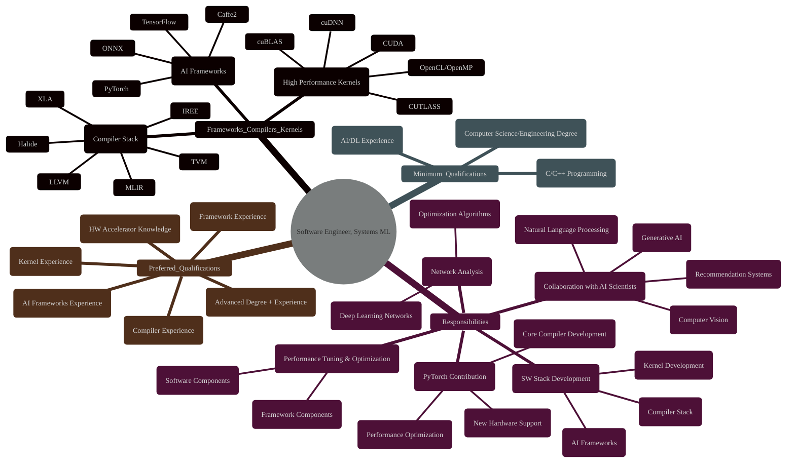
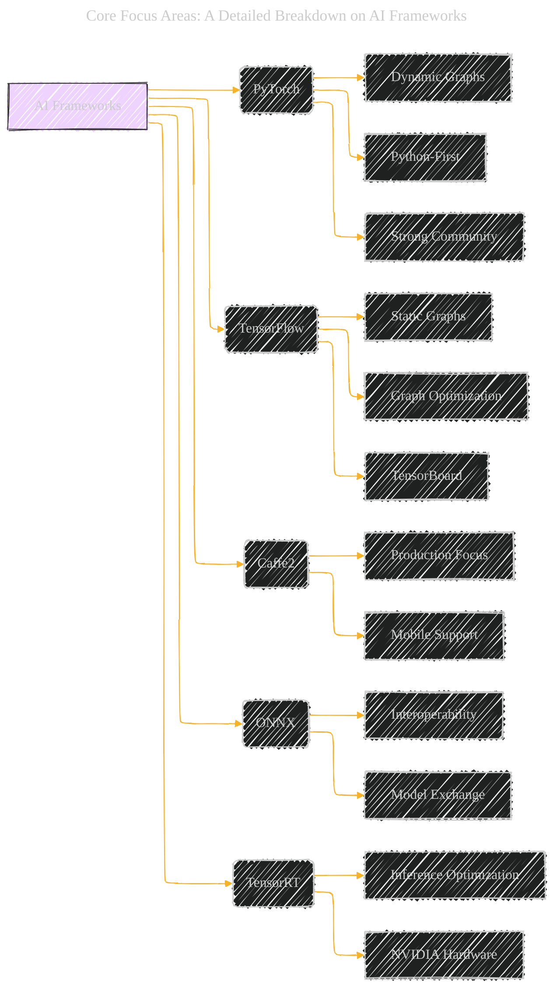
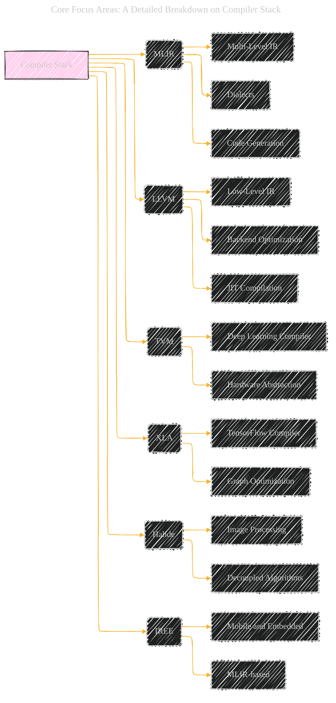
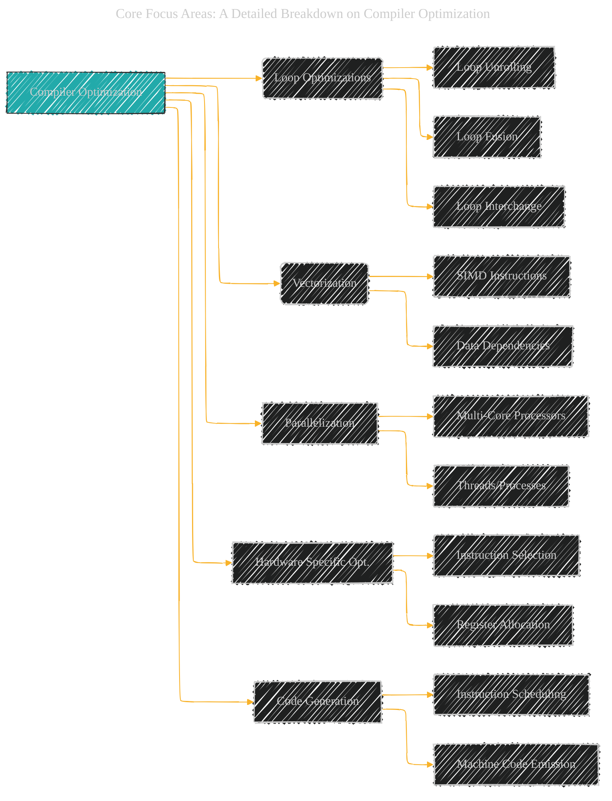
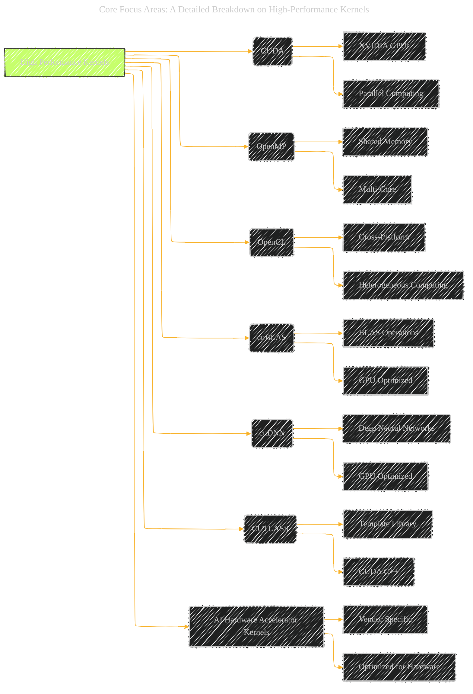
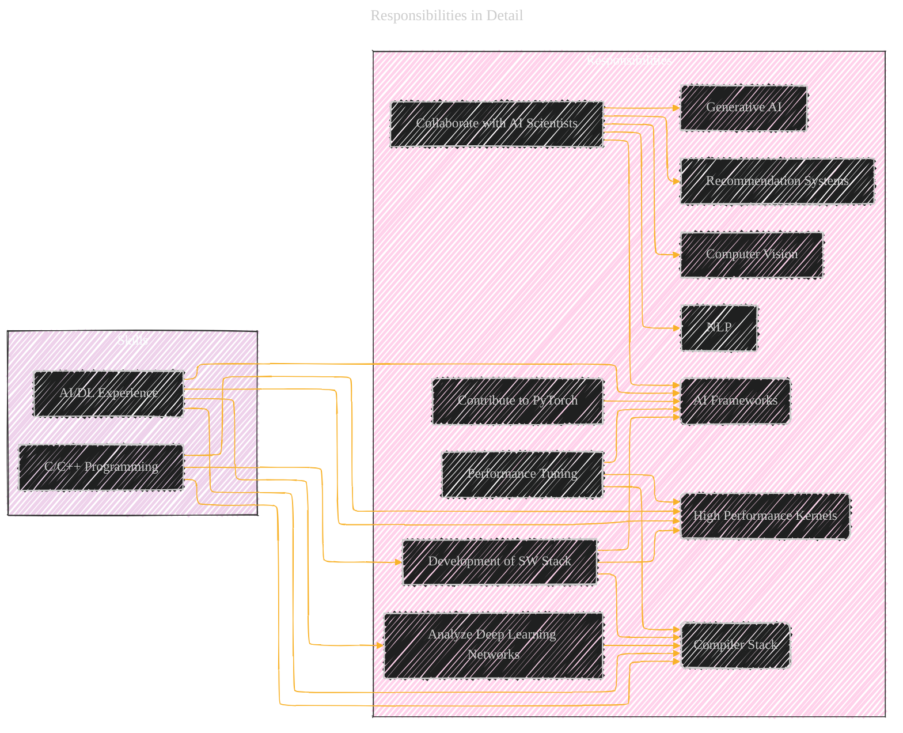

# Software Engineer, Systems ML - Frameworks - Compilers - Kernels - A Diagrammatic Guide
> **Disclaimer:**
>
> This document contains my personal notes on the topic,
> compiled from publicly available documentation and various cited sources.
> The materials are intended for educational purposes, personal study, and reference.
> The content is dual-licensed:
> 1. **MIT License:** Applies to all code implementations (Swift, Mermaid, and other programming languages).
> 2. **Creative Commons Attribution 4.0 International License (CC BY 4.0):** Applies to all non-code content, including text, explanations, diagrams, and illustrations.
---

This comprehensive breakdown, combining visual explanations with practical advice, should provide a candidate with a clear roadmap for understanding the job description and preparing for the application process. The inclusion of open-source project links gives them concrete avenues to develop and showcase their skills.

## **1. Overview: Role and Responsibilities**

First, we'll create a high-level mind map to capture the essence of the role and its responsibilities. This will help candidates understand the big picture.

**Explanation:** This mind map provides a structured overview of the role. It breaks down the three core focus areas (Frameworks, Compilers, Kernels), lists examples of relevant technologies, and outlines the key responsibilities. It also separates minimum and preferred qualifications.  A candidate can quickly see the required skills and the areas where they can add extra value.

----

## **2. Core Focus Areas: A Detailed Breakdown**

Next, we'll create separate diagrams for each of the core focus areas mentioned in the job description:  AI Frameworks, Compiler Stack, and High-Performance Kernels. These diagrams will offer more in-depth context.

### **2.1 AI Frameworks**

**Explanation:** This diagram shows the major AI frameworks mentioned in the job description. It also highlights some key features of each framework, giving a candidate a quick grasp of their differences and strengths.  This helps them understand the context of the "PyTorch contribution" responsibility. Knowing the landscape improves context awareness.

----

### **2.2 Compiler Stack**

**Compiler Optimization:** This diagram shows important steps to optimize a compiler.

**Explanation:** This diagram visualizes the components of a compiler stack relevant to the role.  It includes both general-purpose compilers (LLVM) and specialized deep learning compilers (TVM, XLA, Halide, IREE). Key features are highlighted to help a candidate understand the capabilities of each.  The "compiler optimization algorithms" responsibility directly relates to these technologies.

### **2.3 High-Performance Kernels**

**Explanation:** This diagram showcases different approaches to high-performance kernel development.  It includes GPU programming (CUDA), shared-memory parallelism (OpenMP), cross-platform heterogeneous computing (OpenCL), and optimized libraries (cuBLAS, cuDNN, CUTLASS).  The diagram also acknowledges the existence of vendor-specific AI hardware accelerator kernels.  This relates to the responsibility of optimizing performance on "next-generation hardware architectures."

----

## **3. Responsibilities in Detail**

Now, let's map the responsibilities to the core focus areas and required skills.  This will show how the different aspects of the job fit together.

**Explanation:** This diagram shows a direct mapping between responsibilities and the technical areas, as well as the required skills.  For instance, "Contribute to PyTorch" clearly links to "AI Frameworks" and requires "C/C++ Programming" and "AI/DL Experience."  This helps a candidate see how their skills apply to specific tasks.

----

## **4. Demonstrating Qualifications: A Practical Guide**

This section is crucial for turning the job description into actionable steps for a candidate. We'll provide practical advice and link to open-source projects where possible.

### **4.1 Minimum Qualifications**

*   **Proven C/C++ programming skills:**
    *   **Demonstration:**
        *   **GitHub Portfolio:**  A well-maintained GitHub (or similar) profile showcasing C++ projects is the *best* way to demonstrate proficiency.  Focus on:
            *   **Code Quality:**  Clean, well-documented, and well-tested code.
            *   **Project Complexity:**  Projects that go beyond simple exercises. Think about implementing data structures, algorithms, or small system-level tools.
            *   **Contributions to Open Source:** Contributing to existing C++ projects shows collaboration skills and the ability to work with a larger codebase.
        *   **Coding Challenges:**  Platforms like LeetCode, HackerRank, and Codewars offer C++ challenges.  While solving these doesn't *directly* demonstrate software engineering skills, they can be helpful for practicing syntax and algorithms.  Link to your profile on these platforms if you have a good track record.
        *   **Specific Project Ideas (if starting from scratch):**
            *   **A custom memory allocator:**  This demonstrates understanding of low-level memory management.
            *   **A simple compiler or interpreter:**  This provides deep insight into programming language fundamentals.
            *   **A multithreaded application:**  This showcases knowledge of concurrency.
            *   **A game using a C++ game engine (like Unreal Engine or a smaller library):** This shows practical application of C++ in a complex system.
            *   **A performance-critical library (e.g., for mathematical computation or image processing):** Focus on optimization techniques.

    *   **Open Source Projects (to Contribute to):**
        *   **LLVM:** [https://github.com/llvm/llvm-project](https://github.com/llvm/llvm-project) (Compiler infrastructure – a very challenging but rewarding project)
        *   **TVM:** [https://github.com/apache/tvm](https://github.com/apache/tvm) (Deep Learning Compiler)
        *   **PyTorch:** [https://github.com/pytorch/pytorch](https://github.com/pytorch/pytorch) (AI Framework - look for issues tagged with "C++")

*   **Bachelor's degree in Computer Science, Computer Engineering, relevant technical field, or equivalent practical experience:**
    *   **Demonstration:** This is straightforward.  A degree is verifiable. "Equivalent practical experience" is demonstrated through the same methods as "Proven C/C++ programming skills" (GitHub, projects, etc.), but with a higher expectation of complexity and impact.

*   **Experience in AI framework development or accelerating deep learning models on hardware architectures:**
    *   **Demonstration:**
        *   **Projects:** This is the most important part. Projects should ideally involve:
            *   **Modifying an existing AI framework (PyTorch, TensorFlow, etc.):**  Adding a new operation, optimizing an existing one, or fixing a bug.
            *   **Implementing a deep learning model from scratch in C++ (using a low-level library like cuDNN if targeting GPUs):** This shows a deep understanding of the underlying computations.
            *   **Profiling and optimizing the performance of a deep learning model:**  Using tools like NVIDIA Nsight Systems or the PyTorch profiler.  Document the process and the improvements achieved.
            *   **Developing a custom kernel (e.g., in CUDA) for a specific deep learning operation:** This demonstrates expertise in low-level optimization.
        *   **Research Papers:** If you've published (or contributed to) research papers related to AI framework development or model acceleration, highlight them.
        * **Internships**: Internships related AI/ML field is a plus.

    *   **Open Source Projects (to Contribute to):**
        *   **PyTorch:** [https://github.com/pytorch/pytorch](https://github.com/pytorch/pytorch) (Look for issues related to performance, operators, or the C++ backend)
        *   **TensorFlow:** [https://github.com/tensorflow/tensorflow](https://github.com/tensorflow/tensorflow) (Similar to PyTorch, look for performance-related issues)
        *   **ONNX Runtime:** [https://github.com/microsoft/onnxruntime](https://github.com/microsoft/onnxruntime) (Focuses on inference optimization)

### **4.2 Preferred Qualifications**

*   **Advanced Degree + Experience:**  Similar to the minimum qualification, this is verifiable. The years of experience should be demonstrated through impactful projects and contributions.

*   **Knowledge of GPU, CPU, or AI hardware accelerator architectures:**
    * **Demonstrating GPU:** CUDA development skills shown via GitHub
    * **Demonstrating CPU:**  Expert level knowledge of cache, memory, and vectorization
    * **Demonstrating AI hardware accelerator:** Project optimizing the AI hardware
    *   **Demonstration:**
        *   **Deep Dive Projects:**  Projects that explicitly target a specific architecture.  For example:
            *   **GPU:**  Implement a highly optimized CUDA kernel for a common deep learning operation (e.g., matrix multiplication, convolution).  Compare its performance to existing implementations (cuBLAS, cuDNN). Document the optimization techniques used (shared memory usage, thread block size optimization, etc.).
            *   **CPU:**  Implement a performance-critical algorithm (e.g., a sorting algorithm, a numerical computation) and optimize it for a specific CPU architecture (using techniques like SIMD instructions, cache optimization, loop unrolling).
        *   **Coursework:**  Mention relevant coursework (e.g., Computer Architecture, Parallel Computing, GPU Programming).
        *   **Reading:**  Familiarize yourself with the architecture documentation for the target hardware (e.g., NVIDIA's CUDA documentation, Intel's optimization manuals).  Be prepared to discuss architectural details in an interview.

*   **Experience working with frameworks like PyTorch, Caffe2, TensorFlow, ONNX, TensorRT:**  This overlaps significantly with the minimum qualification for AI/DL experience.  The advice is the same: focus on projects that demonstrate *deep* understanding, not just using the frameworks at a high level.

*   **OR AI high performance kernels: Experience with CUDA programming, OpenMP / OpenCL programming or AI hardware accelerator kernel programming...**
    
    *   **Demonstration:**
        *   **CUDA Projects:**  (See GPU project examples above).
        *   **OpenMP/OpenCL Projects:**  Develop parallel applications that demonstrate an understanding of shared-memory (OpenMP) or heterogeneous (OpenCL) computing.
        *   **Accelerator Kernel Projects:** This is more specialized.  If you have experience with a specific AI accelerator, highlight projects that demonstrate kernel-level optimization.
    *   **Open Source Projects (to Contribute to):**
        *   **cuDNN:** (Closed source, but understanding its functionality is valuable)
        *   **CUTLASS:** [https://github.com/NVIDIA/cutlass](https://github.com/NVIDIA/cutlass) (CUDA template library for deep learning)
        *   **ROCm:** [https://github.com/ROCm/ROCm](https://github.com/ROCm/ROCm) (AMD's open-source platform for GPU computing)

*   **OR AI Compiler: Experience with compiler optimizations such as loop optimizations, vectorization, parallelization...**

    *   **Demonstration:**
        *   **Compiler Projects:**  The best way to demonstrate this is to contribute to an existing compiler (like LLVM or TVM) or build a small compiler (e.g., a simple language that compiles to LLVM IR).
        *   **Optimization Projects:** Implement specific compiler optimization techniques (loop unrolling, vectorization, etc.) and demonstrate their impact on performance.  This could be done within a larger compiler project or as a standalone project.
    *    **Compiler Optimization Techniques:**
        * **Loop Optimizations:** Show clear and concise code that shows skills with loop unrolling, loop fusion, loop interchange, etc.
        * **Vectorization:** Show clear vectorized code with SIMD instrinsics.
        * **Parallelization:** Show ability multi-core processors and create efficient parallelized code.
        * **Hardware Specific Optimization:**
            - Instruction Selection: Show code with efficient and accurate instruction selections.
            - Register Allocation: Demonstrate a performance-efficient implementation of register allocation.
   
    *   **Open Source Projects (to Contribute to):**
        *   **LLVM:** [https://github.com/llvm/llvm-project](https://github.com/llvm/llvm-project)
        *   **TVM:** [https://github.com/apache/tvm](https://github.com/apache/tvm)
        *   **MLIR:** [https://github.com/llvm/llvm-project](https://github.com/llvm/llvm-project) (Part of the LLVM project)

*   **OR AI frameworks: Experience in developing training and inference framework components...**

    *   **Demonstration:**
        *   **Framework Contributions:** Contribute to PyTorch, TensorFlow, or other frameworks.  Focus on the core components (e.g., the autograd engine, the distributed training infrastructure).
        *   **Performance Analysis Tools:** Develop tools for analyzing the performance of deep learning models (e.g., profiling memory usage, identifying bottlenecks).
        *   **System-Level Optimization:**  Demonstrate experience with techniques like optimizing memory bandwidth, I/O access, and compute utilization.
    *     **System Performance Optimization:**
        * **Run Time Analysis:** Show skills in system optimization
        * **Tooling Development:** Build tools for optimization techniques

    *   **Open Source Projects (to Contribute to):**
        *   **PyTorch:** [https://github.com/pytorch/pytorch](https://github.com/pytorch/pytorch)
        *   **TensorFlow:** [https://github.com/tensorflow/tensorflow](https://github.com/tensorflow/tensorflow)

## **5. Interview Preparation**

Beyond demonstrating qualifications through projects, be prepared to discuss these topics in an interview:

*   **Deep Learning Fundamentals:**  Be able to explain concepts like backpropagation, gradient descent, different activation functions, loss functions, regularization techniques, etc.
*   **C++ Fundamentals:**  Be prepared for questions about memory management, pointers, object-oriented programming, templates, the Standard Template Library (STL), and concurrency.
*   **Compiler Concepts:** Understand the different phases of compilation (lexical analysis, parsing, semantic analysis, code generation), common optimization techniques, and how compilers interact with hardware.
*   **System Design:** Be able to discuss the design of a deep learning framework or a component within a framework. Consider aspects like scalability, efficiency, and maintainability.
*   **Problem Solving:**  Be prepared for coding challenges and problem-solving questions related to AI/ML, algorithms, and data structures.

---
**Licenses:**

- **MIT License:**   - Full text in [LICENSE](LICENSE) file.
- **Creative Commons Attribution 4.0 International:**  - Legal details in [LICENSE-CC-BY](LICENSE-CC-BY) and at [Creative Commons official site](http://creativecommons.org/licenses/by/4.0/).

---