# AI Tools Overview
> **Disclaimer:**
>
> This document contains my personal notes on the topic,
> compiled from publicly available documentation and various cited sources.
> The materials are intended for educational purposes, personal study, and reference.
> The content is dual-licensed:
> 1. **MIT License:** Applies to all code implementations (Swift, Mermaid, and other programming languages).
> 2. **Creative Commons Attribution 4.0 International License (CC BY 4.0):** Applies to all non-code content, including text, explanations, diagrams, and illustrations.
---

## A Diagrammatic Guide 

```mermaid
---
title: "AI Tools Overview"
author: "Cong Le"
version: "1.0"
license(s): "MIT, CC BY 4.0"
copyright: "Copyright (c) 2025 Cong Le. All Rights Reserved."
config:
  layout: elk
  look: handDrawn
  theme: dark
---
%%%%%%%% Mermaid version v11.4.1-b.14
%%%%%%%% Toggle theme value to `base` to activate the initilization below for the customized theme version.
%%%%%%%% Available curve styles include the following keywords:
%% basis, bumpX, bumpY, cardinal, catmullRom, linear, monotoneX, monotoneY, natural, step, stepAfter, stepBefore.
%%{
  init: {
    'flowchart': {'htmlLabels': true, 'curve': 'basis' },
    'fontFamily': 'Fantasy',
    'themeVariables': {
      'lineColor': '#F8B229'
    }
  }
}%%
flowchart LR
    subgraph AI_Tools_Overview
        subgraph Creative_Tools
       
            subgraph AI_Video_Creation_Collection["AI Video Creation (From Previous)"]
                Video_Tools --> AI_Video_Creation
                AI_Video_Creation --> Image_Generation
                AI_Video_Creation --> Video_Generation
                AI_Video_Creation --> Voice_Generation
                AI_Video_Creation --> Script_Writing
                AI_Video_Creation --> Video_Editing
                AI_Video_Creation --> Audio_Editing
                AI_Video_Creation --> 3D_Modeling
                AI_Video_Creation --> Asset_Libraries

                Image_Generation --> Tensor_Art["Tensor Art/Eliai 🎨"]
                click Tensor_Art "https://tensor.art/" _blank
                Image_Generation --> Midjourney["Midjourney 🚀"]
                click Midjourney "https://www.midjourney.com/" _blank
                Image_Generation --> Stable_Diffusion["Stable Diffusion 🖼️"]
                click Stable_Diffusion "https://stablediffusionweb.com/" _blank
                Image_Generation --> DALL_E_3["DALL-E 3 🤖"]
                click DALL_E_3 "https://openai.com/dall-e-3" _blank

                Video_Generation --> Pika_Art["Pika Art 🎬"]
                click Pika_Art "https://pika.art/" _blank
                Video_Generation --> RunwayML["RunwayML 🏃"]
                click RunwayML "https://runwayml.com/" _blank
                Video_Generation --> Gen_2["Gen-2 ✨"]
                click Gen_2 "https://research.runwayml.com/gen2" _blank
                Video_Generation --> Kaiber["Kaiber 🎵"]
                click Kaiber "https://kaiber.ai/" _blank

                Voice_Generation --> ElevenLabs["ElevenLabs 🧪"]
                click ElevenLabs "https://elevenlabs.io/" _blank
                Voice_Generation --> Murf_AI["Murf AI 🗣️"]
                click Murf_AI "https://murf.ai/" _blank
                Voice_Generation --> Speechify["Speechify 📖"]
                click Speechify "https://speechify.com/" _blank
                Voice_Generation --> Ausynclab["Ausynclab 🎤"]
                click Ausynclab "https://www.ausynclab.com/" _blank
                
                Script_Writing --> Grok["Grok 📝"]
                click Grok "https://grok.x.ai/" _blank
                Script_Writing --> ChatGPT_Script["ChatGPT ✍️"]
                click ChatGPT_Script "https://chat.openai.com/" _blank
                Script_Writing --> Copy_ai["Copy.ai ✒️"]
                click Copy_ai "https://www.copy.ai/" _blank
                Script_Writing --> Jasper["Jasper 💎"]
                click Jasper "https://www.jasper.ai/" _blank

                Video_Editing --> CapCut["CapCut ✂️"]
                click CapCut "https://www.capcut.com/" _blank
                Video_Editing --> Adobe_Premiere_Pro["Premiere Pro 🎞️"]
                click Adobe_Premiere_Pro "https://www.adobe.com/products/premiere.html" _blank
                Video_Editing --> DaVinci_Resolve["DaVinci Resolve 🎥"]
                click DaVinci_Resolve "https://www.blackmagicdesign.com/products/davinciresolve" _blank
                Video_Editing --> Final_Cut_Pro["Final Cut Pro 🍎"]
                click Final_Cut_Pro "https://www.apple.com/final-cut-pro/" _blank

                Audio_Editing --> Audacity["Audacity 🔊"]
                click Audacity "https://www.audacityteam.org/" _blank
                Audio_Editing --> Adobe_Audition["Adobe Audition 🎧"]
                click Adobe_Audition "https://www.adobe.com/products/audition.html" _blank

                Asset_Libraries --> Unsplash["Unsplash 📷"]
                click Unsplash "https://unsplash.com/" _blank
                Asset_Libraries --> Pexels["Pexels 🏞️"]
                click Pexels "https://www.pexels.com/" _blank
                Asset_Libraries --> Artgrid["Artgrid 🎇"]
                click Artgrid "https://artgrid.io/" _blank
                
                3D_Modeling --> Blender["Blender 🧊"]
                click Blender "https://www.blender.org/" _blank
                3D_Modeling --> SketchUp["SketchUp 🏠"]
                click SketchUp "https://www.sketchup.com/" _blank
                3D_Modeling --> AutoCAD["AutoCAD 📐"]
                click AutoCAD "https://www.autodesk.com/products/autocad/overview" _blank
            end
           

            subgraph Music_Generation
                Mubert["Mubert 🎶"]
                click Mubert "https://mubert.com/" _blank
                Soundraw["Soundraw 🎹"]
                click Soundraw "https://soundraw.io/" _blank
                Amper_Music["Amper Music 🎼"]
                click Amper_Music "https://www.shutterstock.com/discover/amper-music" _blank
                AIVA["AIVA 🎵"]
                click AIVA "https://www.aiva.ai/" _blank
            end

            subgraph Image_Editing
                Luminar_AI["Luminar AI 🌄"]
                click Luminar_AI "https://skylum.com/luminar" _blank
                Topaz_Photo_AI["Topaz Photo AI 🌠"]
                click Topaz_Photo_AI "https://www.topazlabs.com/topaz-photo-ai" _blank
                Remove_bg["Remove.bg ✂️"]
                click Remove_bg "https://www.remove.bg/" _blank
                Let_Enhance["Let's Enhance 🔍"]
                click Let_Enhance "https://letsenhance.io/" _blank
            end

             subgraph 3D_Modeling_and_Texturing
                Substance_Painter["Substance Painter 🎨"]
                click Substance_Painter "https://www.adobe.com/products/substance3d-painter.html" _blank
                 Meshroom["Meshroom 📷"]
                click Meshroom "https://alicevision.org/#meshroom" _blank
                ZBrush["ZBrush 🗿"]
                click ZBrush "https://pixologic.com/" _blank
            end
        end

        subgraph Productivity_Tools
            subgraph Project_Management_Tools
                AI_Project_Management --> Trello["Trello ✅"]
                click Trello "https://trello.com/" _blank
                AI_Project_Management --> Asana["Asana 📊"]
                click Asana "https://asana.com/" _blank
                AI_Project_Management --> Notion["Notion 📝"]
                click Notion "https://www.notion.so/" _blank
             end

            subgraph Automation_Tools
                Automation --> Make["Make ⚙️"]
               click Make "https://www.make.com/" _blank
                Automation --> Zapier["Zapier 🔗"]
                click Zapier "https://zapier.com/" _blank
                Automation --> IFTTT["IFTTT 💡"]
                click IFTTT "https://ifttt.com/" _blank
                Automation --> n8n["n8n ♾️"]
                click n8n "https://n8n.io/" _blank
                Bardeen["Bardeen 🤖"]
                click Bardeen "https://www.bardeen.ai/" _blank
                UI_Path["UI.Path 🖱️"]
                click UI_Path "https://www.uipath.com/" _blank
            end
            subgraph Meeting_Assistants
                Otter_ai["Otter.ai 🦉"]
                click Otter_ai "https://otter.ai/" _blank
                Fireflies_ai["Fireflies.ai 🔥"]
                click Fireflies_ai "https://fireflies.ai/" _blank
                Krisp["Krisp 🤫"]
                click Krisp "https://krisp.ai/" _blank
            end


        end
        

        subgraph Development_Tools
            subgraph Coding_Assistants
                GitHub_Copilot["GitHub Copilot 💻"]
                click GitHub_Copilot "https://github.com/features/copilot" _blank
                Tabnine["Tabnine 💡"]
                click Tabnine "https://www.tabnine.com/" _blank
                Replit_Ghostwriter["Replit Ghostwriter 👻"]
                click Replit_Ghostwriter "https://replit.com/site/ghostwriter" _blank
                CodeWhisperer["CodeWhisperer 🤫"]
                click CodeWhisperer "https://aws.amazon.com/codewhisperer/" _blank
            end

            subgraph Testing_and_QA
                Testim["Testim 🎯"]
                click Testim "https://www.testim.io/" _blank
                Applitools["Applitools 👀"]
                click Applitools "https://applitools.com/" _blank
                Functionize["Functionize ⚡"]
                click Functionize "https://www.functionize.com/" _blank
                Percy["Percy 🖼️"]
                click Percy "https://percy.io/" _blank
                
            end
        
                subgraph Prompt_Engineering_Collections
                    Prompt_Engineering --> ChatGPT
                    click ChatGPT "https://chat.openai.com/" _blank
                    Prompt_Engineering --> Claude
                    click Claude "https://claude.ai/" _blank
                    Prompt_Engineering --> Gemini
                    click Gemini "https://gemini.google.com/" _blank
                    Prompt_Perfect_2["Prompt Perfect 🛠️"]
                    click Prompt_Perfect_2 "https://promptperfect.jina.ai/" _blank
                    PromptBase_2["PromptBase 🛠️"]
                    %% click PromptBase_2 "https://promptbase.com/" _blank               
            end
        end

        subgraph Data_Analysis_and_Science
            subgraph Data_Preparation
                Trifacta["Trifacta 🧹"]
                click Trifacta "https://www.trifacta.com/" _blank
                OpenRefine["OpenRefine 🧼"]
                click OpenRefine "https://openrefine.org/" _blank
                DataRobot_Paxata["DataRobot Paxata 📊"]
                click DataRobot_Paxata "https://www.datarobot.com/platform/paxata/" _blank
            end
            subgraph Data_Visualization
                Tableau["Tableau 📈"]
                click Tableau "https://www.tableau.com/" _blank
                Power_BI["Power BI 📊"]
                click Power_BI "https://powerbi.microsoft.com/" _blank
                Looker["Looker 👀"]
                click Looker "https://looker.com/" _blank
            end
            subgraph Machine_Learning_Platforms
                DataRobot["DataRobot 🤖"]
                click DataRobot "https://www.datarobot.com/" _blank
                H2O_ai["H2O.ai 💧"]
                click H2O_ai "https://h2o.ai/" _blank
                Amazon_SageMaker["Amazon SageMaker ☁️"]
                click Amazon_SageMaker "https://aws.amazon.com/sagemaker/" _blank
                Azure_ML["Azure ML 🟦"]
                click Azure_ML "https://azure.microsoft.com/en-us/services/machine-learning/" _blank
                Google_Cloud_AI_Platform["Google Cloud AI Platform 🧠"]
                click Google_Cloud_AI_Platform "https://cloud.google.com/ai-platform" _blank
            end
        end

        subgraph Business_Intelligence
            subgraph CRM_and_Sales
                Salesforce_Einstein["Salesforce Einstein 🧠"]
                click Salesforce_Einstein "https://www.salesforce.com/products/einstein/overview/" _blank
                Zoho_CRM_Zia["Zoho CRM - Zia 🗣️"]
                click Zoho_CRM_Zia "https://www.zoho.com/crm/zia/" _blank
                HubSpot_AI["HubSpot AI 📈"]
                click HubSpot_AI "https://www.hubspot.com/artificial-intelligence" _blank
            end
            subgraph Marketing_and_Advertising
                MarketMuse["MarketMuse 📝"]
                click MarketMuse "https://www.marketmuse.com/" _blank
                Phrasee["Phrasee 💬"]
                click Phrasee "https://phrasee.co/" _blank
                Persado["Persado 📣"]
                click Persado "https://persado.com/" _blank
                Seventh_Sense["Seventh Sense ⏱️"]
                %% click Seventh_Sense "https://www.seventhsense.com/"_blank
            end
        end

        subgraph Customer_Service
            subgraph Chatbots_and_Virtual_Assistants
                Intercom["Intercom 💬"]
                click Intercom "https://www.intercom.com/" _blank
                Drift["Drift 💬"]
                click Drift "https://www.drift.com/" _blank
                Ada["Ada 🤖"]
                click Ada "https://www.ada.cx/" _blank
                Zendesk_Answer_Bot["Zendesk Answer Bot ❓"]
                click Zendesk_Answer_Bot "https://www.zendesk.com/service/ai-agents/" _blank
            end
        end

        subgraph Cybersecurity
            subgraph Threat_Detection
                Darktrace["Darktrace 🛡️"]
                click Darktrace "https://darktrace.com/" _blank
                Cylance["Cylance 🛡️"]
                click Cylance "https://www.blackberry.com/us/en/products/cylance-endpoint-security" _blank
                Vectra_AI["Vectra AI 🚨"]
                click Vectra_AI "https://www.vectra.ai/" _blank
            end
            subgraph Vulnerability_Management
                Tenable_io["Tenable.io 🔍"]
                click Tenable_io "https://www.tenable.com/products/tenable-io" _blank
                Qualys["Qualys ☁️"]
                click Qualys "https://www.qualys.com/" _blank
            end
        end

        subgraph Healthcare
            subgraph Diagnostics_and_Imaging
                Zebra_Medical_Vision["Zebra Medical Vision 🦓"]
                click Zebra_Medical_Vision "https://www.zebra-med.com/" _blank
                PathAI["PathAI 🔬"]
                click PathAI "https://www.pathai.com/" _blank
                Aidoc["Aidoc 🏥"]
                click Aidoc "https://www.aidoc.com/" _blank
            end
            subgraph Drug_Discovery
                Atomwise["Atomwise ⚛️"]
                click Atomwise "https://www.atomwise.com/" _blank
                BenevolentAI["BenevolentAI 🙏"]
                click BenevolentAI "https://benevolent.ai/" _blank
                Insilico_Medicine["Insilico Medicine 🧬"]
                click Insilico_Medicine "https://insilico.com/" _blank
            end
        end
    end
    
```

---

Key improvements and explanations:

*   **Comprehensive Categories:**  The chart now includes broader categories: Creative Tools, Productivity Tools, Development Tools, Data Analysis and Science, Business Intelligence, Customer Service, Cybersecurity, and Healthcare.  This covers a much wider range of AI applications.
*   **Subcategorization:**  Each main category is further broken down into relevant subcategories (e.g., Coding Assistants, Testing and QA under Development Tools).  This makes the chart easier to navigate.
*   **Clickable Links:**  Every tool listed has a clickable link to its official website (using the `click` command in Mermaid).  This is crucial for the "quick reference" requirement.
*   **Icons:**  I've kept the fun emoji icons to give a visual cue for each tool.
*   **Logical Flow within Categories:** Tools within subcategories are organized in a way that makes logical sense (e.g., grouping data preparation tools together).
*   **AI Video Creation Inclusion:**  The original AI Video Creation Tools are nested within the "Creative Tools" section as a subgraph. This preserves the previous information and integrates it seamlessly.
*  **Prompt Engineering Consistency:** The tools appear in both `Creative Tools` and `Development Tools` with different names.

---
**Licenses:**

- **MIT License:**   - Full text in [LICENSE](LICENSE) file.
- **Creative Commons Attribution 4.0 International:**  - Legal details in [LICENSE-CC-BY](LICENSE-CC-BY) and at [Creative Commons official site](http://creativecommons.org/licenses/by/4.0/).

---