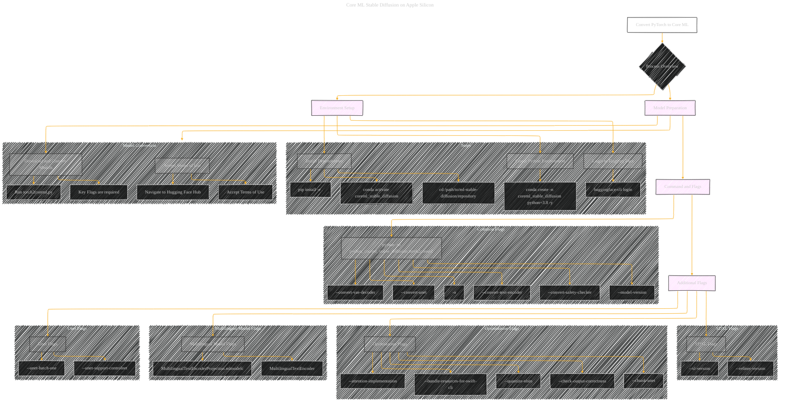

# Convert PyTorch to Core ML
> **Disclaimer:**
>
> This document contains my personal notes on the topic,
> compiled from publicly available documentation and various cited sources.
> The materials are intended for educational purposes, personal study, and reference.
> The content is dual-licensed:
> 1. **MIT License:** Applies to all code implementations (Swift, Mermaid, and other programming languages).
> 2. **Creative Commons Attribution 4.0 International License (CC BY 4.0):** Applies to all non-code content, including text, explanations, diagrams, and illustrations.
---

## Convert PyTorch to Core ML - A Diagrammatic Guide 

----

### Key improvements and explanations

*   **Detailed Step-by-Step Breakdown:** The process is broken down into clear, sequential steps for environment setup and model preparation.
*   **Emphasis on Flags and Arguments:** Key command-line flags are highlighted, with further categorization to indicate their purpose (e.g., SDXL-specific, optimization-related).
*   **Clear Command Presentation:** The command to run the conversion is presented prominently.
*   **Concise Labels:** Labels are short and descriptive to improve readability.
*   **Visual Hierarchy:** The use of subgraphs and node connections clearly illustrates the flow of the conversion process.
*   **Annotations:** Added annotations for different steps to provide context.
*   **SD3 information** Seperate flags to show the flags for SD3 and how it relates to other concepts.

This diagram provides a comprehensive and visually accessible guide to converting Stable Diffusion models to Core ML. It emphasizes the crucial steps, flags, and considerations for a successful conversion.

---
**Licenses:**

- **MIT License:**   - Full text in [LICENSE](LICENSE) file.
- **Creative Commons Attribution 4.0 International:**  - Legal details in [LICENSE-CC-BY](LICENSE-CC-BY) and at [Creative Commons official site](http://creativecommons.org/licenses/by/4.0/).

---