# Core ML Stable Diffusion on Apple Silicon
> **Disclaimer:**
>
> This document contains my personal notes on the topic,
> compiled from publicly available documentation and various cited sources.
> The materials are intended for educational purposes, personal study, and reference.
> The content is dual-licensed:
> 1. **MIT License:** Applies to all code implementations (Swift, Mermaid, and other programming languages).
> 2. **Creative Commons Attribution 4.0 International License (CC BY 4.0):** Applies to all non-code content, including text, explanations, diagrams, and illustrations.
---

## Core ML Stable Diffusion on Apple Silicon - A Diagrammatic Guide 

```mermaid
---
title: "Core ML Stable Diffusion on Apple Silicon"
config:
  layout: elk
  look: handDrawn
  theme: dark
---
%%%%%%%% Mermaid version v11.4.1-b.14
%%%%%%%% Available curve styles include the following keywords:
%% basis, bumpX, bumpY, cardinal, catmullRom, linear, monotoneX, monotoneY, natural, step, stepAfter, stepBefore.
%%{
  init: {
    "graph": { "htmlLabels": false, 'curve': 'linear' },
    'fontFamily': 'Fantasy',
    'themeVariables': {
      'primaryColor': '#BB2528',
      'primaryTextColor': '#f529',
      'primaryBorderColor': '#7C0000',
      'lineColor': '#F8B229',
      'secondaryColor': '#006100',
      'tertiaryColor': '#fff'
    }
  }
}%%
graph LR
    A["Stable Diffusion on Apple Silicon"] --> B{"Core Concepts"}

    B --> C["Model Conversion Process"]:::detail
    C --> CA["PyTorch to Core ML using 'python_coreml_stable_diffusion'"]
    C --> CB["Key Flags:<br> '--convert-unet',<br> '--convert-text-encoder',<br> '--convert-vae-decoder',<br> '--model-version',<br> '--bundle-resources-for-swift-cli'"]
    C --> CC["SD3 Conversion Flags:<br> '--sd3-version',<br> '--convert-mmdit',<br> '--convert-vae-decoder',<br> '--include-t5'"]
    C --> CD["Memory Optimization:<br> '--chunk-unet' (for mobile deployment),<br> weight quantization"]
    C --> CE["Attention Implementation:<br> '--attention-implementation' <br>(ORIGINAL, SPLIT_EINSUM, SPLIT_EINSUM_V2)"]
    C --> CF["Checking Correctness:<br> '--check-output-correctness'"]
    C --> CG["ControlNet Conversion:<br> '--convert-controlnet',<br> '--unet-support-controlnet'"]
    C --> CH["Latent Resolution:<br> '--latent-h',<br> '--latent-w' <br>(affects memory usage and output resolution)"]
    C --> CI["Custom VAE:<br> '--custom-vae-version' <br>(e.g., madebyollin/sdxl-vae-fp16-fix)"]
    C --> CJ["Multilingual Projection:<br> '--input-path',<br> '--output-dir'"]
    C --> CK["Base model version:<br> '--model-version',<br> Refiner version: '--refiner-version'"]
    C --> CL["Unet Batch Size:<br> '--unet-batch-one'"]
    C --> CM["Multilingual Text Encoder:<br> '--use-multilingual-text-encoder'"]

    B --> D["Inference"]:::detail
    D --> DA["Python Pipeline (using 'diffusers'):<br> 'python -m python_coreml_stable_diffusion.pipeline'"]
    D --> DB["Swift Package ('StableDiffusion'):<br> Native Swift/SwiftUI"]
    D --> DC["Command Line Arguments:<br> '--resource-path',<br> '--output-path',<br> '--compute-units',<br> '--seed',<br> '--prompt',<br> '--model-version',<br> '--scheduler',<br> '--controlnet',<br> '--controlnet-inputs',<br> '--xl',<br> '--use-multilingual-text-encoder'"]
    D --> DD["Swift Package:<br> 'StableDiffusionPipeline' class"]
    D --> DE["Image2Image:<br> Requires '--convert-vae-encoder' during model conversion"]
    D --> DF["Multilingual inference:<br> 'useMultilingualTextEncoder = true'"]

    B --> E["Performance Optimization"]:::detail
    E --> EA["Weight Compression (Palettization):<br> coremltools.optimize APIs,<br> '--quantize-nbits'"]
    E --> EB["Mixed-Bit Palettization (MBP):<br> Adaptive bit-width assignment per layer"]
    E --> EC["Activation Quantization:<br> Layer-wise sensitivity analysis for int8/float16 activations"]
    E --> ED["Compute Units:<br> 'CPU_AND_GPU',<br> 'CPU_AND_NE',<br> 'ALL'"]
    E --> EE["Memory Management:<br> 'reduceMemory' option in Swift"]
    E --> EF["Chunking Unet model to two parts"]
    E --> EG["Increased Memory Limit entitlement<br>(iOS)"]
    E --> EH["Metal 3 optimization"]

    B --> F["Hardware and Software Requirements"]:::detail
    F --> FA["macOS:<br> Version 13.1+, 14.0+ <br>(for memory improvements)"]
    F --> FB["Xcode:<br> Version 14.3+"]
    F --> FC["Swift:<br> Version 5.8+"]
    F --> FD["Python:<br> Version 3.8+"]
    F --> FE["coremltools:<br> Version 7.0+"]
    F --> FF["iOS/iPadOS:<br> Version 16.2+, 17.0+<br>(for memory improvements)"]
    F --> FG["Apple Silicon:<br> M1+, A14+"]
    F --> FH["A17 Pro or M4 chips for int8 quantization"]

    B --> G["Model Details & Architectures"]:::detail
    G --> GA["Stable Diffusion v1.4, v1.5, v2, v2.1"]
    G --> GB["Stable Diffusion XL (SDXL) base and refiner"]
    G --> GC["ControlNet"]
    G --> GD["Stable Diffusion 3"]
    G --> GE["Unet, VAE (Decoder/Encoder), Text Encoder (CLIP), Safety Checker"]
    G --> GF["MMDiT"]
    G --> GG["T5 text encoder"]
    G --> GH["NLContextualEmbedding"]

    B --> H["Known Issues & Solutions<br>(FAQ)"]:::detail
    H --> HA["'Failed building wheel for tokenizers'<br>(Rust compiler)"]
    H --> HB["RuntimeError:<br> Error computing NN outputs<br>(Memory pressure)"]
    H --> HC["OOM during model conversion<br>(8GB RAM)"]
    H --> HD["Slow Core ML model loading<br>(Python pipeline)"]
    H --> HE["iOS app crashes during image generation<br>(Memory)"]
    H --> HF["Could not initialize NNPACK!<br>(Safe to ignore)"]
    H --> HG["TracerWarning:<br>Converting a tensor to a Python boolean<br>(Safe to ignore)"]
    H --> HH["UserWarning:<br>resource_tracker:<br> There appear to be 1 leaked semaphore objects to clean up at shutdown<br>(Likely OOM during conversion)"]

    B --> I["Key Resources & Links"]:::detail
    I --> IA["Hugging Face Hub:<br>Model Checkpoints, Pre-analyzed Recipes"]
    I --> IB["Apple's Machine Learning Research Blog:<br> Explanation of Techniques"]
    I --> IC["Core ML Tools Documentation:<br>Optimization APIs, Flexible Shapes"]
    I --> ID["WWDC Session Videos:<br>Model Compression, Multilingual Models"]
    I --> IE["Git Repository:<br>Code, Scripts, Assets"]
    I --> IF["Diffusers Library"]
    I --> IG["DiffusionKit repo"]
    I --> IH["Weights Metadata API"]
    I --> II["Post Training Activation Quantization"]
    I --> IJ["Hugging Face blog"]
    I --> IK["Apple Developer Docs"]

    B --> J["Workflow"]:::detail
    J --> JA["Download model(s) from Hugging Face"]
    J --> JB["Create Python Environment"]
    J --> JC["Convert model(s) to Core ML format"]
    J --> JD["Implement SWIFT code"]
    J --> JE["Test code"]
    J --> JF["Tune configuration and parameters"]
    J --> JG["Compress the CoreML Models"]
    J --> JH["Download required assets"]

    style A fill:#a2da,stroke:#333,stroke-width:1px
    classDef detail fill:#f9f3,stroke:#333,stroke-width:1px
```

---

### Key Points and Considerations

*   **Nodes and Edges:** Each node in the diagram represents a key concept or component of the Stable Diffusion implementation on Apple Silicon. Edges show relationships and dependencies between these components.
*   **Subgraphs:** Subgraphs are used to group related concepts, improving organization and readability.
*   **Levels of Detail:** You can add more levels to each node as needed to provide greater granularity. For instance, the 'Inference' node could be expanded to show the steps involved in the diffusion process.
*   **Targeted Areas:**  The document focuses on the practicalities of running Stable Diffusion on Apple Silicon.
*   **Technical Implementation:**   Key areas are model conversion, memory optimization, and performance tuning, with explicit command-line arguments and API details.
*   **Performance and Hardware:**   There's a strong emphasis on performance benchmarks, specifying device models, and compute unit settings.

This structure provides a strong foundation for visualizing and understanding the key aspects of running Stable Diffusion on Apple Silicon. You can now flesh out each section with more details from the original document, and decide if certain aspects warrant their own diagrams (e.g., the weight compression process could be detailed in a separate flowchart).

---
**Licenses:**

- **MIT License:**   - Full text in [LICENSE](LICENSE) file.
- **Creative Commons Attribution 4.0 International:**  - Legal details in [LICENSE-CC-BY](LICENSE-CC-BY) and at [Creative Commons official site](http://creativecommons.org/licenses/by/4.0/).

---