# Core ML Stable Diffusion on Apple Silicon
> **Disclaimer:**
>
> This document contains my personal notes on the topic,
> compiled from publicly available documentation and various cited sources.
> The materials are intended for educational purposes, personal study, and reference.
> The content is dual-licensed:
> 1. **MIT License:** Applies to all code implementations (Swift, Mermaid, and other programming languages).
> 2. **Creative Commons Attribution 4.0 International License (CC BY 4.0):** Applies to all non-code content, including text, explanations, diagrams, and illustrations.
---

## Core ML Stable Diffusion on Apple Silicon - A Diagrammatic Guide 

```mermaid
---
title: "Core ML Stable Diffusion on Apple Silicon"
config:
  layout: elk
  look: handDrawn
  theme: dark
---
%%%%%%%% Mermaid version v11.4.1-b.14
%%%%%%%% Available curve styles include the following keywords:
%% basis, bumpX, bumpY, cardinal, catmullRom, linear, monotoneX, monotoneY, natural, step, stepAfter, stepBefore.
%%{
  init: {
    "graph": { "htmlLabels": false, 'curve': 'linear' },
    'fontFamily': 'Fantasy',
    'themeVariables': {
      'primaryColor': '#BB2528',
      'primaryTextColor': '#f529',
      'primaryBorderColor': '#7C0000',
      'lineColor': '#F8B229',
      'secondaryColor': '#006100',
      'tertiaryColor': '#fff'
    }
  }
}%%
graph LR
    A["Stable Diffusion on Apple Silicon"] --> B{Core Concepts}
    style A fill:#a2da,stroke:#333,stroke-width:1px

    B --> C["Model Conversion Process"]:::detail
    C --> CA["PyTorch to Core ML"]
    CA --> CA1["Tool:<br> 'python_coreml_stable_diffusion'"]
    CA --> CA2["Key:<br> 'torch2coreml.py'"]
    C --> CB["Key Flags"]:::flags

    subgraph Key_Flags["Key Flags"]
        CB --> CB1["--convert-unet"]
        CB --> CB2["--convert-text-encoder"]
        CB --> CB3["--convert-vae-decoder"]
        CB --> CB4["--model-version"]
        CB --> CB5["--bundle-resources-for-swift-cli"]
        CB --> CB6["--xl-version<br>(SDXL)"]
        CB --> CB7["--refiner-version<br>(SDXL)"]
        CB --> CB8["--sd3-version<br>(SD3)"]
        CB --> CB9["--convert-mmdit<br>(SD3)"]
        CB --> CB10["--include-t5<br>(SD3)"]
        CB --> CB11["--chunk-unet<br>(Memory)"]
        CB --> CB12["--quantize-nbits<br>(Compression)"]
        CB --> CB13["--attention-implementation"]
        CB --> CB14["--check-output-correctness"]
        CB --> CB15["--convert-controlnet"]
        CB --> CB16["--unet-support-controlnet"]
        CB --> CB17["--latent-h, --latent-w<br>(Resolution)"]
        CB --> CB18["--custom-vae-version"]
        CB --> CB19["--unet-batch-one"]
    end

    B --> D[Inference]:::detail
    D --> DA[Python Pipeline]:::implementation
    D --> DB[Swift Package]:::implementation

    subgraph Implementation_Details["Implementation Details"]
        DA --> DA1["'diffusers' based"]
        DA --> DA2["'python -m python_coreml_stable_diffusion.pipeline'"]
        DB --> DB1["Native Swift/SwiftUI"]
        DB --> DB2["'StableDiffusionPipeline' class"]
    end

    D --> DC[CLI Arguments]:::cli

    subgraph CLI_Arguments["CLI Arguments"]
        DC --> DC1["--resource-path"]
        DC --> DC2["--output-path"]
        DC --> DC3["--compute-units"]
        DC --> DC4["--seed"]
        DC --> DC5["--prompt"]
        DC --> DC6["--model-version"]
        DC --> DC7["--scheduler"]
        DC --> DC8["--xl"]
        DC --> DC9["--sd3"]
        DC --> DC10["--use-multilingual-text-encoder"]
        DC --> DC11["--controlnet, --controlnet-inputs"]
    end

    B --> E[Performance Optimization]:::detail
    E --> EA[Weight Compression]:::compression
    E --> EB[Activation Quantization]:::quantization
    E --> EC[Compute Units]:::hardware
    E --> ED[Memory Management]:::memory

    subgraph Compression_Details["Compression Details"]
        EA --> EA1[coremltools.optimize APIs]
        EA --> EA2["'--quantize-nbits'"]
        EA --> EA3["Mixed-Bit Palettization<br>(MBP)"]
        EB --> EB1[Layer-wise sensitivity analysis]
        EB --> EB2[int8/float16 activations]
    end

    subgraph Hardware_Considerations["Hardware Considerations"]
        EC --> EC1["'CPU_AND_GPU',<br> 'CPU_AND_NE',<br> 'ALL' "]
        ED --> ED1["'reduceMemory'<br>(Swift)"]
        ED --> ED2["Chunking Unet model"]
        ED --> ED3["Increased Memory Limit entitlement<br>(iOS)"]
    end

    B --> F["Hardware & Software Requirements"]:::detail
    F --> FA["macOS: 13.1+, 14.0+"]
    F --> FB["Xcode: 14.3+"]
    F --> FC["Swift: 5.8+"]
    F --> FD["Python: 3.8+"]
    F --> FE["coremltools: 7.0+"]
    F --> FF["iOS/iPadOS: 16.2+, 17.0+"]
    F --> FG["Apple Silicon: M1+, A14+"]
    F --> FH["A17 Pro/M4 for int8"]

    B --> G["Model Details"]:::detail
    G --> GA["SD Versions:<br> v1.4, v1.5, v2, v2.1"]
    G --> GB["SDXL base & refiner"]
    G --> GC["SD3 Medium"]
    G --> GD["ControlNet"]
    G --> GE["Components:<br> Unet, VAE, Text Encoder, Safety Checker"]
    G --> GF["NLContextualEmbedding"]

    B --> H["FAQ"]:::detail
    H --> HA["tokenizers build error"]
    H --> HB["NN outputs error"]
    H --> HC["OOM during conversion"]
    H --> HD["Slow model loading"]
    H --> HE["iOS memory crashes"]
    H --> HF["NNPACK unsupported"]
    H --> HG["TracerWarning"]
    H --> HH["Leaked semaphore objects"]

    B --> I["Key Resources"]:::detail
    I --> IA["Hugging Face Hub"]
    I --> IB["Apple ML Research Blog"]
    I --> IC["Core ML Tools Docs"]
    I --> ID["WWDC Videos"]
    I --> IE["Git Repo"]

    B --> J["Workflow"]:::detail
    J --> JA["Download from HF"]
    J --> JB["Create Python env"]
    J --> JC["Convert to Core ML"]
    J --> JD["Implement Swift code"]
    J --> JE["Test"]
    J --> JF["Tune config"]
    J --> JG["Compress"]
    J --> JH["Get assets"]

    classDef detail fill:#f9f3,stroke:#333,stroke-width:1px
    classDef flags fill:#eee3,stroke:#333,stroke-width:1px
    classDef implementation fill:#ddd3,stroke:#333,stroke-width:1px
    classDef cli fill:#ccc3,stroke:#333,stroke-width:1px
    classDef compression fill:#bbb3,stroke:#333,stroke-width:1px
    classDef quantization fill:#aaa3,stroke:#333,stroke-width:1px
    classDef hardware fill:#9993,stroke:#333,stroke-width:1px

```

-----

### Key improvements and explanations

*   **Visual Hierarchy:** Uses subgraphs to group related concepts (e.g., CLI arguments, performance optimization techniques). This makes the overall structure easier to follow.
*   **Descriptive Node Labels:** Nodes have clearer labels that convey the essence of each component (e.g., "PyTorch to Core ML" instead of just "Conversion").
*   **Specific Examples:** Key arguments, function names, and paths from the original document are included as examples to provide concrete information.
*   **Emphasis on Key Information:**  The most important concepts (e.g., the main tools, model versions) are placed higher in the hierarchy.
*   **Connections to Original Document:** The annotations point to the corresponding sections in the original document, making it easy to cross-reference.
*   **Color Coding:** Color coding is used to visually distinguish different categories of information (e.g., "Core Concepts" in one color, "Implementation Details" in another).  This adds another layer of organization.
*    **Styling:** The `config`, `look`, and `theme` sections are used for a cleaner, more consistent look.
*   **Model details:** A special branch for Models details and how each model is represented in CoreML.
*   **Known Issues:** A key section of the document is the FAQ, with known issues.
*   **Workflow** The core concepts from each of the steps are also outlined.

---
**Licenses:**

- **MIT License:**   - Full text in [LICENSE](LICENSE) file.
- **Creative Commons Attribution 4.0 International:**  - Legal details in [LICENSE-CC-BY](LICENSE-CC-BY) and at [Creative Commons official site](http://creativecommons.org/licenses/by/4.0/).

---