# Key Flags in details
> **Disclaimer:**
>
> This document contains my personal notes on the topic,
> compiled from publicly available documentation and various cited sources.
> The materials are intended for educational purposes, personal study, and reference.
> The content is dual-licensed:
> 1. **MIT License:** Applies to all code implementations (Swift, Mermaid, and other programming languages).
> 2. **Creative Commons Attribution 4.0 International License (CC BY 4.0):** Applies to all non-code content, including text, explanations, diagrams, and illustrations.
---

## Key Flags in details - A Diagrammatic Guide 

```mermaid
---
title: "Core ML Stable Diffusion on Apple Silicon"
config:
  layout: elk
  look: handDrawn
  theme: dark
---
%%%%%%%% Mermaid version v11.4.1-b.14
%%%%%%%% Available curve styles include the following keywords:
%% basis, bumpX, bumpY, cardinal, catmullRom, linear, monotoneX, monotoneY, natural, step, stepAfter, stepBefore.
%%{
  init: {
    "graph": { "htmlLabels": false, 'curve': 'linear' },
    'fontFamily': 'Fantasy',
    'themeVariables': {
      'primaryColor': '#BB2528',
      'primaryTextColor': '#f529',
      'primaryBorderColor': '#7C0000',
      'lineColor': '#F8B229',
      'secondaryColor': '#006100',
      'tertiaryColor': '#fff'
    }
  }
}%%
graph LR
    A["Key Conversion Flags<br>(torch2coreml.py)"] --> B{"Purpose & Usage"}
    style A fill:#f9f3,stroke:#333,stroke-width:1px

    B --> C["--convert-unet"]:::unet
    C --> C1["Converts the UNet model"]
    C --> C2["Essential for image generation"]

    B --> D["--convert-text-encoder"]:::textenc
    D --> D1["Converts the text encoder model"]
    D --> D2["Translates text prompts into latent space"]

    B --> E["--convert-vae-decoder"]:::vaedec
    E --> E1["Converts the VAE decoder model"]
    E --> E2["Decodes latent representations into images"]

    B --> F["--convert-safety-checker"]:::safety
    F --> F1["Converts the safety checker model<br>(optional)"]
    F --> F2["Filters potentially unsafe content"]

    B --> G["--model-version"]:::version
    G --> G1["Specifies the Stable Diffusion version from Hugging Face Hub"]
    G --> G2["Example:<br>'stabilityai/stable-diffusion-2-1-base'"]

    B --> H["--refiner-version"]:::refiner
    H --> H1["SDXL: Specifies refiner model"]
    H --> H2["Enables ensemble of expert denoisers inference for SDXL"]

    B --> I["--bundle-resources-for-swift-cli"]:::swift
    I --> I1["Bundles all models and resources for Swift deployment"]
    I --> I2["Creates '<output-mlpackages-directory>/Resources'"]

    B --> J["--quantize-nbits"]:::quantize
    J --> J1["Quantizes weights to 2, 4, 6, or 8 bits"]
    J --> J2["Reduces model size, improves performance on Neural Engine"]
    J --> J3["Impacts image quality, 6 bits recommended minimum"]

    B --> K["--chunk-unet"]:::chunk
    K --> K1["Splits UNet into two chunks for mobile deployment"]
    K --> K2["Required for Neural Engine on iOS/iPadOS if not using '--quantize-nbits < 6'"]
    K --> K3["Not compatible with Python pipeline"]

    B --> L["--attention-implementation"]:::attention
    L --> L1["ORIGINAL:<br> For CPU/GPU on Mac"]
    L --> L2["SPLIT_EINSUM:<br> For CPU_AND_NE on iPhone/iPad"]
    L --> L3["SPLIT_EINSUM_V2:<br> Mobile devices"]
    L --> L4["Trades off compilation time and performance"]

    B --> M["--check-output-correctness"]:::check
    M --> M1["Compares Core ML outputs to PyTorch outputs"]
    M --> M2["Increases RAM consumption, use for debugging only"]

    B --> N["--convert-controlnet"]:::controlnet
    N --> N1["Converts ControlNet models<br>(specified after this option)"]
    N --> N2["Enables ControlNet for image generation"]

    B --> O["--unet-support-controlnet"]:::unetcontrol
    O --> O1[Enables UNet to receive ControlNet inputs]
    O --> O2[Generates '*_control-unet.mlpackage']
    O --> O3[Cannot be used without ControlNet]

    B --> P["--latent-h, --latent-w"]:::latent
    P --> P1["SDXL:<br>Set latent space dimensions"]
    P --> P2["Affects output image resolution"]
    P --> P3["768x768 recommended for iOS/iPadOS<br>(96x96 latent)"]
    P --> P4["1024x1024 default"]

    B --> Q["--custom-vae-version"]:::vae
    Q --> Q1["SDXL:<br>Specifies custom VAE<br>(e.g., madebyollin/sdxl-vae-fp16-fix)"]
    Q --> Q2["Restores float16 precision for VAE"]

    B --> R["--unet-batch-one"]:::batchone
    R --> R1["Uses a batch size of one for UNet"]
    R --> R2["Needed for 'guidance-scale < 1'"]

    B --> S["--sd3-version"]:::version3
    S --> S1["Indicates Stable Diffusion 3 model conversion"]

    B --> T["--convert-mmdit"]:::mmdit
    T --> T1["Convert the MMDiT model (SD3)"]

    B --> U["--include-t5"]:::t5
    U --> U1["Downloads and includes a pre-converted T5 text encoder (SD3)"]

    classDef unet fill:#f0f8ff,stroke:#333,stroke-width:1px
    classDef textenc fill:#f5f5dc,stroke:#333,stroke-width:1px
    classDef vaedec fill:#f0fff0,stroke:#333,stroke-width:1px
    classDef safety fill:#e6e6fa,stroke:#333,stroke-width:1px
    classDef version fill:#fff0f5,stroke:#333,stroke-width:1px
    classDef refiner fill:#ffe4e1,stroke:#333,stroke-width:1px
    classDef swift fill:#fffaf0,stroke:#333,stroke-width:1px
    classDef quantize fill:#ffffe0,stroke:#333,stroke-width:1px
    classDef chunk fill:#ffefd5,stroke:#333,stroke-width:1px
    classDef attention fill:#ffebcd,stroke:#333,stroke-width:1px
    classDef check fill:#f5deb3,stroke:#333,stroke-width:1px
    classDef controlnet fill:#f4a460,stroke:#333,stroke-width:1px
    classDef unetcontrol fill:#d2b48c,stroke:#333,stroke-width:1px
    classDef latent fill:#deb887,stroke:#333,stroke-width:1px
    classDef vae fill:#c04000,stroke:#333,stroke-width:1px
    classDef batchone fill:#a0522d,stroke:#333,stroke-width:1px
    classDef version3 fill:#663300,stroke:#333,stroke-width:1px
    classDef mmdit fill:#8b4513,stroke:#333,stroke-width:1px
    classDef t5 fill:#d26911,stroke:#333,stroke-width:1px
    
```

---

### Key improvements

*   **Visual Clarity:** The use of subgraphs allows the overall structure to be cleaner and easier to understand. The structure helps the diagram from being too spread out.
*   **Grouping of Key flags:** The `Key Flags` have been placed in a specific subgraph and each key flag has its own set of properties.
*   **Details:** Specific use cases have been provided for each key flag.
*   **Semantic Styling:** Specific color coding has been applied to each of the `classDef` to allow for specific semantic meaning to be applied to each key flag.
*   **Clear Purpose:** The purpose of each flag is clearly described, along with potential trade-offs or considerations.

This Mermaid diagram is a detailed reference for the key flags used during the Core ML model conversion process. It is designed to help users understand the purpose of each flag and how to use them to optimize their models for different deployment scenarios.

---
**Licenses:**

- **MIT License:**   - Full text in [LICENSE](LICENSE) file.
- **Creative Commons Attribution 4.0 International:**  - Legal details in [LICENSE-CC-BY](LICENSE-CC-BY) and at [Creative Commons official site](http://creativecommons.org/licenses/by/4.0/).

---