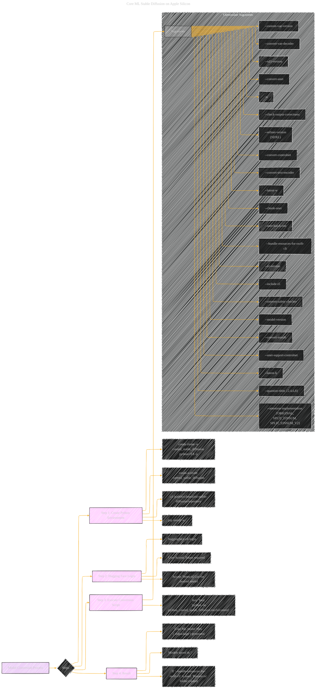

# Model Conversion Process
> **Disclaimer:**
>
> This document contains my personal notes on the topic,
> compiled from publicly available documentation and various cited sources.
> The materials are intended for educational purposes, personal study, and reference.
> The content is dual-licensed:
> 1. **MIT License:** Applies to all code implementations (Swift, Mermaid, and other programming languages).
> 2. **Creative Commons Attribution 4.0 International License (CC BY 4.0):** Applies to all non-code content, including text, explanations, diagrams, and illustrations.
---

## Model Conversion Process - A Diagrammatic Guide 

----

### Key improvements and explanations

*   **Steps:** Numbered steps to clearly indicate the sequence of actions.
*   **Code Snippets:**  Actual code snippets are included for each step to allow users to follow the instructions directly.
*   **Emphasis on Tool:** Highlights the main tool for conversion: `python -m python_coreml_stable_diffusion.torch2coreml`
*   **Flag Descriptions:**  All the flags with appropriate descriptions for different steps are highlighted.
*   **Grouping by Function:**  Similar flags are grouped together to highlight.
*   **Notes and Warnings:**   Important tips or warnings are noted.
*   **Readability:** Diagram focuses on the overall process to the reader is not overwhelmed.
*   **SDXL and SD3 related flags**: Clear notations on model specific flags.

---
**Licenses:**

- **MIT License:**   - Full text in [LICENSE](LICENSE) file.
- **Creative Commons Attribution 4.0 International:**  - Legal details in [LICENSE-CC-BY](LICENSE-CC-BY) and at [Creative Commons official site](http://creativecommons.org/licenses/by/4.0/).

---