# Stable Diffusion on Apple Silicon
> **Disclaimer:**
>
> This document contains my personal notes on the topic,
> compiled from publicly available documentation and various cited sources.
> The materials are intended for educational purposes, personal study, and reference.
> The content is dual-licensed:
> 1. **MIT License:** Applies to all code implementations (Swift, Mermaid, and other programming languages).
> 2. **Creative Commons Attribution 4.0 International License (CC BY 4.0):** Applies to all non-code content, including text, explanations, diagrams, and illustrations.
---

## Stable Diffusion on Apple Silicon - A Diagrammatic Guide 

```mermaid
---
title: "Core ML Stable Diffusion on Apple Silicon"
config:
  layout: elk
  look: handDrawn
  theme: dark
---
%%%%%%%% Mermaid version v11.4.1-b.14
%%%%%%%% Available curve styles include the following keywords:
%% basis, bumpX, bumpY, cardinal, catmullRom, linear, monotoneX, monotoneY, natural, step, stepAfter, stepBefore.
%%{
  init: {
    "graph": { "htmlLabels": false, 'curve': 'linear' },
    'fontFamily': 'Fantasy',
    'themeVariables': {
      'primaryColor': '#BB2528',
      'primaryTextColor': '#f529',
      'primaryBorderColor': '#7C0000',
      'lineColor': '#F8B229',
      'secondaryColor': '#006100',
      'tertiaryColor': '#fff'
    }
  }
}%%
graph LR
    A["Stable Diffusion on Apple Silicon"] --> B{"Core Concepts"}
    style A fill:#a2da,stroke:#333,stroke-width:1px

    B --> C["Model Conversion Process"]:::detail
    C --> CA["PyTorch to Core ML using 'python_coreml_stable_diffusion'"]
    CA --> CA1["Script: 'torch2coreml.py'"]
    C --> CB["Key Flags"]:::flags

    subgraph Key_Flags["Key Flags"]
        CB --> CB1["--convert-unet:<br> Converts UNet model"]
        CB --> CB2["--convert-text-encoder:<br> Converts Text Encoder model"]
        CB --> CB3["--convert-vae-decoder:<br> Converts VAE Decoder model"]
        CB --> CB4["--convert-safety-checker:<br> Converts Safety Checker model"]
        CB --> CB5["--model-version:<br> Specifies Hugging Face model version"]
        CB --> CB6["--bundle-resources-for-swift-cli:<br> Bundles resources for Swift"]
        CB --> CB7["--xl-version:<br> For SDXL models"]
        CB --> CB8["--refiner-version:<br> For SDXL refiner model"]
        CB --> CB9["--sd3-version:<br> For SD3 models"]
        CB --> CB10["--convert-mmdit:<br> Convert the MMDiT model (SD3)"]
        CB --> CB11["--include-t5:<br> Downloads and includes a pre-converted T5 text encoder (SD3)"]
        CB --> CB12["--chunk-unet:<br> Splits Unet for mobile (<= 6-bit quantization)"]
        CB --> CB13["--quantize-nbits {2,4,6,8}:<br> Weight quantization"]
        CB --> CB14["--attention-implementation {ORIGINAL,SPLIT_EINSUM, SPLIT_EINSUM_V2}"]
        CB --> CB15["--check-output-correctness:<br> Compares PyTorch and Core ML outputs"]
        CB --> CB16["--convert-controlnet <models>:<br> Converts ControlNet models"]
        CB --> CB17["--unet-support-controlnet:<br> Enables ControlNet support in UNet"]
        CB --> CB18["--latent-h, --latent-w:<br> Sets latent resolution (SDXL)"]
        CB --> CB19["--custom-vae-version <repo>:<br> Custom VAE version"]
        CB --> CB20["--unet-batch-one:<br> Unet Batch Size"]
    end

    B --> D["Inference"]:::detail
    D --> DA["Python Pipeline<br>(using 'diffusers')"]:::implementation
    DA --> DA1["Script: 'python -m python_coreml_stable_diffusion.pipeline'"]
    DB --> DB2["Swift:<br> 'StableDiffusionPipeline' class"]
    DB --> DB3["Swift:<br> Setting 'reduceMemory = true' for low memory"]

    D --> DC["CLI Arguments"]:::cli

    subgraph CLI_Arguments
        DC --> DC1["--resource-path <dir>:<br> Path to Core ML models"]
        DC --> DC2["--output-path <dir>:<br> Path to output image"]
        DC --> DC3["--compute-units {ALL, CPU_AND_GPU, CPU_AND_NE}"]
        DC --> DC4["--seed <int>:<br> Random seed"]
        DC --> DC5["--prompt <text>:<br> Text prompt"]
        DC --> DC6["--model-version <name>:<br> Hugging Face model version"]
        DC --> DC7["--scheduler <name>:<br>  Scheduler type"]
        DC --> DC8["--xl:<br> Enables Stable Diffusion XL"]
        DC --> DC9["--sd3:<br> Enables Stable Diffusion 3"]
        DC --> DC10["--use-multilingual-text-encoder"]
        DC --> DC11["--controlnet <models>:<br> ControlNet models"]
        DC --> DC12["--controlnet-inputs <images>:<br> ControlNet input images"]
    end

    B --> E["Performance Optimization"]:::detail
    E --> EA["Weight Compression<br>(Palettization)"]:::compression
    E --> EB["Activation Quantization"]:::quantization
    E --> EC["Compute Units"]:::hardware
    E --> ED["Memory Management"]:::memory

    subgraph Compression_Details
        EA --> EA1["Tools:<br> 'coremltools.optimize.coreml.palettize_weights'"]
        EA --> EA2["'--quantize-nbits {2,4,6,8}':<br> Quantize the model"]
        EA --> EA3["Mixed-Bit Palettization (MBP):<br> Adaptive bit-width per layer"]
        EA --> EA4["Pre-analysis:<br> Compute recipes for signal strength"]
        EB --> EB1["Post Training Activation Quantization:<br> Calibration data and per-layer analysis"]
        EB --> EB2["Quantization to int8/float16"]
    end

    subgraph Hardware_Considerations
        EC --> EC1["'CPU_AND_GPU':<br> Mac"]
        EC --> EC2["'CPU_AND_NE':<br> iPhone, iPad"]
        ED --> ED1["'reduceMemory' (Swift):<br> Reduces memory usage"]
        ED --> ED2["Chunking Unet model:<br> For mobile deployment"]
        ED --> ED3["Increased Memory Limit entitlement (iOS):<br> If needed"]
    end

    B --> F[Hardware & Software Requirements]:::detail
    F --> FA["macOS: 13.1+ (Model Conversion & Runtime), 14.0+ (Memory Improvements)"]
    F --> FB[Xcode: 14.3+]
    F --> FC[Swift: 5.8+]
    F --> FD[Python: 3.8+]
    F --> FE[coremltools: 7.0+]
    F --> FF["iOS/iPadOS: 16.2+ (Runtime), 17.0+ (Memory Improvements)"]
    F --> FG["Apple Silicon: M1+, A14+ (Target Device Hardware Generation)"]
    F --> FH[A17 Pro/M4: For int8 activation quantization]

    B --> G["Model Details"]:::detail
    G --> GA["SD Versions:<br> v1.4, v1.5, v2, v2.1"]
    G --> GB["SDXL:<br> Base and refiner (Optional) models"]
    G --> GC["ControlNet:<br> For conditioned image generation"]
        G --> GD[SD3 Medium: New Model];
    G --> GE["Components:<br> UNet, VAE (Decoder/Encoder), Text Encoder, Safety Checker"]
    G --> GF["MMDiT Model (SD3):<br> A new model"]
    G --> GG["T5 text encoder (SD3):<br>  Downloads and includes a pre-converted T5 text encoder"]
    G --> GH["NLContextualEmbedding:<br> Multilingual Text Encoder"]

    B --> H[FAQ]:::detail
    H --> HA["ERROR:<br> Failed building wheel for tokenizers: Missing Rust compiler"]
    H --> HB["RuntimeError:<br> Error computing NN outputs: Memory pressure"]
    H --> HC["OOM during conversion (8GB RAM):<br>  Use sequential conversion"]
    H --> HD["Slow Core ML model loading (Python pipeline):<br> Use .mlmodelc assets"]
    H --> HE["iOS app crashes during image generation:<br> Memory limits. Use compression/chunking/entitlements"]
    H --> HF["Could not initialize NNPACK!:<br> Safe to ignore"]
    H --> HG["TracerWarning:<br> Converting a tensor to a Python boolean: Safe to ignore"]
    H --> HH["Leaked semaphore objects:<br> OOM during conversion"]

    B --> I["Key Resources"]:::detail
    I --> IA["Hugging Face Hub:<br> Models, Pre-analyzed Recipes"]
    I --> IB["Apple ML Research Blog:<br> Techniques, Performance"]
    I --> IC["Core ML Tools Docs:<br> Optimization, Flexible Shapes, API"]
    I --> ID["WWDC Videos:<br> Compression, Multilingual"]
    I --> IE["Git Repo:<br> apple/ml-stable-diffusion"]
    I --> IF["huggingface/swift-coreml-diffusers:<br> Demo App"]
    I --> IG["huggingface/diffusers:<br> Open source Demo App"]
    I --> IH["argmaxinc/DiffusionKit:<br> New framework for new models"]
    I --> II["coremltools/Weights Metadata API:<br> Get information about the weights"]
    I --> IJ["coremltools/Post Training Activation Quantization:<br> Optimize training time"]
    I --> IK["Apple Developer Docs"]

    B --> J["Workflow"]:::detail
    J --> JA["Step 1. Download from Hugging Face Hub"]
    J --> JB["Step 2. Create Python Environment"]
    J --> JC["Step 3. Convert model to Core ML"]
    J --> JD["Step 4. Implement Swift code"]
    J --> JE["Step 5. Test Implementation"]
    J --> JF["Step 6. Tune configuration parameters"]
    J --> JG["Step 7. Compress for Deployment"]
    J --> JH["Step 8. Get and set up the assets"]

    classDef detail fill:#f9f3,stroke:#333,stroke-width:1px
    classDef flags fill:#eee3,stroke:#333,stroke-width:1px
    classDef implementation fill:#ddd3,stroke:#333,stroke-width:1px
    classDef cli fill:#ccc3,stroke:#333,stroke-width:1px
    classDef compression fill:#bbb3,stroke:#333,stroke-width:1px
    classDef quantization fill:#aaa3,stroke:#333,stroke-width:1px
    classDef hardware fill:#9993,stroke:#333,stroke-width:1px
    
```

----

### Key improvements and explanations

*   **All Relevant Concepts Included:** This version now attempts to incorporate *all* of the core concepts from the original document.
*   **Specificity:** Specific command-line arguments, file names, and code snippets are included to make the diagram more actionable.
*   **Hardware Focus:** The importance of hardware considerations is reflected in the dedicated "Hardware Considerations" subgraph.
*   **FAQ Emphasis:** The FAQ section is a very important part of the document, so its node is prominently placed.
*   **Version-Specific Details:** Stable Diffusion XL and Stable Diffusion 3 specific options and components are incorporated.
*   **Directly Maps to Document Structure:** This diagram can be used as a reference to the most important aspects of the document.

---
**Licenses:**

- **MIT License:**   - Full text in [LICENSE](LICENSE) file.
- **Creative Commons Attribution 4.0 International:**  - Legal details in [LICENSE-CC-BY](LICENSE-CC-BY) and at [Creative Commons official site](http://creativecommons.org/licenses/by/4.0/).

---