# Claude 3.7 Sonnet System Card Paper Overview
> **Disclaimer:**
>
> This document contains my personal notes on the topic,
> compiled from publicly available documentation and various cited sources.
> The materials are intended for educational purposes, personal study, and reference.
> The content is dual-licensed:
> 1. **MIT License:** Applies to all code implementations (Swift, Mermaid, and other programming languages).
> 2. **Creative Commons Attribution 4.0 International License (CC BY 4.0):** Applies to all non-code content, including text, explanations, diagrams, and illustrations.
---

## Claude 3.7 Sonnet System Card Paper Overview - A Diagrammatic Guide 

```mermaid
---
title: "Claude 3.7 Sonnet System Card by Anthropic"
config:
  layout: elk
  look: handDrawn
  theme: dark
---
%%%%%%%% Mermaid version v11.4.1-b.14
%%%%%%%% Available curve styles include the following keywords:
%% basis, bumpX, bumpY, cardinal, catmullRom, linear, monotoneX, monotoneY, natural, step, stepAfter, stepBefore.
%%{
  init: {
    "graph": { "htmlLabels": false, 'curve': 'linear' },
    'fontFamily': 'Fantasy',
    'themeVariables': {
      'primaryColor': '#BB2528',
      'primaryTextColor': '#f529',
      'primaryBorderColor': '#7C0000',
      'lineColor': '#F8B229',
      'secondaryColor': '#006100',
      'tertiaryColor': '#fff'
    }
  }
}%%
graph TD
    A["Claude 3.7 Sonnet:<br>Problem Formulation"] --> B{Core Challenges}
    B --> C[Reducing Harms]:::detail
    C --> CA[Minimizing potential for misuse and harmful outputs.]
    C --> CB[Ensuring child safety and mitigating bias.]
    C --> CC[Preventing prompt injection and malicious computer use.]
    C --> CD[Maintaining faithfulness in extended thinking mode.]

    B --> D[Transparency & Trust]:::detail
    D --> DA[Providing insight into the model's reasoning process.]
    D --> DB[Enabling users to evaluate the quality and thoroughness of reasoning.]
    D --> DC[Supporting safety research by exposing reasoning traces.]

    B --> E[Responsible Scaling]:::detail
    E --> EA[Managing potential risks associated with increasing AI capabilities.]
    E --> EB["Meeting ASL (AI Safety Level) requirements"]
    E --> EC["Continuous monitoring and incident response"]
    
    B --> F[Appropriate Harmlessness]:::detail
    F --> FA[Handling ambiguous or potentially harmful user requests.]
    F --> FB[Providing safe, helpful responses rather than simply refusing assistance.]
    F --> FC[Reducing unnecessary refusals while maintaining safety.]
    
    style A fill:#a2da,stroke:#333,stroke-width:1px
    classDef detail fill:#f9f3,stroke:#333,stroke-width:1px,stroke-dasharray:5 5
    
```

----

### Explanation

*   **Claude 3.7 Sonnet: Problem Formulation:** The central topic is "Problem Formulation" as it relates to this specific AI model.
*   **Core Challenges:**
    *   **Reducing Harms:** Focuses on the different aspects of what harms could occur, such as the child saftery, the possibility of using the AI for malicious use, etc.
    *   **Transparency & Trust:** Relates to trust and transparency with the user, as well as transparency in its reasoning.
    *   **Responsible Scaling:** Focuses on the safeguards needed to prevent possible misuse.
    *   **Appropriate Harmlessness:** Relates to the harmlessness of the model and the user.
*   **Style:**  A clear visual hierarchy is established using Mermaid syntax, with specific styling of the main node for emphasis.

This visualization captures the primary concerns and objectives that Anthropic is addressing with Claude 3.7 Sonnet.

---
**Licenses:**

- **MIT License:**   - Full text in [LICENSE](LICENSE) file.
- **Creative Commons Attribution 4.0 International:**  - Legal details in [LICENSE-CC-BY](LICENSE-CC-BY) and at [Creative Commons official site](http://creativecommons.org/licenses/by/4.0/).

---