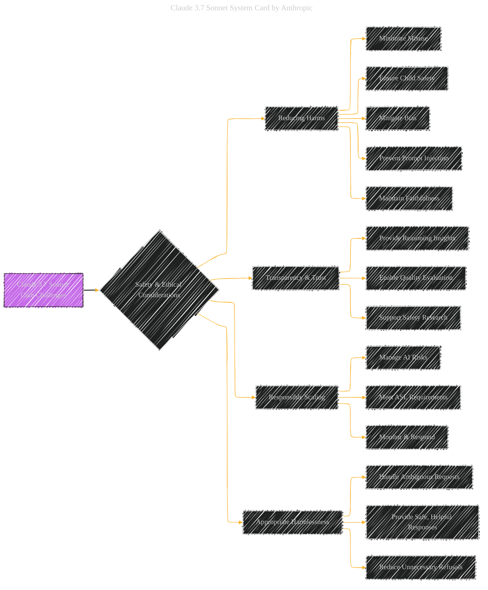
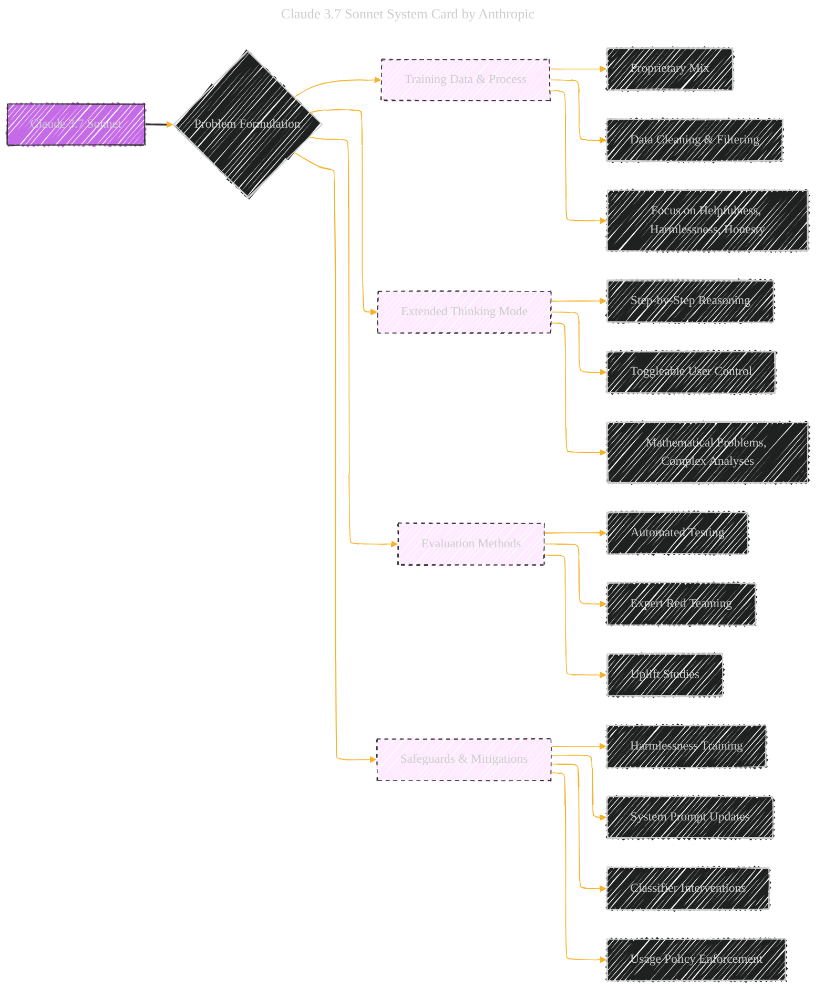
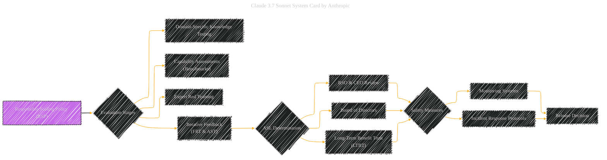

# Claude 3.7 Sonnet System Card Paper Overview
> **Disclaimer:**
>
> This document contains my personal notes on the topic,
> compiled from publicly available documentation and various cited sources.
> The materials are intended for educational purposes, personal study, and reference.
> The content is dual-licensed:
> 1. **MIT License:** Applies to all code implementations (Swift, Mermaid, and other programming languages).
> 2. **Creative Commons Attribution 4.0 International License (CC BY 4.0):** Applies to all non-code content, including text, explanations, diagrams, and illustrations.
---

## Claude 3.7 Sonnet System Card Paper Overview - A Diagrammatic Guide 

These diagrams below  provide a visual summary of the problem formulation for Claude 3.7 Sonnet, highlighting the core challenges, the relationships between components, and the key steps in the responsible scaling policy.

---

### Diagram 1: Core Challenges

This diagram visualizes the main challenges Anthropic is addressing with Claude 3.7 Sonnet.

### Explanation

*   **Purpose:** This diagram summarizes the core challenges related to the development and deployment of Claude 3.7 Sonnet.
*   **Nodes:** The main node "Claude 3.7 Sonnet: Core Challenges" is connected to the four main challenge areas (Reducing Harms, Transparency & Trust, Responsible Scaling, and Appropriate Harmlessness).
*   **Sub-Nodes:** Each challenge area is further broken down into more specific sub-challenges.
*   **Style:** The style ensures easy visual interpretation of the challenges.

---

### Diagram 2: Dependencies and Relationships

This diagram emphasizes the dependencies and relationships between the various aspects of the problem formulation.

### Explanation

*   **Purpose:** To showcase the relationship between the different components.
*   **Nodes:**  The main node is "Claude 3.7 Sonnet", which branches out to the main aspects of the document (Training Data, Extended Thinking, Evaluation Methods, and Safeguards).
*   **Sub-Nodes:** Each aspect is further broken down into its key components.
*   **Style:** The style allows for an easy visual interpretation of the relationship between topics.

---

### Diagram 3: Responsible Scaling Policy (RSP) Flow

This diagram visualizes the RSP and how the ASL is determined.

### Explanation

*   **Purpose:** Shows the process behind the RSP and the steps taken.
*   **Nodes:**  The main node is the "Responsible Scaling Policy (RSP)", which goes through evaluation stages and finally a release decision is made.
*   **Style:** The style allows for an easy visual interpretation of the process.

---
**Licenses:**

- **MIT License:**   - Full text in [LICENSE](LICENSE) file.
- **Creative Commons Attribution 4.0 International:**  - Legal details in [LICENSE-CC-BY](LICENSE-CC-BY) and at [Creative Commons official site](http://creativecommons.org/licenses/by/4.0/).

---