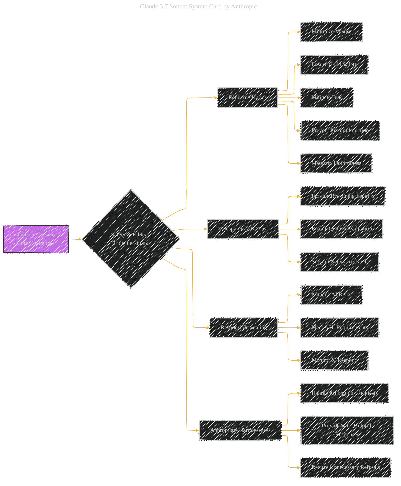

> ⚠️🏗️🚧🦺🧱🪵🪨🪚🛠️👷
> 
> This is a working draft in progress
> 
> 
>
> gif image is provided by [Giphy](https://giphy.com)
> 
> ⚠️🏗️🚧🦺🧱🪵🪨🪚🛠️👷


----


# Claude 3.7 Sonnet System Card Paper Overview
<details open>
<summary>Click to show/hide the full disclaimer.</summary>
   
> <ins>📢 **Disclaimer** 🚨</ins>
>
> This document contains my personal notes on the topic,
> compiled from publicly available documentation and various cited sources.
> The materials are intended for educational purposes (<ins>sometimes, entertainment purposes</ins>), personal study, and reference.
> The content is dual-licensed:
> 1. **MIT License:** Applies to all code implementations (Swift, Mermaid, and other programming languages).
> 2. **Creative Commons Attribution-ShareAlike 4.0 International License (CC BY-SA 4.0):** Applies to all non-code content, including text, explanations, diagrams, and illustrations.

</details>

---

## Claude 3.7 Sonnet System Card Paper Overview - A Diagrammatic Guide 


These diagrams below  provide a visual summary of the problem formulation for Claude 3.7 Sonnet, highlighting the core challenges, the relationships between components, and the key steps in the responsible scaling policy.

---


### Diagram 1: Core Challenges

This diagram visualizes the main challenges Anthropic is addressing with Claude 3.7 Sonnet.




### Explanation

*   **Purpose:** This diagram summarizes the core challenges related to the development and deployment of Claude 3.7 Sonnet.
*   **Nodes:** The main node "Claude 3.7 Sonnet: Core Challenges" is connected to the four main challenge areas (Reducing Harms, Transparency & Trust, Responsible Scaling, and Appropriate Harmlessness).
*   **Sub-Nodes:** Each challenge area is further broken down into more specific sub-challenges.
*   **Style:** The style ensures easy visual interpretation of the challenges.

---

### Diagram 2: Dependencies and Relationships

This diagram emphasizes the dependencies and relationships between the various aspects of the problem formulation.


### Explanation

*   **Purpose:** To showcase the relationship between the different components.
*   **Nodes:**  The main node is "Claude 3.7 Sonnet", which branches out to the main aspects of the document (Training Data, Extended Thinking, Evaluation Methods, and Safeguards).
*   **Sub-Nodes:** Each aspect is further broken down into its key components.
*   **Style:** The style allows for an easy visual interpretation of the relationship between topics.

---

### Diagram 3: Responsible Scaling Policy (RSP) Flow

This diagram visualizes the RSP and how the ASL is determined.


### Explanation

*   **Purpose:** Shows the process behind the RSP and the steps taken.
*   **Nodes:**  The main node is the "Responsible Scaling Policy (RSP)", which goes through evaluation stages and finally a release decision is made.
*   **Style:** The style allows for an easy visual interpretation of the process.


----

```mermaid
---
title: "❓...CongLeSolutionX....❓"
author: "Cong Le"
version: "1.0"
license(s): "MIT, CC BY-SA 4.0"
copyright: "Copyright (c) 2025 Cong Le. All Rights Reserved."
config:
  theme: base
---
%%%%%%%% Mermaid version v11.4.1-b.14
%%{
  init: {
    'flowchart': { 'htmlLabels': false },
    'fontFamily': 'Bradley Hand',
    'themeVariables': {
      'primaryColor': '#fc82',
      'primaryTextColor': '#F8B229',
      'primaryBorderColor': '#27AE60',
      'secondaryColor': '#5229',
      'secondaryTextColor': '#6C3483',
      'lineColor': '#F8B229',
      'fontSize': '20px'
    }
  }
}%%
flowchart LR
    My_Meme@{ img: "https://raw.githubusercontent.com/CongLeSolutionX/CongLeSolutionX/refs/heads/main/assets/images/My-meme-and-question-marks-open-book-old-characters-background.png", label: "..🙉..👀..📖..", pos: "b", w: 200, h: 150, constraint: "off" }
   
    Link_to_my_profile{{"<a href='https://github.com/CongLeSolutionX' target='_blank'>Click here if you care about my profile</a>"}}

  Closing_quote@{ shape: braces, label: "..👀..<br/>'Unfortunately,<br/>no one can be told<br/> what the Matrix is.<br/>You have to see it<br/>for yourself'<br/>...📚..<br/>-<ins>Morpheus,<br/>a character from the movie The Matrix 1999</ins>"}

   Closing_quote ~~~ My_Meme

    My_Meme animatingEdge@--> Link_to_my_profile
  
  animatingEdge@{ animate: true }

```

---
><b>Licenses</b>:
>
>- <b>MIT License</b>:  [](LICENSE) - Full text in [LICENSE](LICENSE) file.
>- <b>Creative Commons Attribution-ShareAlike 4.0 International</b>: [CC BY-SA 4.0](https://creativecommons.org/licenses/by-sa/4.0/) [](https://creativecommons.org/licenses/by-sa/4.0/) - Legal details in [LICENSE-CC-BY-SA-4.0](THE_PAST/LICENSE-CC-BY-SA-4.0) and at [Creative Commons official site](https://creativecommons.org/licenses/by-sa/4.0/).
>
---