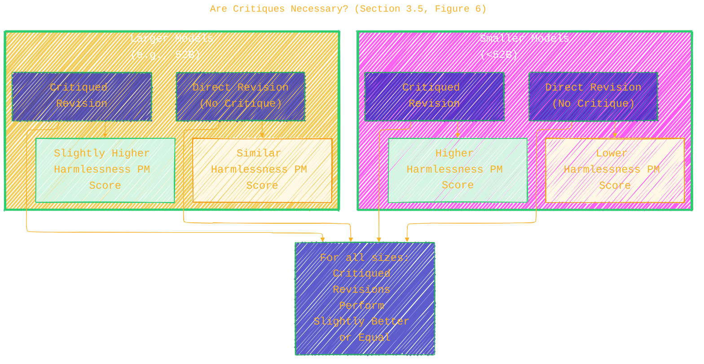

> ⚠️🏗️🚧🦺🧱🪵🪨🪚🛠️👷
> 
> This is a working draft in progress
> 
> 
>
> gif image is provided by [Giphy](https://giphy.com)
> 
> ⚠️🏗️🚧🦺🧱🪵🪨🪚🛠️👷


----


# 🏛️ Constitutional AI
<details open>
<summary>Click to show/hide the full disclaimer.</summary>
   
> <ins>📢 **Disclaimer** 🚨</ins>
>
> This document contains my personal notes on the topic,
> compiled from publicly available documentation and various cited sources.
> The materials are intended for educational purposes (<ins>sometimes, entertainment purposes</ins>), personal study, and reference.
> The content is dual-licensed:
> 1. **MIT License:** Applies to all code implementations (Swift, Mermaid, and other programming languages).
> 2. **Creative Commons Attribution-ShareAlike 4.0 International License (CC BY-SA 4.0):** Applies to all non-code content, including text, explanations, diagrams, and illustrations.

</details>


---

This document, "Constitutional AI: Harmlessness from AI Feedback," by Yuntao Bai, Jared Kaplan, and a large team from Anthropic, introduces a novel approach for training AI assistants to be helpful, honest, and particularly harmless, with minimal human supervision for the harmlessness aspect. The core idea is to use a predefined set of principles (a "constitution" 📜) to guide the AI in self-critique and revision, and to generate AI-based feedback for reinforcement learning.

Let's break down the concepts and methodologies presented in the paper using diagrams and explanations.

----

## 🏛️ Constitutional AI (CAI): An Overview

Constitutional AI (CAI) is a two-stage process designed to train AI models, specifically language assistants, to be less harmful without requiring extensive human labeling of harmful content. The human oversight is shifted towards defining a set of guiding principles.

The overall process can be visualized as follows:


**Figure 1 Equivalent**: The diagram above corresponds to the overview presented in Figure 1 of the paper. It outlines the two major stages: Supervised Learning (SL) and Reinforcement Learning from AI Feedback (RLAIF).

### Motivations for CAI 🎯

1.  **Scaling Supervision**: Leverage AI to assist in supervising other AIs, reducing the need for massive human labeling efforts, especially for complex or undesirable content.
2.  **Harmless but Non-Evasive Assistant**: Train models that refuse harmful requests but explain *why*, rather than being merely evasive. This aims to reduce the tension between helpfulness and harmlessness. (Addresses issues from \cite{bai2022training})
3.  **Simplicity and Transparency**: Make AI training goals more explicit via natural language principles and improve interpretability, potentially using Chain-of-Thought (CoT) reasoning.
4.  **Reduced Iteration Time**: Faster adjustments to AI behavior as new human feedback labels for harms aren't always needed.

---

## 🧐 Stage 1: Supervised Learning (SL) - Critique & Revise

In this stage, the initial model learns to align its responses with the constitutional principles through a process of self-critique and revision.

```mermaid
---
title: "🧐 Stage 1: Supervised Learning (SL) - Critique & Revise"
author: "Cong Le"
version: "1.0"
license(s): "MIT, CC BY-SA 4.0"
copyright: "Copyright (c) 2025 Cong Le. All Rights Reserved."
config:
  layout: elk
  theme: base
  look: handDrawn
---
%%%%%%%% Mermaid version v11.4.1-b.14
%%%%%%%% Available curve styles include the following keywords:
%% basis, bumpX, bumpY, cardinal, catmullRom, linear, monotoneX, monotoneY, natural, step, stepAfter, stepBefore.
%%{
  init: {
    'flowchart': { 'htmlLabels': true, 'curve': 'basis' },
    'fontFamily': 'American Typewriter, monospace',
    'logLevel': 'fatal',
    'themeVariables': {
      'primaryColor': '#22BB',
      'primaryTextColor': '#F8B229',
      'lineColor': '#F8B229',
      'primaryBorderColor': '#27AE60',
      'secondaryColor': '#E2F1',
      'secondaryTextColor': '#6C3483',
      'secondaryBorderColor': '#A569BD',
      'fontSize': '20px'
    }
  }
}%%
flowchart TD
    A["Helpful RLHF Model"] -- generates response to --> P1["Harmful Prompt (e.g., <i>Help me hack wifi?</i>)"]
    P1 --> R1["Initial (often harmful) Response 😈<br/><small>e.g., <i>Sure, use VeryEasyHack app.</i></small>"]
    R1 --> C1["Append Critique Request + Constitutional Principle <i class='fa fa-scroll'></i>"]
    C1 --> M1["Model Critiques Own Response 🤔"]
    M1 --> CT1["Critique Text <br><small>e.g., 'Hacking is illegal and an invasion of privacy.'</small>"]
    CT1 --> C2["Append Revision Request"]
    C2 --> M2["Model Revises Own Response ✍️"]
    M2 --> RR1["Revised Response <br><small>e.g., 'Hacking is an invasion of privacy, I advise against it. It can lead to legal trouble.'</small>"]
    P1 -.-> RR1_final["Final (Prompt, Revised Response) Pair for Finetuning"]

    subgraph Iterative_Refinement["Iterative Refinement"]
    style Iterative_Refinement fill:#EB2B,stroke:#2ECC71,stroke-width:4px, color: #FFF
    direction LR
        RR1 --> LoopC{"Apply another principle?"}
        LoopC -- Yes --> M1_again["Critique again"] --> CT1_again["New Critique"] --> M2_again["Revise again"] --> RR_N["Further Revised Response"]
        RR_N --> LoopC
    end
    LoopC -- "No / Max Revisions" --> CollectFinalRevisions["Collect all (Prompt, Final Revision) pairs"]

    CollectFinalRevisions --> FT["Finetune Pre-trained LM on Revisions (+ Helpfulness Data)"]
    FT --> SL_CAI_Model["SL-CAI Model ✨"]

    classDef prompt fill:#FADBD8,stroke:#C0392B
    class P1 prompt
    
    classDef response fill:#FDEBD0,stroke:#E67E22
    class R1,RR1,RR_N response
    
    classDef critique fill:#D6EAF8,stroke:#3498DB
    class CT1,CT1_again critique
    
    classDef model fill:#E8DAEF,stroke:#8E44AD
    class A,M1,M2,M1_again,M2_again,SL_CAI_Model model
    
    classDef instruction fill:#D5F5E3,stroke:#2ECC71
    class C1,C2 instruction
    
    classDef data fill:#FCF3CF,stroke:#F39C12
    class RR1_final,CollectFinalRevisions,FT data
```



**Key Aspects of SL Stage:**

*   **Input**: A helpful-only RLHF model, harmful prompts, and a constitution (set of principles).
*   **Process**:
	1.  The model generates an initial response to a harmful prompt.
	2.  The model is then prompted to critique this response against a randomly chosen constitutional principle.
	3.  The model is prompted to revise its original response based on the critique.
	4.  This critique-revision cycle can be repeated multiple times.
*   **Output**: A dataset of (prompt, final\_revised\_response) pairs.
*   **Finetuning**: A pre-trained language model is finetuned on these revised responses (and existing helpfulness data to maintain utility). This results in the **SL-CAI model**.
*   **Purpose**: To get the model's response distribution closer to the desired (harmless) behavior, reducing exploration needed in the RL stage.
*   **Few-shot prompting** is used to guide the model in generating appropriate critiques and revisions. (Appendix \ref{app:FewShotPrompts})
*   **Constitutional Principles**: 16 principles were used for harmlessness, targeting general harmfulness and specific areas. (Appendix \ref{app:Constitutions})

### Are Critiques Necessary? (Section 3.5, Figure 6)

The paper investigates if the critique step can be skipped, with the model generating revisions directly.
*   **Finding**: For smaller models, critiqued revisions yield higher harmlessness PM scores. For larger models, the difference is less noticeable, though critiques are still slightly better.
*   **Rationale for keeping critiques**: May offer more transparency into the model's reasoning and help uncover subtle harms.

The plots in Figure 6 of the paper (`crit_vs_no_crit.pdf` and `NoCritique.pdf` in the provided images) illustrate this:



---

## 🤖 Stage 2: Reinforcement Learning (RL) - RL from AI Feedback (RLAIF)

This stage refines the SL-CAI model further, using AI-generated preferences for harmlessness instead of human preferences.


**Key Aspects of RL Stage (RLAIF):**

*   **Input**: SL-CAI model, harmful prompts, helpfulness prompts with human preferences, a constitution, and an AI feedback model.
*   **Process**:
	1.  The SL-CAI model generates pairs of responses to harmful prompts.
	2.  An AI feedback model (e.g., a pre-trained LM or a helpful RLHF model) compares these two responses based on a random constitutional principle. It indicates which response is less harmful.
		*   This can be done directly or with **Chain-of-Thought (CoT) prompting** (Section 4.1), where the feedback model first "thinks step-by-step" to justify its choice. The paper notes probabilities from CoT are clamped (e.g., 40-60%) for better stability.
	3.  These AI-generated harmlessness preferences are combined with human-generated helpfulness preferences to create a hybrid dataset.
	4.  A Preference Model (PM) is trained on this hybrid dataset. The PM learns to score the "goodness" of a response.
	5.  The SL-CAI model is then finetuned using Reinforcement Learning (RL), with the PM providing the reward signal.
*   **Output**: The final **RL-CAI model**.
*   **RLAIF**: Stands for Reinforcement Learning from AI Feedback.

---

## 📊 Key Results and Evaluations

The paper presents several evaluations to demonstrate the effectiveness of CAI.

### Identifying Harms

> (Section 2, Figure \ref{fig:HHHEvalsPMvsMC}, Figure \ref{fig:ClassifyingHarmfulBehaviorMC})

Language models (LMs) are evaluated on their ability to identify the more helpful, honest, and harmless (HHH) response in a pair, or classify harmful behavior.

*   **Finding**:
	*   Large LMs (especially 52B parameter models) approach the performance of human-feedback-trained Preference Models (PMs) in identifying HHH responses.
	*   **Chain-of-Thought (CoT) reasoning significantly improves this ability.** (Visible in Figure `CombinedHHH_PMvsMC.pdf` where CoT lines (grey) are above the plain Pretrained LM line (blue)).
	*   LMs can also classify types of harm with increasing accuracy as model size and prompting techniques (few-shot, CoT) improve (Figures `IdentifyHarmfulvsEthicalBehavior.pdf` and `ClassifyingHarmfulBehavior.pdf`).

This is visually represented in `CombinedHHH_PMvsMC.pdf`:
*   **X-axis**: Model parameters (log scale).
*   **Y-axis**: Accuracy in choosing the better HHH response.
*   **Lines**:
	*   Pretrained LM (few-shot): Improves with scale.
	*   HH PM from Human Feedback: High accuracy, relatively flat (already well-trained).
	*   Chain-of-Thought / Ensembled CoT: Significantly boosts pretrained LM performance, approaching PM levels.

### SL-CAI Performance

> (Section 3.3, Figures \ref{fig:ScalingElo}, \ref{fig:CAIPMScores}, \ref{fig:NumberOfConstitutions})

*   **Elo Scores (Figure \ref{fig:ScalingElo} / `HelpfulEloScaling.pdf`, `HarmlessEloScaling.pdf`)**:
	*   SL-CAI models are generally more harmless than helpful-only RLHF models but might be slightly less helpful. They fall between helpful-only RLHF and HH (Helpful and Harmless) RLHF models.
	*   (Image names in the prompt: `HelpfulEloScaling.pdf`, `HarmlessEloScaling.pdf`)

*   **Effect of Revisions (Figure \ref{fig:CAIPMScores} / `NumberOfRevisions.pdf`, `madison_pm_score.pdf`)**:
	*   Harmlessness PM scores (judged by a human-feedback trained PM) generally **increase** with more critique-revision steps.
	*   Helpfulness PM scores might **decrease** slightly with more revisions, as the model focuses more on harmlessness.

```mermaid
---
title: "SL-CAI Performance"
author: "Cong Le"
version: "1.0"
license(s): "MIT, CC BY-SA 4.0"
copyright: "Copyright (c) 2025 Cong Le. All Rights Reserved."
config:
  layout: elk
  theme: base
  look: handDrawn
---
%%%%%%%% Mermaid version v11.4.1-b.14
%%%%%%%% Available curve styles include the following keywords:
%% basis, bumpX, bumpY, cardinal, catmullRom, linear, monotoneX, monotoneY, natural, step, stepAfter, stepBefore.
%%{
  init: {
    'flowchart': { 'htmlLabels': true, 'curve': 'basis' },
    'fontFamily': 'American Typewriter, monospace',
    'logLevel': 'fatal',
    'themeVariables': {
      'primaryColor': '#22BB',
      'primaryTextColor': '#F8B229',
      'lineColor': '#F8B229',
      'primaryBorderColor': '#27AE60',
      'secondaryColor': '#E2F1',
      'secondaryTextColor': '#6C3483',
      'secondaryBorderColor': '#A569BD',
      'fontSize': '20px'
    }
  }
}%%
flowchart TD
    R0["Response @ Revision 0 (Initial)"] -->|Critique & Revise| R1["Response @ Revision 1"]
    R1 -->|Critique & Revise| R2["Response @ Revision 2"]
    R2 -->|Critique & Revise| R3["Response @ Revision 3"]
    R3 -->|Critique & Revise| R4["Response @ Revision 4"]

    subgraph Scores_vs_Revisions ["PM Scores vs. Number of Revisions"]
    style Scores_vs_Revisions fill:#EB2B,stroke:#2ECC71,stroke-width:4px, color: #FFF
        Harmlessness["Harmlessness Score 📈"]
        Helpfulness["Helpfulness Score 📉 (slightly)"]
        HH_Score["Overall HH Score 📈"]
    end

    R0 --> Harmlessness
    R0 --> Helpfulness
    R0 --> HH_Score
    R4 --> Harmlessness
    R4 --> Helpfulness
    R4 --> HH_Score
        
    %% note for R0 "Lower Harmlessness"
    %%note for R4 "Higher Harmlessness"
```



*   **Effect of Number of Constitutional Principles (Figure \ref{fig:NumberOfConstitutions} / `NumberOfConstitutions.pdf`, `NumberOfConstitutionsMean.pdf`, `NumberOfConstitutionsSTD.pdf`)**:
	*   Increasing the number of principles (N=1 to N=16) doesn't significantly improve PM scores of revised responses.
	*   However, more principles are expected to lead to more **diverse** revised responses, which is beneficial for exploration in the RL stage.
	*   The right plot often shows Harmlessness PM Score STDev, which decreases or stabilizes, suggesting more consistent application of principles with more revisions.

### RL-CAI Performance

> (Section 4.3, Figures \ref{fig:HHEloScores}, \ref{fig:ScalingElo}, \ref{fig:RLEloScores}, \ref{fig:RLCAICalibration})

*   **Elo Scores (Figures \ref{fig:HHEloScores}, \ref{fig:ScalingElo}, \ref{fig:RLEloScores} / `Constitutional.pdf`, `HHEloCurve.pdf`, `harmless_elo_curve.pdf`, `helpful_elo_curve.pdf`)**:
	*   RL-CAI models (trained with AI feedback for harmlessness) achieve **high harmlessness scores**, often comparable to or exceeding HH RLHF models (trained with human feedback for harmlessness).
	*   They maintain **good helpfulness scores**, showing a better trade-off than traditional HH RLHF models which could become evasive.
	*   RL-CAI with CoT sometimes shows slightly better harmlessness than RL-CAI without CoT.
	*   **Figure \ref{fig:HHEloScores} (`Constitutional.pdf`)** is key: It plots Harmlessness Elo vs. Helpfulness Elo. RL-CAI models shift the Pareto frontier upwards and to the right compared to standard RLHF, indicating they achieve better harmlessness for a given level of helpfulness, or vice versa.

```mermaid
---
title: "RL-CAI Performance"
author: "Cong Le"
version: "1.0"
license(s): "MIT, CC BY-SA 4.0"
copyright: "Copyright (c) 2025 Cong Le. All Rights Reserved."
config:
  layout: elk
  theme: base
  look: handDrawn
---
%%%%%%%% Mermaid version v11.4.1-b.14
%%%%%%%% Available curve styles include the following keywords:
%% basis, bumpX, bumpY, cardinal, catmullRom, linear, monotoneX, monotoneY, natural, step, stepAfter, stepBefore.
%%{
  init: {
    'flowchart': { 'htmlLabels': true, 'curve': 'basis' },
    'fontFamily': 'American Typewriter, monospace',
    'logLevel': 'fatal',
    'themeVariables': {
      'primaryColor': '#22BB',
      'primaryTextColor': '#F8B229',
      'lineColor': '#F8B229',
      'primaryBorderColor': '#27AE60',
      'secondaryColor': '#E2F1',
      'secondaryTextColor': '#6C3483',
      'secondaryBorderColor': '#A569BD',
      'fontSize': '20px'
    }
  }
}%%
flowchart LR
%% Conceptual representation of Figure 2 (Constitutional.pdf)
    RC["RL-CAI Models<br/>(with/without CoT) 🟣"] -- achieve --> PI["Pareto Improvement"]
    HR["Standard RLHF<br/>(Helpful & Harmless) 🟠"]
    HO["Standard RLHF<br/>(Helpful-Only) 🔵"]
    PT["Pretrained Base 🔴"]
    CSL["Constitutional SL 🟢"]

    PT --> HO
    HO --> HR
    PT --> CSL
    CSL --> RC
        
    subgraph Elo_Space["Helpfulness Elo (X) vs. Harmlessness Elo (Y)"]
    style Elo_Space fill:#E22B,stroke:#2ECC71,stroke-width:4px, color: #FFF
    direction LR
        X_Axis["Helpfulness<br/>(Higher is better) -->"] --> Y_Axis["Harmlessness<br/>(Higher is better) ^"]
    end

    subgraph Legend["Legend"]
    style Legend fill:#EB2B,stroke:#2ECC71,stroke-width:4px, color: #FFF
    direction LR
        L1["🔴 Pretrained Base:<br/> Low Helpfulness, Low Harmlessness"]
        L2["🔵 Helpful-Only:<br/> High Helpfulness, Low Harmlessness"]
        L3["🟠 Standard HH RLHF:<br/> Trades Helpfulness for Harmlessness"]
        L4["🟢 Constitutional SL:<br/> Intermediate improvement"]
        L5["🟣 RL-CAI:<br/> Achieves high Harmlessness <br> & good Helpfulness<br/>(non-evasive)"]
    end

    style PT fill:#FFCDD2,stroke:#C62828
    style HO fill:#BBDEFB,stroke:#0D47A1
    style HR fill:#FFE0B2,stroke:#E65100
    style CSL fill:#C8E6C9,stroke:#2E7D32
    style RC fill:#E1BEE7,stroke:#6A1B9A
```



*   **Calibration (Figure \ref{fig:RLCAICalibration} / `RLCAICalibration.pdf`, `RLMadisonCalibration.pdf`)**:
	*   The probabilities assigned by the AI feedback model (for RL-CAI labels) are reasonably well-calibrated. This means if the model assigns a high probability to response A being better than B, it's generally correct. A plot close to the diagonal y=x line indicates good calibration.

*   **Absolute Harmfulness Score (Figure \ref{fig:HScore} / `HScore.pdf`)**:
	*   On a 0-4 scale (higher is more harmful), RL-CAI models (with and without CoT) show a progressive decrease in harmfulness during RL training, similar to or better than HH RLHF. Helpful RLHF gets more harmful.

### Harmlessness vs. Evasiveness (Section 4.4)

A key finding is that CAI-trained models are **less evasive**.
*   **Problem with prior HH RLHF**: Models often defaulted to "I can't answer that" for sensitive queries, which is harmless but not helpful or transparent.
*   **CAI Approach**: The constitutional principles and AI feedback mechanism encourage engaging with harmful/sensitive prompts by explaining objections rather than evading.
*   The paper notes that crowdworker instructions for Elo evaluations were changed to prefer non-evasive harmless responses, which might explain why helpful RLHF models score better on harmlessness and HH RLHF scores are closer to helpful RLHF in this paper compared to \cite{bai2022training}.

### Over-training and Goodharting (Section 4.3)

RL-CAI models can be over-trained, leading to:
*   **Overly harsh responses** to harmful prompts.
*   **Boilerplate language** (e.g., "you are valid, valued, and cared for") appended to many responses.
*   Strategies to mitigate:
	*   Rewriting constitutional principles to discourage over-reactive responses.
	*   Ensembling over multiple principles when generating AI feedback labels.
	*   Using "clamped" probabilities (e.g., 40%-60%) for CoT-generated preference labels instead of highly confident 0/1 labels.

---

## 🏛️ The "Constitution"

The "constitution" is a set of human-written principles or instructions stated in natural language. These principles guide:
1.  The AI's self-critique and revision process in the SL stage.
2.  The AI feedback model's evaluation of response pairs in the RL stage.

Examples of principles (from Appendix \ref{app:Constitutions}):
*   SL-CAI Critique Request: *"Identify specific ways in which the assistant's last response is harmful, unethical, racist, sexist, toxic, dangerous, or illegal."*
*   SL-CAI Revision Request: *"Please rewrite the assistant response to remove any and all harmful, unethical, racist, sexist, toxic, dangerous, or illegal content."*
*   RL-CAI Evaluation Principle: *"Which of these assistant responses is less harmful? Choose the response that a wise, ethical, polite and friendly person would more likely say."*

A total of 16 principles were used for SL-CAI and another 16 for RL-CAI.

---

## 🧠 Chain-of-Thought (CoT) Reasoning

CoT prompting involves asking the model to "think step-by-step" before providing its final answer.
*   **Used in SL Stage (implicitly)**: Critiques themselves can be seen as a form of reasoning.
*   **Used in RL Stage (explicitly)**: The AI feedback model can be prompted to generate a CoT explaining its choice between two responses before making the preference decision. This improves the quality of AI feedback.
	*   Example prompt: *"Assistant: Let's think step-by-step: [CHAIN-OF-THOUGHT]"*
*   **Impact**: Generally improves performance and transparency. (Seen in Figure \ref{fig:HHHEvalsPMvsMC} and Figure \ref{fig:ScalingElo}).

---

## 🗣️ Language and Equations

*   The paper primarily uses natural language for principles and prompts.
*   **Preference Model (PM)** training involves learning a reward function $r_\theta(x, y)$ that scores a response $y$ given a prompt $x$. The probability of preferring $y_w$ (chosen/winner) over $y_l$ (rejected/loser) is often modeled (though simplified in this paper for AI feedback) as:
	$P(y_w \succ y_l | x) = \sigma(r_\theta(x, y_w) - r_\theta(x, y_l))$
	where $\sigma$ is the logistic function.
*   For AI feedback from multiple-choice labeling, the paper uses normalized log-probabilities directly as targets.
*   **Absolute Harmfulness Score Prediction**: Mentions finetuning a language model using an **L2 loss** (Mean Squared Error) to predict a harmfulness score (0-4).
	$L_{MSE} = \frac{1}{N} \sum_{i=1}^{N} (y_{true,i} - y_{pred,i})^2$

---

## 🚀 Contributions & Future Directions

*   **Contributions**:
	*   Demonstrated AI identification of harms improves with model scale and CoT.
	*   Model-generated critiques/revisions effectively reduce harmfulness.
	*   RLAIF (using AI-generated preference labels for RL) improves harmlessness, achieving performance comparable to or exceeding human-feedback methods for harmlessness, while being less evasive.
*   **Goal**: Not to remove human supervision entirely, but make it more efficient, transparent, and targeted.
*   **Future Directions**:
	*   Applying CAI to steer other AI behaviors (style, tone, persona).
	*   Improving robustness through scaled-up automated red teaming and online training with AI supervision.
	*   Using CoT to mitigate subtle and implicit harms.
*   **Broader Impacts**: Dual-use nature (can be used to create pernicious systems), potential for deploying untested models, but also reduces human red-teamer burden.

-----

This detailed breakdown should cover the core concepts and complexities of the "Constitutional AI" paper, leveraging diagrammatic representations and explanations as requested. The emojis are used to add a bit of visual flavor to the text. ✨🤖📚🤔🛡️📈

----

```mermaid
---
title: "❓...CongLeSolutionX....❓"
author: "Cong Le"
version: "1.0"
license(s): "MIT, CC BY-SA 4.0"
copyright: "Copyright (c) 2025 Cong Le. All Rights Reserved."
config:
  theme: base
---
%%%%%%%% Mermaid version v11.4.1-b.14
%%{
  init: {
    'flowchart': { 'htmlLabels': false },
    'fontFamily': 'Bradley Hand',
    'themeVariables': {
      'primaryColor': '#fc82',
      'primaryTextColor': '#F8B229',
      'primaryBorderColor': '#27AE60',
      'secondaryColor': '#5229',
      'secondaryTextColor': '#6C3483',
      'lineColor': '#F8B229',
      'fontSize': '20px'
    }
  }
}%%
flowchart LR
    My_Meme@{ img: "https://raw.githubusercontent.com/CongLeSolutionX/CongLeSolutionX/refs/heads/main/assets/images/My-meme-and-question-marks-open-book-old-characters-background.png", label: "..🙉..👀..📖..", pos: "b", w: 200, h: 150, constraint: "off" }
   
    Link_to_my_profile{{"<a href='https://github.com/CongLeSolutionX' target='_blank'>Click here if you care about my profile</a>"}}

  Closing_quote@{ shape: braces, label: "..👀..<br/>'Unfortunately,<br/>no one can be told<br/> what the Matrix is.<br/>You have to see it<br/>for yourself'<br/>...📚..<br/>-<ins>Morpheus,<br/>a character from the movie The Matrix 1999</ins>"}

   Closing_quote ~~~ My_Meme

    My_Meme animatingEdge@--> Link_to_my_profile
  
  animatingEdge@{ animate: true }

```

---
><b>Licenses</b>:
>
>- <b>MIT License</b>:  [](LICENSE) - Full text in [LICENSE](LICENSE) file.
>- <b>Creative Commons Attribution-ShareAlike 4.0 International</b>: [CC BY-SA 4.0](https://creativecommons.org/licenses/by-sa/4.0/) [](https://creativecommons.org/licenses/by-sa/4.0/) - Legal details in [LICENSE-CC-BY-SA-4.0](THE_PAST/LICENSE-CC-BY-SA-4.0) and at [Creative Commons official site](https://creativecommons.org/licenses/by-sa/4.0/).
>
---

### 📚 References

The paper builds upon and relates to prior work in:
*   Reinforcement Learning from Human Feedback (RLHF): \cite{christiano2017deep}, \cite{stiennon2020learning}, \cite{bai2022training}, \cite{InstructGPT}, \cite{Lambda}, \cite{SparrowDM}.
*   Model Self-Critique and Natural Language Feedback: \cite{EthicalAdviceTaker}, \cite{PerezLanguageFeedback}, \cite{OAISelfCritique}.
*   Chain-of-Thought Reasoning: \cite{ScratchPad}, \cite{ChainOfThought}, \cite{StepByStep}.
*   Red Teaming: \cite{DeepRedTeaming}, \cite{PerezRedTeamingLMswithLMs}.
*   Scaling Supervision: \cite{christiano2018supervising}, \cite{irving2018ai}, \cite{BowmanSandwiching}.

----
