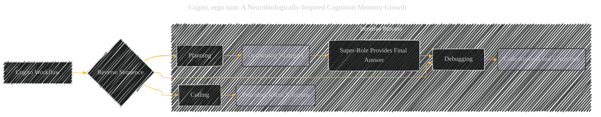
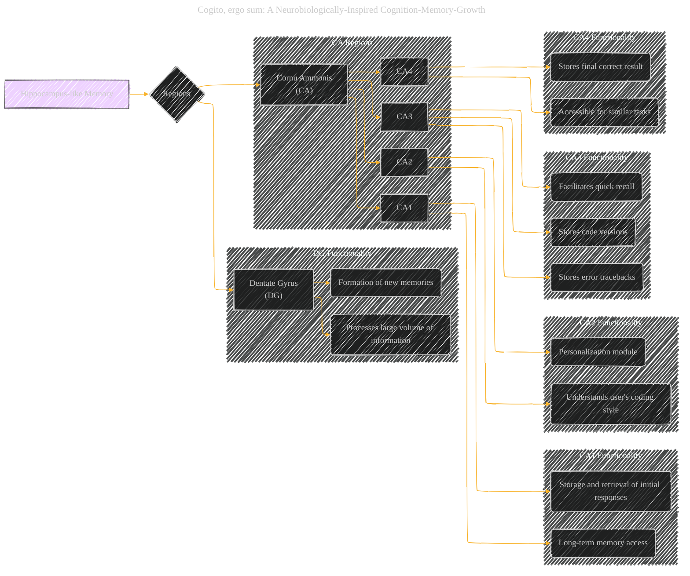
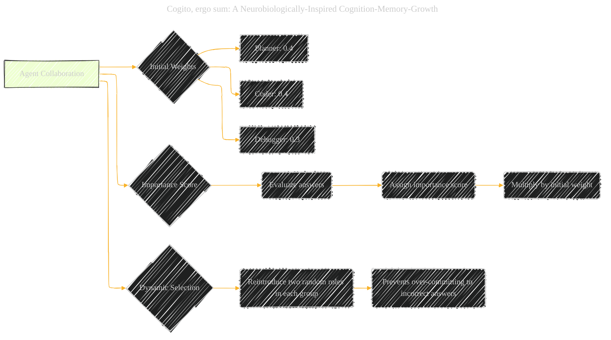
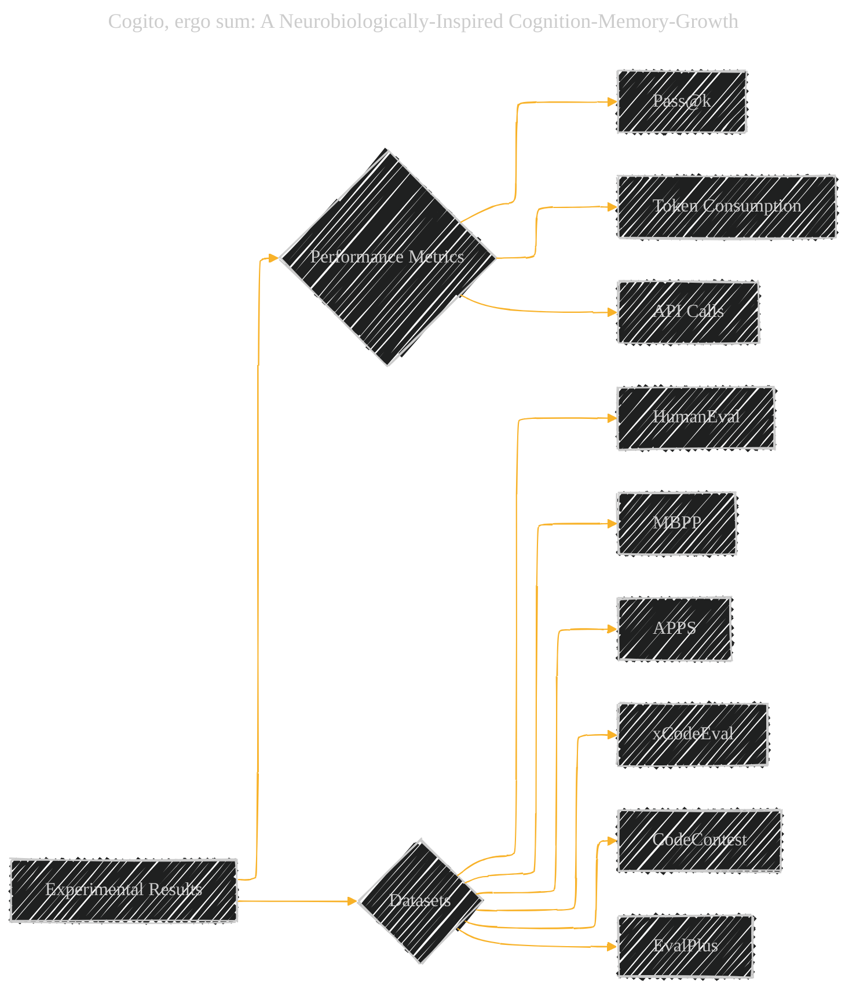

# Cogito, ergo sum: A Neurobiologically-Inspired Cognition-Memory-Growth
> **Disclaimer:**
>
> This document contains my personal notes on the topic,
> compiled from publicly available documentation and various cited sources.
> The materials are intended for educational purposes, personal study, and reference.
> The content is dual-licensed:
> 1. **MIT License:** Applies to all code implementations (Swift, Mermaid, and other programming languages).
> 2. **Creative Commons Attribution 4.0 International License (CC BY 4.0):** Applies to all non-code content, including text, explanations, diagrams, and illustrations.
---

## Cogito - A Diagrammatic Guide 

### I. Overall System Architecture

This section will describe the core architecture with primary components like:

*   Planner
*   Coder
*   Debugger
*   Super-Role
*   Hippocampus-like Memory

---

### II. Workflow

This section describes the sequence of actions of the Cogito System.

---

### III. Hippocampus-Inspired Memory

Detailing the different regions of the memory module.

---

### IV. Agent Collaboration Settings

Illustrating agent weights and how the best answers are selected.

----

### V. Results and Performance

Summarizing the quantitative results and comparisons to baselines. (This might be better presented as a table, but a graph could highlight key trends).

---
**Licenses:**

- **MIT License:**   - Full text in [LICENSE](LICENSE) file.
- **Creative Commons Attribution 4.0 International:**  - Legal details in [LICENSE-CC-BY](LICENSE-CC-BY) and at [Creative Commons official site](http://creativecommons.org/licenses/by/4.0/).

---