# Cogito, ergo sum: A Neurobiologically-Inspired Cognition-Memory-Growth
> **Disclaimer:**
>
> This document contains my personal notes on the topic,
> compiled from publicly available documentation and various cited sources.
> The materials are intended for educational purposes, personal study, and reference.
> The content is dual-licensed:
> 1. **MIT License:** Applies to all code implementations (Swift, Mermaid, and other programming languages).
> 2. **Creative Commons Attribution 4.0 International License (CC BY 4.0):** Applies to all non-code content, including text, explanations, diagrams, and illustrations.
---


## Cogito - A Diagrammatic Guide 


## 1. Core Inspiration: Neurobiology and Human Learning

This diagram visually summarizes the foundational inspirations behind the Cogito framework.


**Explanation:**

*   **Central Idea:**  Highlights the core concept of Cogito as a neurobiologically inspired system for code generation.
*   **Inspiration 1: Human Brain Specialization:** Illustrates the concept of functional specialization in the brain, drawing a parallel to Cogito's agent roles. It emphasizes the efficiency gained from specialized modules working together.
*   **Inspiration 2: Human Learning Process:** Depicts the growth-driven nature of human learning, moving from observation to expertise. This is contrasted with traditional code generation workflows and linked to Cogito's reverse approach.
*   **Goal:** States the primary objective of Cogito – improved code generation capabilities with reduced resource consumption.

----

## 2. Cogito Framework Overview

This diagram provides a high-level architecture of the Cogito framework, showing the interaction of its main components.


**Explanation:**

*   **Cogito Framework (Main Flow):**  This subgraph outlines the primary data flow within Cogito, starting from the input question, moving through agent roles and the memory module, leading to Super-Role evolution and the final code output.
*   **Hippocampus-like Memory Module (Detailed View):** This subgraph breaks down the memory module into its key regions (DG, CA1, CA2, CA3, CA4) and their respective functions. It shows the flow of information within the memory system, inspired by the hippocampus.
*   **Agent Roles:**  Highlights the core roles within Cogito: Debugger, Coder, and Planner, which interact with the memory module.
*   **Super-Role Evolution:** Shows how the Super-Role emerges from the learning process and utilizes accumulated expertise to provide the final answer.
*   **Information Flow Arrows:** Arrows indicate the direction of information exchange between components.

---

## 3. Reverse Learning Sequence and Super-Role Evolution

This diagram contrasts Cogito's reverse learning approach with the traditional sequence and illustrates how the Super-Role evolves through the learning stages.

```mermaid
---
title: "Cogito, ergo sum: A Neurobiologically-Inspired Cognition-Memory-Growth"
config:
  layout: elk
  look: handDrawn
  theme: dark
---
%%%%%%%% Mermaid version v11.4.1-b.14
%%%%%%%% Available curve styles include the following keywords:
%% basis, bumpX, bumpY, cardinal, catmullRom, linear, monotoneX, monotoneY, natural, step, stepAfter, stepBefore.
%%{
  init: {
    "graph": { "htmlLabels": false, 'curve': 'natural' },
    'fontFamily': 'Fantasy',
    'themeVariables': {
      'primaryColor': '#BB2528',
      'primaryTextColor': '#f529',
      'primaryBorderColor': '#7C0000',
      'lineColor': '#F8B229',
      'secondaryColor': '#006100',
      'tertiaryColor': '#fff'
    }
  }
}%%
flowchart LR
    subgraph Traditional_Sequence["Traditional Sequence<br>(Planning -> Coding -> Debugging)"]
    style Traditional_Sequence fill:#ee33,stroke:#333,stroke-width:1px
        TS_Plan[Planning] --> TS_Code[Coding]
        TS_Code --> TS_Debug[Debugging]
        TS_Debug --> TS_Final[Final Code]
        TS_Plan -- Standard Workflow --> TS_Code
        TS_Code -- Standard Workflow --> TS_Debug
    end
    
    subgraph Cogito_Reverse_Sequence["Cogito's Reverse Sequence<br>(Debugging -> Coding -> Planning)"]
    style Cogito_Reverse_Sequence fill:#ff22,stroke:#333,stroke-width:1px
        CR_Debug[Debugger Role] --> CR_Code[Coder Role]
        CR_Code --> CR_Plan[Planner Role]
        CR_Plan --> CR_Super["Super-Role<br>(Expert)"]
        CR_Debug -- Growth-Based Learning --> CR_Code
        CR_Code -- Growth-Based Learning --> CR_Plan
        CR_Plan -- Growth-Based Learning --> CR_Super
    end
    
    TS_Final --- CR_Super
    CR_Super --> FinalOutput["Final Output by Super-Role"]
    CR_Debug -- Stage 1: Debugging Focus --> CR_Code
    CR_Code -- Stage 2: Coding Focus --> CR_Plan
    CR_Plan -- Stage 3: Planning Focus --> CR_Super

```



**Explanation:**

*   **Traditional Sequence:** Depicts the conventional Planning -> Coding -> Debugging workflow used in many existing systems.
*   **Cogito's Reverse Sequence:** Illustrates Cogito's unique Debugging -> Coding -> Planning sequence, mirroring human skill acquisition.
*   **Super-Role Evolution:** Shows the progression from Debugger, to Coder, to Planner, culminating in the Super-Role, which embodies expertise gained through this reverse learning process.
*   **Growth-Based Learning Arrows:** Arrows labeled "Growth-Based Learning" highlight the progressive accumulation of knowledge and skills at each stage.
*   **Contrast and Final Output:**  Visually separates the traditional and Cogito approaches and emphasizes that the Super-Role produces the final output in Cogito.

---

## 4. Hippocampus-like Memory Module: Functional Regions

This diagram details the functional regions of the Hippocampus-like Memory Module and their specific roles in Cogito.


**Explanation:**

*   **Hippocampus-like Memory Module (Detailed Regions):**  Focuses specifically on the memory module and its internal components (DG, CA1, CA2, CA3, CA4), mirroring the structure of the human hippocampus.
*   **Functional Descriptions:** For each region (DG, CA1, CA2, CA3, CA4), the diagram includes a description node (`*_Desc`) and a function node (`*_Func`) to clearly define its role within Cogito's memory system.
*   **Information Flow within Memory:** Arrows illustrate the information flow between different CA regions and DG, showing how they are interconnected and contribute to memory processing.
*   **Personalization (CA2):**  Highlights the unique role of CA2 as the Personalization Module, allowing users to input their own code style.

---

## 5. Agent Collaboration and Role Switching

This diagram illustrates the agent collaboration within Cogito, focusing on the roles of Planner, Coder, and Debugger, and the concept of the Super-Role.

```mermaid
---
title: "Cogito, ergo sum: A Neurobiologically-Inspired Cognition-Memory-Growth"
config:
  layout: elk
  look: handDrawn
  theme: dark
---
%%%%%%%% Mermaid version v11.4.1-b.14
%%%%%%%% Available curve styles include the following keywords:
%% basis, bumpX, bumpY, cardinal, catmullRom, linear, monotoneX, monotoneY, natural, step, stepAfter, stepBefore.
%%{
  init: {
    "flowchart": { "htmlLabels": false, 'curve': 'natural' },
    'fontFamily': 'Fantasy',
    'themeVariables': {
      'primaryColor': '#BB2528',
      'primaryTextColor': '#f529',
      'primaryBorderColor': '#7C0000',
      'lineColor': '#F8B229',
      'secondaryColor': '#006100',
      'tertiaryColor': '#fff'
    }
  }
}%%
flowchart LR
    subgraph Agent_Team["Agent Team"]
    style Agent_Team fill:#aaf2,stroke:#333,stroke-width:2px
        Planner[Planner Role]
        Coder[Coder Role]
        Debugger[Debugger Role]
        SuperRole["Super-Role"]
    end

    subgraph Learning_Cycle_Group_1["Learning Cycle - Group 1"]
    style Learning_Cycle_Group_1 fill:#afa2,stroke:#333,stroke-width:1px
        G1_Debugger[Debugger] --> G1_Output["Output:<br>Debugged Code"]
    end
    subgraph Learning_Cycle_Group_2["Learning Cycle - Group 2"]
    style Learning_Cycle_Group_2 fill:#faa2,stroke:#333,stroke-width:1px
        G2_Coder[Coder] --> G2_Output["Output:<br>Initial Code Solution"]
    end
    subgraph Learning_Cycle_Group_3["Learning Cycle - Group 3"]
    style Learning_Cycle_Group_3 fill:#ffa2,stroke:#333,stroke-width:1px
        G3_Planner[Planner] --> G3_Output["Output:<br>Problem-Solving Strategy"]
    end

    Planner -- "Task Decomposition, Strategy" --> Coder
    Coder -- "Code Implementation" --> Debugger
    Debugger -- "Error Analysis, Correction" --> Planner

    SuperRole -- Rotation through Roles --> Agent_Team
    SuperRole -- Memory Accumulation --> SuperRole
    SuperRole -- "Independent Problem Solving<br>(Expert Phase)" --> FinalSolution[Final Solution]

    G1_Output -- Experience as Debugger --> SuperRole
    G2_Output -- Experience as Coder --> SuperRole
    G3_Output -- Experience as Planner --> SuperRole

    direction LR
    Agent_Team -- Roles in Cogito --> Learning_Cycle_Group_1
    Agent_Team -- Roles in Cogito --> Learning_Cycle_Group_2
    Agent_Team -- Roles in Cogito --> Learning_Cycle_Group_3
    
    Learning_Cycle_Group_1 -- Stage 1 --> Learning_Cycle_Group_2
    
    Learning_Cycle_Group_2 -- Stage 2 --> Learning_Cycle_Group_3
    
    Learning_Cycle_Group_3 -- Stage 3 --> SuperRole
    
```




**Explanation:**

*   **Agent Team:**  Lists the three core roles (Planner, Coder, Debugger) and the Super-Role as part of the Cogito agent team.
*   **Learning Cycles (Group 1, 2, 3):**  Represents the three stages of the reverse learning sequence as separate groups. Each group focuses on a specific role: Debugger, Coder, and Planner respectively.
*   **Role Interaction:** Arrows between Planner, Coder, and Debugger indicate the collaborative workflow within a traditional sequence (even though Cogito uses reverse order for learning, these roles still interact conceptually).
*   **Super-Role Rotation:**  The "SuperRole -- Rotation through Roles --> Agent Team" arrow signifies the Super-Role's dynamic participation across all roles during the learning process.
*   **Memory Accumulation:**  "SuperRole -- Memory Accumulation --> SuperRole" highlights that the Super-Role retains and builds upon experiences from each role.
*   **Super-Role Expertise & Final Solution:** Shows the Super-Role's transition to an expert capable of independent problem-solving and delivering the final code solution.
*   **Experience Feedback:** Arrows from `G*_Output` to `SuperRole` depict how the outputs of each learning stage (Debugger, Coder, Planner experiences) feed into the Super-Role's knowledge base.

-----

## 6. Experimental Results Summary

This table summarizes the key experimental findings, focusing on performance improvements and efficiency gains of Cogito.

```mermaid
table Diagram of Cogito Experimental Results
    header Dataset, Metric, Cogito Performance, Baseline Performance, Improvement, Key Finding
    row HumanEval, Pass@1 (GPT-3.5-turbo), 90.24%, 80.5% (MapCoder), 12.1% ↑, Significant Performance Gain
    row HumanEval-ET, Pass@1 (GPT-3.5-turbo), 81.71%, 70.1% (MapCoder), 16.6% ↑, Substantial Improvement
    row EvalPlus, Pass@1 (GPT-3.5-turbo), 85.37%, 83.5% (MapCoder), 2.2% ↑, Moderate Performance Increase
    row APPS (Introductory), Pass@1 (GPT-3.5-turbo), High, - , Significant Outperformance, Effective for Simpler Problems
    row APPS (Competition), Pass@1 (GPT-3.5-turbo), Improved, - , Notable Advancement, Handles Complex Tasks Better
    row Token Reduction (HumanEval), %, 66.29%, - , 66.29% ↓, Significant Token Efficiency
    row API Calls Reduction (HumanEval), %, 70%, - , 70% ↓, High API Call Efficiency
    row Overall,  , State-of-the-Art, MapCoder, Average 12.2% Performance Improvement & ~32.8% Token Reduction, Cogito Achieves Superior Performance and Efficiency

```

**Explanation:**

*   **Table Format:** Uses a Mermaid `table` to present experimental results clearly and concisely.
*   **Key Metrics:** Includes crucial metrics like Pass@1, Token Reduction, and API Calls Reduction.
*   **Dataset and Baselines:** Specifies the datasets used (HumanEval, APPS, etc.) and the primary baseline (MapCoder).
*   **Performance and Improvement:**  Quantifies Cogito's performance and the percentage improvement over baselines.
*   **Key Findings:**  Summarizes the main takeaways from each result, highlighting performance gains and efficiency improvements.
*   **Theming:** Basic theming is applied to enhance readability.


---
**Licenses:**

- **MIT License:**  [](LICENSE) - Full text in [LICENSE](LICENSE) file.
- **Creative Commons Attribution 4.0 International:** [](LICENSE-CC-BY) - Legal details in [LICENSE-CC-BY](LICENSE-CC-BY) and at [Creative Commons official site](http://creativecommons.org/licenses/by/4.0/).

---