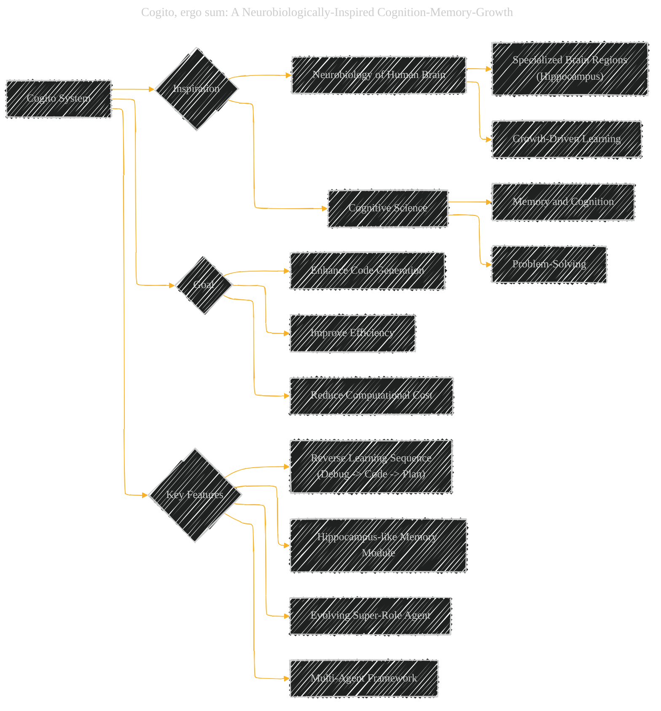
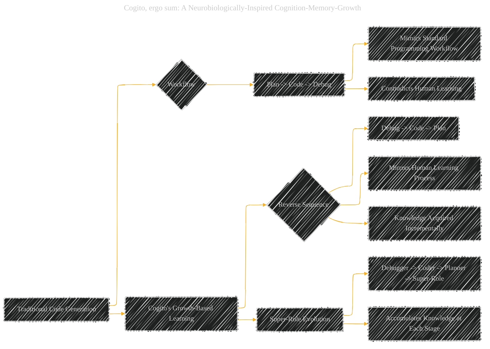
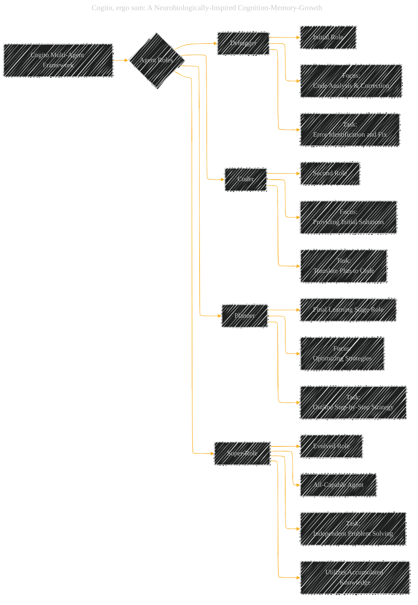
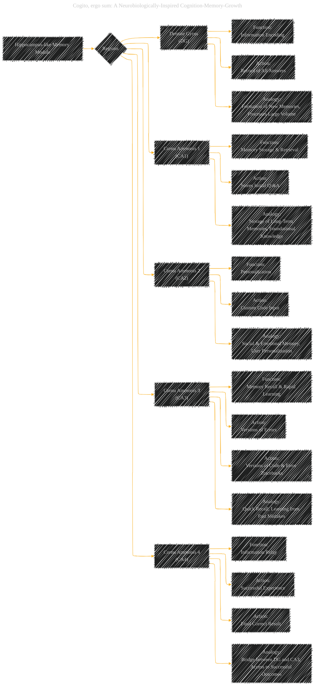
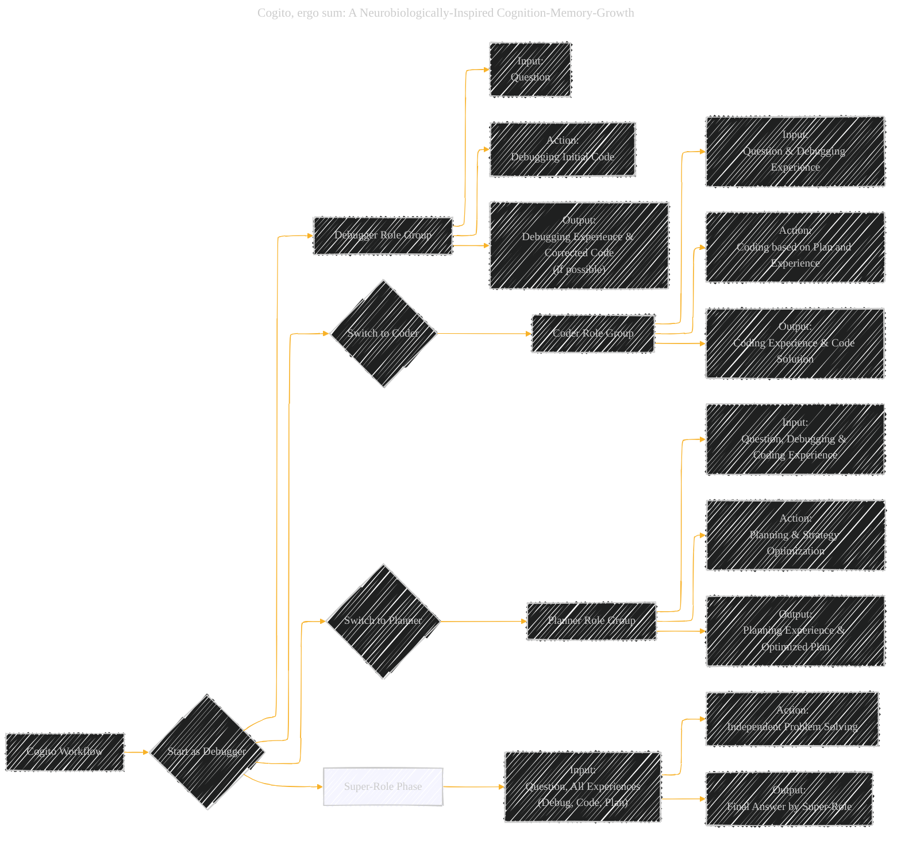
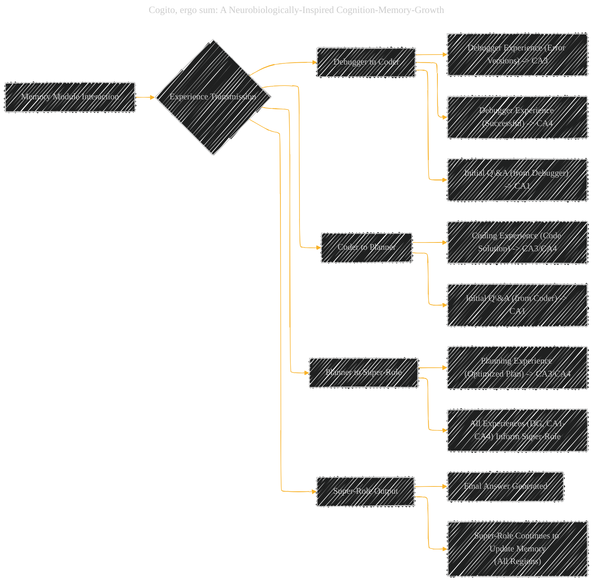
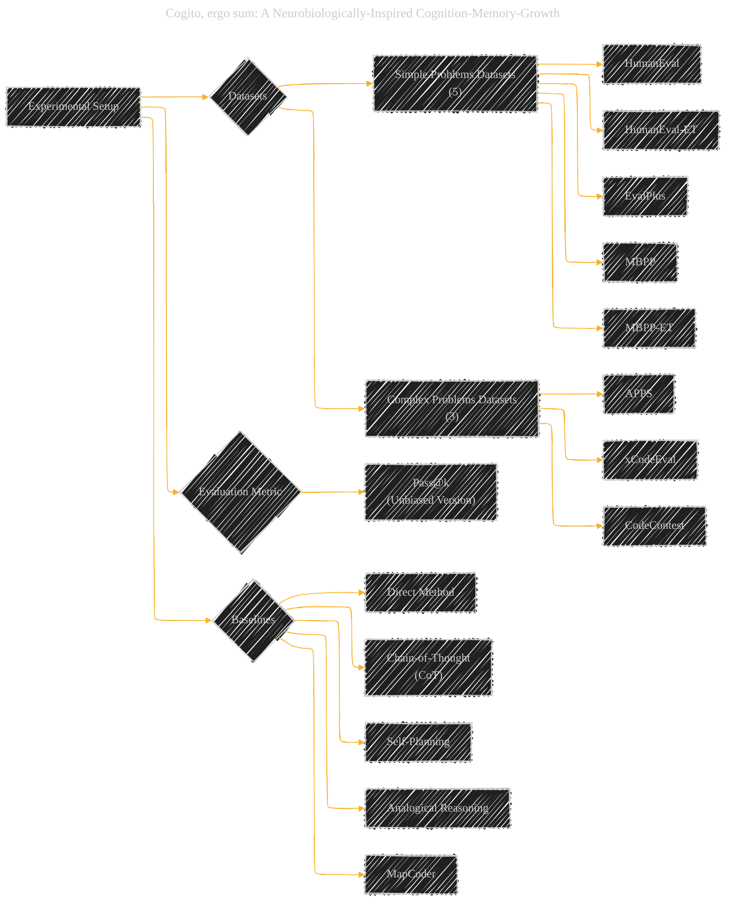
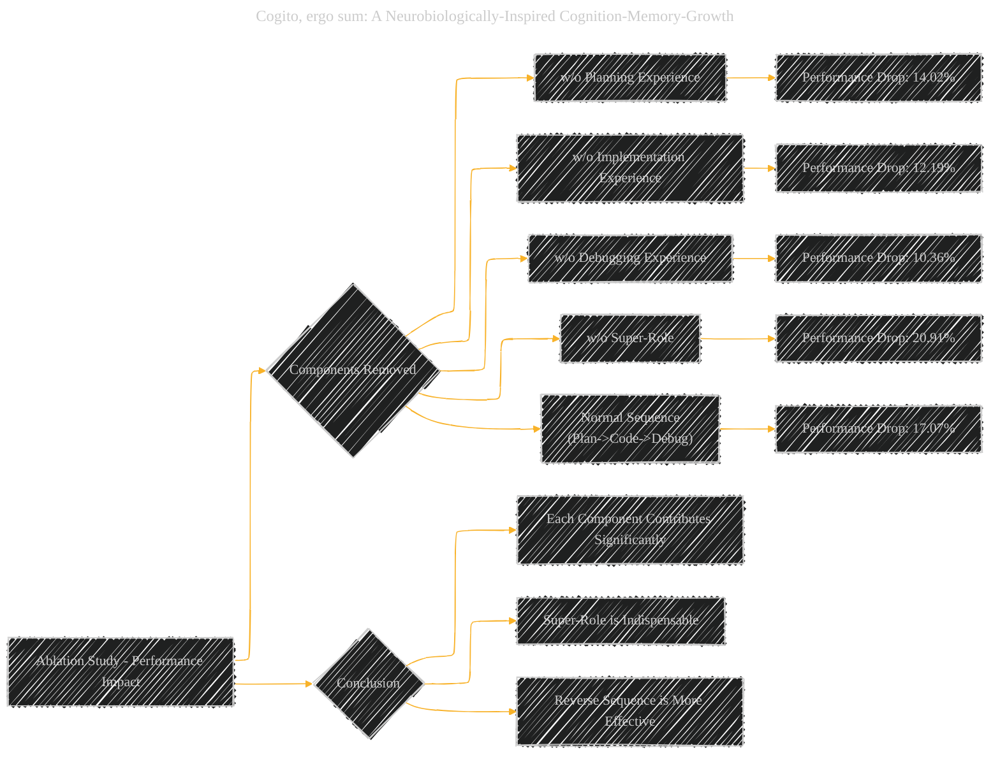
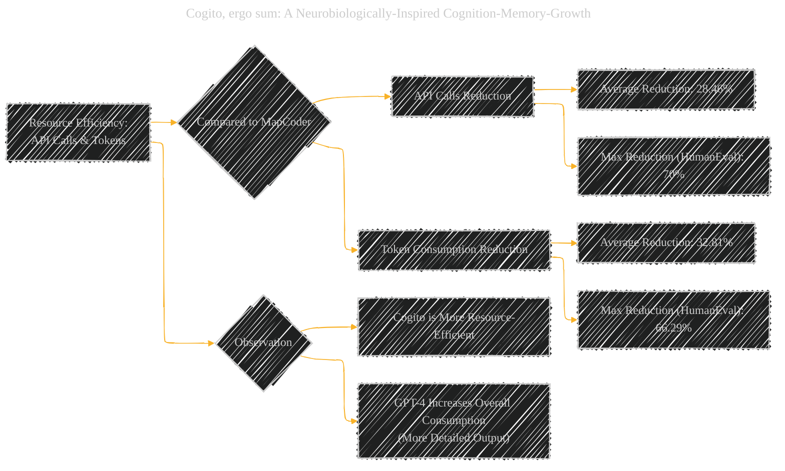

# Cogito, ergo sum: A Neurobiologically-Inspired Cognition-Memory-Growth
> **Disclaimer:**
>
> This document contains my personal notes on the topic,
> compiled from publicly available documentation and various cited sources.
> The materials are intended for educational purposes, personal study, and reference.
> The content is dual-licensed:
> 1. **MIT License:** Applies to all code implementations (Swift, Mermaid, and other programming languages).
> 2. **Creative Commons Attribution 4.0 International License (CC BY 4.0):** Applies to all non-code content, including text, explanations, diagrams, and illustrations.
---


## Cogito - A Diagrammatic Guide 


### 1. Core Idea: Neurobiologically-Inspired Cognition-Memory-Growth System (Cogito)




### Description
This diagram introduces Cogito's central concept: a system inspired by neurobiology and cognitive science to improve code generation. It emphasizes the inspiration from the human brain, the goal of enhancing code generation, and key features like the reverse learning sequence and memory module.

----

### 2. Learning Trajectory: Reverse Growth-Based Learning



### Description
This diagram contrasts Cogito's reverse learning sequence with the traditional "Plan -> Code -> Debug" workflow. It highlights how Cogito mirrors human learning by starting with debugging and progressively evolving to planning, ultimately leading to the Super-Role.

---

### 3. Agent Roles within Cogito Framework



### Description
This diagram outlines the distinct roles of agents within the Cogito framework: Debugger, Coder, Planner, and the evolved Super-Role. It details the progression of roles and the focus of each agent, highlighting the learning evolution into a Super-Role.

----

### 4. Hippocampus-like Memory Module: Functional Regions




### Description
This diagram details the hippocampus-inspired memory module in Cogito, breaking down its regions (DG, CA1, CA2, CA3, CA4) and their respective functions. It draws analogies to human hippocampal functions, outlining the type of information stored and the purpose of each region within the code generation process.

-----

### 5. Cogito Workflow: Stage-by-Stage Process




### Description
This diagram visualizes the step-by-step workflow of Cogito, from starting as a Debugger, transitioning to Coder, then Planner, and finally culminating in the Super-Role. It outlines the inputs, actions, and outputs at each stage of the reverse learning process.

----

### 6. Memory Interaction: Experience Transmission




### Description
This diagram illustrates how experiences are transmitted and stored within Cogito's memory module across different agent roles. It shows the flow of experience from Debugger to Coder, Coder to Planner, and how the Super-Role utilizes the accumulated knowledge from all memory regions (DG, CA1-CA4) to produce the final answer.

----

### 7. Experimental Setup: Datasets and Baselines



### Description
This diagram summarizes the experimental setup used to evaluate Cogito. It lists the datasets categorized by problem complexity (simple and contest-level), the evaluation metric (Pass@k), and the baseline methods used for comparison.

----

### 8. Performance Improvement: Cogito vs. Baselines

```mermaid
gantt
    title Performance Improvement of Cogito over MapCoder

    dateFormat  X
    axisFormat    %

    section Simple Problems (GPT-3.5-turbo)
    HumanEval         :crit, map1, 12.1%, 0, 1
    HumanEval-ET      :crit, map2, 16.6%, after map1, 1
    EvalPlus          :crit, map3, 15.5%, after map2, 1
    MBPP              :crit, map4, 8.7%, after map3, 1
    MBPP-ET           :crit, map5, 9.7%, after map4, 1

    section Contest-Level Problems (GPT-3.5-turbo)
    APPS              :crit, apps1, 59.29%, 0, 1
    xCodeEval         :crit, xcode1, 30.19%, after apps1, 1
    CodeContest       :crit, codecontest1, 5.0%, after xcode1, 1
```

### Description
This Gantt chart visually represents the performance improvements of Cogito over the state-of-the-art MapCoder, specifically focusing on the percentage improvements across various datasets for both simple and complex code generation problems when using GPT-3.5-turbo. It clearly shows the substantial gains achieved by Cogito.

----

### 9. Ablation Study: Component Impact on Performance



### Description
This diagram summarizes the ablation study results, showing the performance drop when key components of Cogito are removed or altered. It quantifies the impact of Planning, Implementation, Debugging Experience, the Super-Role, and the reverse sequence, highlighting the importance of each for Cogito's overall performance.

----

### 10. API Calls and Token Consumption Reduction



### Description
This diagram focuses on Cogito's efficiency in resource consumption. It presents the average and maximum reduction in API calls and token usage compared to MapCoder. It emphasizes Cogito's improved efficiency and notes the impact of using GPT-4 on resource consumption due to its more verbose outputs.


---
**Licenses:**

- **MIT License:**  [](LICENSE) - Full text in [LICENSE](LICENSE) file.
- **Creative Commons Attribution 4.0 International:** [](LICENSE-CC-BY) - Legal details in [LICENSE-CC-BY](LICENSE-CC-BY) and at [Creative Commons official site](http://creativecommons.org/licenses/by/4.0/).

---