# Overview ComfyUI Repo
> **Disclaimer:**
>
> This document contains my personal notes on the topic,
> compiled from publicly available documentation and various cited sources.
> The materials are intended for educational purposes, personal study, and reference.
> The content is dual-licensed:
> 1. **MIT License:** Applies to all code implementations (Swift, Mermaid, and other programming languages).
> 2. **Creative Commons Attribution 4.0 International License (CC BY 4.0):** Applies to all non-code content, including text, explanations, diagrams, and illustrations.
---

## ComfyUI Repo - A Diagrammatic Guide

```mermaid
---
title: "ComfyUI Repo - A Diagrammatic Guide"
config:
  layout: elk
  look: handDrawn
  theme: dark
---
%%%%%%%% Mermaid version v11.4.1-b.14
%%%%%%%% Available curve styles include the following keywords:
%% basis, bumpX, bumpY, cardinal, catmullRom, linear, monotoneX, monotoneY, natural, step, stepAfter, stepBefore.
%%{
  init: {
    "graph": { "htmlLabels": false, 'curve': 'linear' },
    'fontFamily': 'Fantasy',
    'themeVariables': {
      'lineColor': '#F8B229'
    }
  }
}%%
graph LR
    A[ComfyUI] --> B{Core Concept};
    style A fill:#a2d3,stroke:#333,stroke-width:1px
    B --> C[Visual AI Engine & Application]:::detail;
    C --> CA[Powerful & Modular];
    C --> CB[Graph/Nodes/Flowchart Interface];
    C --> CC[Stable Diffusion Pipelines];

    A --> D{Key Features};
    D --> E[Image Models]:::detail;
    E --> EA[SD1.x, SD2.x];
    E --> EB[SDXL, SDXL Turbo];
    E --> EC[Stable Cascade];
    E --> EE[SD3 and SD3.5];
    E --> EF[Pixart Alpha and Sigma];
    E --> EG[AuraFlow];
    E --> EH[HunyuanDiT];
    E --> EI[Flux];
    E --> EJ[Lumina Image 2.0];
    D --> F[Video Models]:::detail;
    F --> FA[Stable Video Diffusion];
    F --> FB[Mochi];
    F --> FC[LTX-Video];
    F --> FD[Hunyuan Video];
    F --> FE[Nvidia Cosmos];
    F --> FF[Wan 2.1];

    D --> G[Audio Models]:::detail;
    G --> GA[Stable Audio];

    D --> H[Core Functionality]:::detail;
    H --> HA[Asynchronous Queue];
    H --> HB[Optimized Re-execution];
    H --> HC[Smart Memory Management];
    H --> HD["CPU Support (with --cpu flag)"]
    H --> HE["Model Loading (ckpt, safetensors, diffusers, VAEs, CLIP)"]
    H --> HF[Embeddings/Textual Inversion]
        H --> HG["Loras (regular, locon and loha)"]
        H --> HH[Hypernetworks];
    H --> HI["Workflow Loading (PNG, WebP, FLAC)"]
    H --> HJ["Workflow Saving (Json)"]
    H --> HK[Node-Based Interface];
    H --> HL[Area Composition];
    H --> HM[Inpainting];
    H --> HN[ControlNet and T2I-Adapter];
    H --> HO[Upscale Models];
    H --> HP[unCLIP Models];
    H --> HQ[GLIGEN];
    H --> HR[Model Merging];
        H --> HS[LCM models and Loras];
    H --> HT[Latent previews with TAESD];
    H --> HU[Fast Startup];
    H --> HV[Offline Operation];
    H --> HW["Config File (extra_model_paths.yaml)"]

    A --> I{Installation};
    I --> J[Desktop Application]:::detail;
    J --> JA[Easiest Start];
    J --> JB[Windows & macOS];
    I --> K[Windows Portable Package]:::detail;
    K --> KA[Latest Commits];
    K --> KB[Portable];
    K --> KC[Windows];
    I --> L[Manual Install]:::detail;
    L --> LA[All OS & GPUs];
    L --> LB["Dependencies (requirements.txt)"]

    A --> M{Running ComfyUI};
    M --> N[Basic Command]:::detail;
    N --> NA[python main.py];
    M --> O[AMD-Specific Flags]:::detail;
        O --> OA[HSA_OVERRIDE_GFX_VERSION=...];
    M --> P[AMD ROCm Tips]:::detail;
        P --> PA[TORCH_ROCM_AOTRITON_ENABLE_EXPERIMENTAL=1];
    M --> Q[Additional Environment Variables]:::detail;
        Q --> QA[PYTORCH_TUNABLEOP_ENABLED=1];

    A --> R{Frontend Information};
    R --> S[Frontend Repository]:::detail;
    S --> SA[Comfy-Org/ComfyUI_frontend];
    R --> T[Frontend Version Control]:::detail;
        T --> TA[--front-end-version Comfy-Org/ComfyUI_frontend@latest];
    R --> U[Legacy Frontend]:::detail;
        U --> UA[--front-end-version Comfy-Org/ComfyUI_legacy_frontend@latest];

    A --> V{Useful Keyboard Shortcuts};
    V --> VShortcuts["List of Shortcuts"]
    style VShortcuts fill:#f2a3,stroke:#333,stroke-width:1px;

    subgraph Keyboard_Shortcuts [Shortcuts]
    direction LR
    VShortcuts --> VA[Ctrl + Enter - Queue graph for generation];
    VShortcuts --> VB[Ctrl + Shift + Enter - Queue graph as first];
    VShortcuts --> VC[Ctrl + Alt + Enter - Cancel Generation];
    VShortcuts --> VD[Ctrl + Z/Ctrl + Y - Undo/Redo];
    VShortcuts --> VE[Ctrl + S - Save Workflow];
    VShortcuts --> VF[Ctrl + O - Load Workflow];
    VShortcuts --> VG[Ctrl + A - Select All Nodes];
    VShortcuts --> VH[Alt + C - Collapse/Uncollapse Nodes];
    VShortcuts --> VI[Ctrl + M - Mute/Unmute Nodes];
    VShortcuts --> VJ[Ctrl + B - Bypass Nodes];
    VShortcuts --> VK[Delete/Backspace - Delete Nodes];
    VShortcuts --> VL[Ctrl + Backspace - Delete Graph];
    VShortcuts --> VM[Space - Move Canvas];
    VShortcuts --> VN[Ctrl/Shift + Click - Add to Selection];
    VShortcuts --> VO[Ctrl + C/Ctrl + V - Copy/Paste Nodes];
    VShortcuts --> VP[Shift + Drag - Move Selected Nodes];
    VShortcuts --> VQ[Ctrl + D - Load Default Graph];
    VShortcuts --> VR[Alt + + - Zoom In];
    VShortcuts --> VS[Alt + - - Zoom Out];
    VShortcuts --> VT[Ctrl + Shift + LMB - Canvas Zoom];
    VShortcuts --> VU[P - Pin/Unpin Nodes];
    VShortcuts --> VV[Ctrl + G - Group Nodes];
    VShortcuts --> VW[Q - Toggle Queue Visibility];
    VShortcuts --> VX[H - Toggle History Visibility];
    VShortcuts --> VY[R - Refresh Graph];
    VShortcuts --> VZ[F - Show/Hide Menu];
    VShortcuts --> VAA[. - Fit View];
    VShortcuts --> VAB[Double-Click LMB - Open Node Search];
    VShortcuts --> VAC[Shift + Drag - Move Wires];
    VShortcuts --> VAD[Ctrl + Alt + LMB - Disconnect Wires];
    end

    A --> W{Troubleshooting};
    W --> WA[Torch CUDA Error]:::detail;
    W --> WB[Reinstall Torch];
    A --> X{Support Channels};
    X --> XA["Discord (#help, #feedback)"]:::detail
    X --> XB[Matrix space]:::detail;

style A fill:#a2d3,stroke:#333,stroke-width:1px
style VShortcuts fill:#a2f3,stroke:#333,stroke-width:1px
style Keyboard_Shortcuts fill:#f2b3,stroke:#333,stroke-width:1px;

```

----

### Key improvements and explanations of each node and what it represents:

*   **A \[ComfyUI]:** The central concept: the visual AI engine itself.
*   **B {Core Concept}:** Summarizes ComfyUI's primary function.
*   **C \[Visual AI Engine & Application]:** High-level description.
*   **CA \[Powerful & Modular]:** Qualities of the engine.
*   **CB \[Graph/Nodes/Flowchart Interface]:** The method of interaction.
*   **CC \[Stable Diffusion Pipelines]:** Main use case.
*   **D {Key Features}:** Categorizes the capabilities.
*   **E \[Image Models], F \[Video Models], G \[Audio Models]:** Model types.
*   **EA, EB, etc.:** Specific model names within each category.
*   **H \[Core Functionality]:** Non-model-specific features.
*   **HA, HB, etc.:** Specific core functionalities.
*   **I {Installation}:** Installation methods.
*   **J \[Desktop Application], K \[Windows Portable Package], L \[Manual Install]:** The specific installation methods, along with brief descriptions.
*   **JA, KB, LA, etc.:** Key characteristics or considerations for each method.
*   **M {Running ComfyUI}:** Explains how to launch the application.
*   **N \[Basic Command], O \[AMD-Specific Flags], P \[AMD ROCm Tips], Q \[Additional Environment Variables]:** Specific commands and flags for running the engine in different scenarios.
*   **NA, OA, PA, QA, etc.:** Describe the purpose and syntax of each command.
*   **R {Frontend Information}:** Specifies the source for the frontend and ways to select different versions.
*   **S \[Frontend Repository], T \[Frontend Version Control], U \[Legacy Frontend]:** Components of the frontend and methods for selecting them.
*   **SA, TA, UA, etc.:** Additional instructions for accessing the frontend.
*   **V {Useful Keyboard Shortcuts}:** List of keyboard shortcuts.
*   **VA \[Ctrl + Enter], VB \[Queue graph for generation]:** Specific keyboard shortcuts, along with their functions.
*   **W {Troubleshooting}:** Troubleshooting tips for the engine.
*   **XA \[Discord], XB \[Matrix space]:** Support Channels

---
**Licenses:**

- **MIT License:**   - Full text in [LICENSE](LICENSE) file.
- **Creative Commons Attribution 4.0 International:**  - Legal details in [LICENSE-CC-BY](LICENSE-CC-BY) and at [Creative Commons official site](http://creativecommons.org/licenses/by/4.0/).

---
