# Which GPU should I buy for ComfyUI?
> **Disclaimer:**
>
> This document contains my personal notes on the topic,
> compiled from publicly available documentation and various cited sources.
> The materials are intended for educational purposes, personal study, and reference.
> The content is dual-licensed:
> 1. **MIT License:** Applies to all code implementations (Swift, Mermaid, and other programming languages).
> 2. **Creative Commons Attribution 4.0 International License (CC BY 4.0):** Applies to all non-code content, including text, explanations, diagrams, and illustrations.
---

```mermaid
---
title: "Which GPU should I buy for ComfyUI?"
config:
  layout: elk
  look: handDrawn
  theme: dark
---
%%%%%%%% Mermaid version v11.4.1-b.14
%%%%%%%% Available curve styles include the following keywords:
%% basis, bumpX, bumpY, cardinal, catmullRom, linear, monotoneX, monotoneY, natural, step, stepAfter, stepBefore.
%%{
  init: {
    "graph": { "htmlLabels": false, 'curve': 'linear' },
    'fontFamily': 'Fantasy',
    'themeVariables': {
      'lineColor': '#F8B229'
    }
  }
}%%
graph TD
    A["GPU Recommendation Tier List for ComfyUI"] --> B{"Tier List Criteria"}

    B --> C["Software Stack<br>(PyTorch Support & Optimization)"]:::criteria
    B --> D["Performance<br>(Speed, VRAM)"]:::criteria
    B --> E["Reliability<br>(Driver Stability, OS Updates)"]:::criteria
    B --> F["Ease of Use<br>(Setup, Extensions)"]:::criteria
    B --> G["Future Potential<br>(Official Support, Development)"]:::criteria

    subgraph S_Tier["S Tier - Nvidia<br>(Recommended)"]
    style S_Tier fill:#aaf4,stroke:#333,stroke-width:1px
        S["Nvidia<br>(3000 Series & Above)"] --> S1{"Excellent PyTorch Support"}
        S1 --> S1a["All Nvidia GPUs since GTX 900 supported"]
        S1 --> S1b["3000 series+ recommended"]
        S1 --> S1c["fp16,<br> bf16 (3000+),<br> fp8 (4000+),<br> fp4 (5000+)"]

        S --> S2["High Performance"]
        S --> S3["Large VRAM Preferable"]
        S --> S4["Avoid Older Generations if Possible"]
        S4 --> S4a["Limited Feature Support<br>(FP32 only)"]
        S4 --> S4b["Poor Performance due to missing operations"]
    end

    subgraph B_Tier["B Tier - AMD<br>(Linux)"]
    style B_Tier fill:#bbc7,stroke:#333,stroke-width:1px
        B1["AMD<br>(Linux)"] --> B1a{"Officially Supported in PyTorch<br>(ROCm)"}
        B1a --> B1b["ROCm Supported Cards only"]
        B1 --> B2["Slower than Nvidia"]
        B2 --> B2a["Lack of optimized scaled_dot_product_attention"]
        B1 --> B3["Unsupported Cards:<br>Difficult to Run"]
    end

    subgraph C_Tier["C Tier - Mac with Apple Silicon"]
    style C_Tier fill:#ffa1,stroke:#333,stroke-width:1px
        C1["Mac<br>(Apple Silicon)"] --> C1a{"Officially Supported in PyTorch"}
        C1a --> C1b["OS Updates often Break Compatibility"]
        C1 --> C2["Very Slow"]
        C1 --> C3["Limited Operation Support"]
    end

    subgraph I_Tier["I Tier - Intel<br>(Linux + Windows)"]
    style I_Tier fill:#f9f3,stroke:#333,stroke-width:1px
        I1["Intel<br>(Linux + Windows)"] --> I1a{"Requires Custom PyTorch Extension"}
        I1 --> I2["Occasional Issues"]
        I1 --> I3["Potential for Improvement<br>(Future Official Support)"]
    end

    subgraph D_Tier["D Tier - AMD (Windows)"]
    style D_Tier fill:#ffa3,stroke:#333,stroke-width:1px
        D1["AMD<br>(Windows)"] --> D1a{"Requires PyTorch Extension (DirectML) or Custom Build (ZLuda)"}
        D1 --> D2["Painful User Experience"]
        D1 --> D3["Potential Future Improvement<br>(ROCm on Windows)"]
    end
    
    subgraph F_Tier["F Tier - Qualcomm AI PC"]
    style F_Tier fill:#ff62,stroke:#333,stroke-width:1px
        F1["Qualcomm AI PC"] --> F1a{"PyTorch Not Working at All"}
        F1 --> F2["Working on it - Unreliable"]
        F1 --> F3["Recommend Avoiding<br>(Hardware May Become Obsolete Before Support)"]
    end

    subgraph Key_Terminology["Key Terminology"]
    style Key_Terminology fill:#dde3,stroke:#333,stroke-width:1px
        K1["fp16:<br>Half Precision Floating Point<br>(16-bit)"]
        K2["bf16:<br>BFloat16 (Brain Floating Point<br>(16-bit)"]
        K3[fp8:<br>Floating Point 8-bit]
        K4[fp4:<br>Floating Point 4-bit]
        K5["fp32:<br>Single Precision Floating Point<br>(32-bit)"]
        K6["ROCm:<br>Radeon Open Compute Platform<br>(AMD's GPU compute platform)"]
        K7["DirectML:<br>Microsoft's Direct Machine Learning<br>(API for GPU compute)"]
        K8["ZLuda:<br>Custom Pytorch Build"]
        K9["VRAM:<br>Video Random Access Memory<br>(GPU Memory)"]
    end

    A --> H[Important Note]
    H --> H1[Software support is most critical factor for AI tasks]
    
    subgraph Disclaimer
    style Disclaimer fill:#f232,stroke:#333,stroke-width:1px
        Disc1[This tier list is a recommendation and not a guarantee of performance]
        Disc2[Performance can vary based on specific models and workloads]
        Disc3[Future software updates can change support and performance characteristics]
    end

    classDef criteria fill:#ffffc,stroke:#333,stroke-width:1px
```

----

### Explanation of the Diagram Structure

*   **Root Node:** "GPU Recommendation Tier List for ComfyUI" - The central topic.
*   **Tier Nodes:** The main levels of the recommendation (S, B, C, D, F) representing the overall recommendation tiers, now are styled with a specific color.
*   **GPU Vendor/Model Nodes:** Represent specific GPUs or categories of GPUs within each tier.
*   **Supporting Information Nodes:**
    *   Key aspects of software support, hardware features, and performance.
    *   Reasons for the tier placement (why a GPU is in that specific tier).
*   **Criteria Node:** Represent the criteria to consider when picking a GPU.
*   **Key Terminology Node:** Definition of the terms used in the documentation.
*   **Disclaimer Node:** To clarify the content of the document.

---
**Licenses:**

- **MIT License:**   - Full text in [LICENSE](LICENSE) file.
- **Creative Commons Attribution 4.0 International:**  - Legal details in [LICENSE-CC-BY](LICENSE-CC-BY) and at [Creative Commons official site](http://creativecommons.org/licenses/by/4.0/).

---