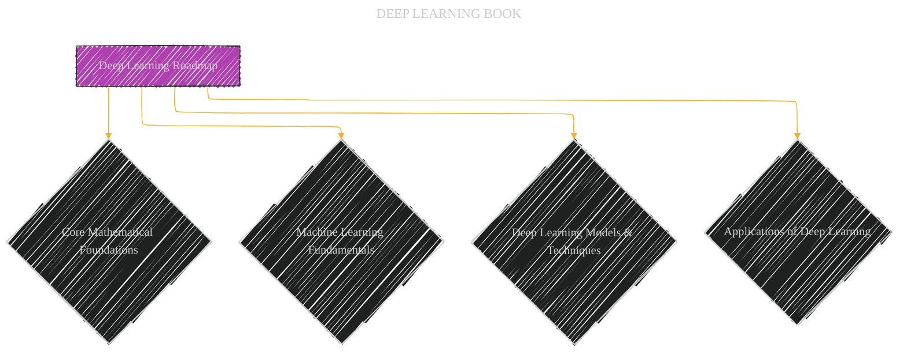
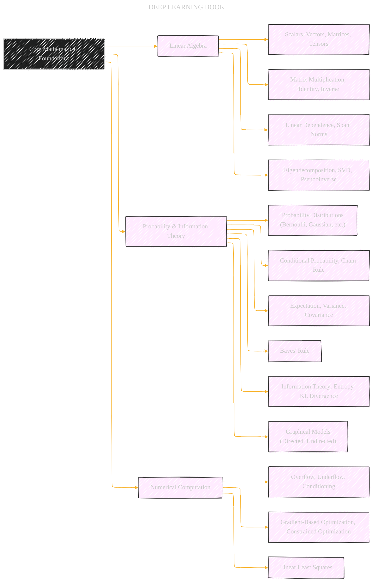
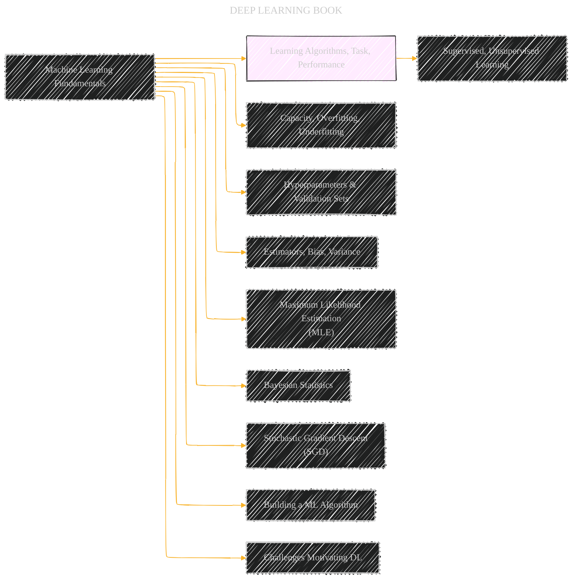
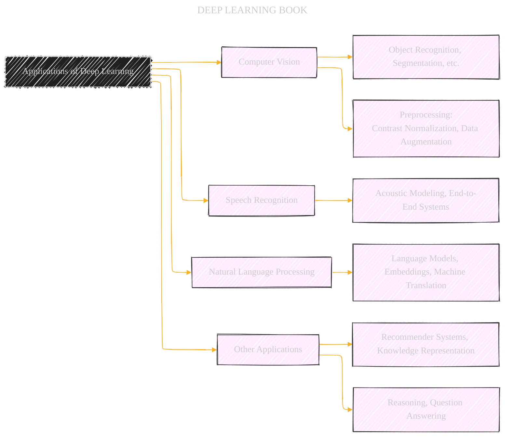

# Deep Learning Book Overview
> **Disclaimer:**
>
> This document contains my personal notes on the topic,
> compiled from publicly available documentation and various cited sources.
> The materials are intended for educational purposes, personal study, and reference.
> The content is dual-licensed:
> 1. **MIT License:** Applies to all code implementations (Swift, Mermaid, and other programming languages).
> 2. **Creative Commons Attribution 4.0 International License (CC BY 4.0):** Applies to all non-code content, including text, explanations, diagrams, and illustrations.
---

## Deep Learning Book Overview - A Diagrammatic Guide 

The diagrams below are designed to provide a visual and hierarchical representation of the "Deep Learning" book's structure and topics.

### Diagram 1: The Core Deep Learning Roadmap

**Explanation:** This diagram shows the core perspectives and the overall topics.

---

### Diagram 2: Mathematical Foundations

**Explanation:** This diagram details the essential mathematical areas for deep learning.

---

### Diagram 3: Machine Learning Fundamentals

**Explanation:** This diagram focuses on core machine learning concepts, setting the foundation for deep learning.

---

### Diagram 4: Deep Learning Models and Techniques

```mermaid
---
title: "DEEP LEARNING BOOK"
config:
  layout: elk
  look: handDrawn
  theme: dark
---
%%%%%%%% Mermaid version v11.4.1-b.14
%%%%%%%% Available curve styles include the following keywords:
%% basis, bumpX, bumpY, cardinal, catmullRom, linear, monotoneX, monotoneY, natural, step, stepAfter, stepBefore.
%%{
  init: {
    "graph": { "htmlLabels": false, 'curve': 'linear' },
    'fontFamily': 'Fantasy',
    'themeVariables': {
      'primaryColor': '#BB2528',
      'primaryTextColor': '#f529',
      'primaryBorderColor': '#7C0000',
      'lineColor': '#F8B229',
      'secondaryColor': '#006100',
      'tertiaryColor': '#fff'
    }
  }
}%%
graph LR
    P["Deep Learning Models & Techniques"] --> Q[Deep Feedforward Networks]:::detail
    Q --> QA[Hidden Units, Architecture Design]
    Q --> QB[Backpropagation, Differentiation]
    Q --> QC[Example: XOR]
    
    P --> R[Regularization]:::detail
    R --> RA["Parameter Norm Penalties<br>(L1, L2)"]
    R --> RB[Dataset Augmentation, Noise Robustness]
    R --> RC[Multi-Task Learning, Early Stopping]
    R --> RD[Parameter Sharing, Sparse Representations]
    R --> RE[Dropout, Adversarial Training, Tangent Methods]

    P --> S["Optimization"]:::detail
    S --> SA["Challenges:<br> Non-convexity, ill-conditioning"]
    S --> SB["Basic Algorithms:<br> SGD, Momentum"]
    S --> SC["Adaptive Learning Rates:<br> AdaGrad, RMSProp, Adam"]
    S --> SD["Approximate Second-Order Methods:<br> CG, BFGS"]
    S --> SE["Optimization Strategies:<br> Batch Normalization"]

    P --> T["Convolutional Neural Networks<br>(CNNs)"]:::detail
    T --> TA["Convolution Operation, Sparse Interactions"]
    T --> TB["Parameter Sharing, Equivariance"]
    T --> TC["Pooling, Invariance"]
    T --> TD["Variants:<br> Tiled Convolution, etc."]
    T --> TE["Efficient Algorithms, Hardware Implementations"]
    T --> TF["Neuroscientific Basis"]
    
    P --> U["Recurrent Neural Networks<br>(RNNs)"]:::detail
    U --> UA["Unfolding Computational Graphs"]
    U --> UB["Architectures:<br>Bi-directional, Deep, Recursive"]
    U --> UC["Teacher Forcing, Backpropagation Through Time<br>(BPTT)"]
    U --> UD["Long-Term Dependencies:<br> Vanishing/Exploding Gradients"]
    U --> UE["LSTM, GRU, Gated RNNs"]
    U --> UF["Echo State Networks"]
    U --> UG["Attention Mechanisms, Memory Networks"]

    V --> BB[Confronting the Partition Function]:::detail
    BB --> BB1[Log-Likelihood Gradient]:::detail
    BB --> BB2[Stochastic Maximum Likelihood, Contrastive Divergence]:::detail
    BB --> BB3[Pseudolikelihood]:::detail
    BB --> BB4[Score Matching, Ratio Matching]:::detail
    BB --> BB5[Denoising Score Matching]:::detail
    BB --> BB6[Noise-Contrastive Estimation]:::detail
    BB --> BB7[Estimating the Partition Function]:::detail

    classDef detail fill:#f9f3,stroke:#333,stroke-width:1px;
    class QA,QB,QC,RA,RB,RC,RD,RE,SA,SB,SC,SD,SE,TA,TB,TC,TD,TE,TF,UA,UB,UC,UD,UE,UF,UG detail
    
```

**Explanation:** This diagram lists major models and techniques for deep learning.

---

### Diagram 5: Applications of Deep Learning

**Explanation:** This diagram covers the application domains.

---
**Licenses:**

- **MIT License:**   - Full text in [LICENSE](LICENSE) file.
- **Creative Commons Attribution 4.0 International:**  - Legal details in [LICENSE-CC-BY](LICENSE-CC-BY) and at [Creative Commons official site](http://creativecommons.org/licenses/by/4.0/).

---