```mermaid
---
title: DeepSeek-R1 Architecture
config:
  layout: elk
  look: handDrawn
  theme: dark
---
%%{
  init: {
    'fontFamily': 'verdana',
    'themeVariables': {
      'primaryColor': '#BB2528',
      'primaryTextColor': '#f529',
      'primaryBorderColor': '#7C0000',
      'lineColor': '#F8B229',
      'secondaryColor': '#006100',
      'tertiaryColor': '#fff'
    }
  }
}%%
graph LR
    subgraph DeepSeek_R1_Architecture["DeepSeek-R1 Architecture"]
        A[DeepSeek-R1] --> B(Base Model)
        B --> C[DeepSeek-V3-Base]

        A --> D[Cold Start Stage]
        D --> E[Fine-Tuning DeepSeek-V3-Base]
        E --> F["Reinforcement Learning (RL) Stage 1"]
        F --> G[Reasoning-Oriented RL]
        G --> H[Language Consistency Reward]
        G --> I[Accuracy Reward]
        G --> J["Combined Reward<br>(Accuracy + Language)"]
        J --> K[Model Convergence]

        K --> L[Rejection Sampling Stage]
        L --> M[Reasoning Data Collection]
        M --> N["Supervised Fine-Tuning (SFT) Stage 1"]
        N --> O[Fine-Tuning DeepSeek-V3-Base]

        O --> P["Reinforcement Learning (RL) Stage 2"]
        P --> Q["RL for All Scenarios<br>(Helpfulness, Harmlessness)"]
        Q --> R[Model DeepSeek-R1]
        
        A --> S[Distillation Stage]
        S --> T["Fine-Tuning Small Models<br>(Qwen, Llama)"]
        T --> U[DeepSeek-R1-Distill-Qwen-1.5B, DeepSeek-R1-Distill-Qwen-7B, etc.]
    end
    
```

# DeepSeek-R1 Architecture Details
> **Disclaimer:**
>
> This document contains my personal notes on the topic,
> compiled from publicly available documentation and various cited sources.
> The materials are intended for educational purposes, personal study, and reference.
> The content is dual-licensed:
> 1. **MIT License:** Applies to all code implementations (Swift, Mermaid, and other programming languages).
> 2. **Creative Commons Attribution 4.0 International License (CC BY 4.0):** Applies to all non-code content, including text, explanations, diagrams, and illustrations.
---

----

### Explanation of the DeepSeek-R1 Architecture Diagram

This diagram details the multi-stage training process for DeepSeek-R1.

* **Base Model (DeepSeek-V3-Base):** The foundational LLM used as the starting point for training.

* **Cold Start Stage:** A small dataset of high-quality Chain-of-Thought (CoT) examples is used to fine-tune the base model.  This initial step is crucial for establishing good initial reasoning abilities and readability.

* **Reinforcement Learning (RL) Stage 1:**  Applies reasoning-oriented RL to the cold-started model.  Crucially, this stage uses a combination of accuracy, format, and language consistency rewards to steer the model toward generating well-structured reasoning paths.  The process continues until convergence on reasoning tasks.

* **Rejection Sampling Stage:**  Once the first RL stage converges, this stage uses rejection sampling to generate more high-quality reasoning data for the next fine-tuning step. This ensures that the reasoning data is not only correct but also well-formatted.

* **Supervised Fine-Tuning (SFT) Stage 1:** This stage uses the collected reasoning data, along with data from other domains (writing, QA, etc.), to further fine-tune the base model.

* **Reinforcement Learning (RL) Stage 2:** This secondary RL stage refines the model's helpfulness and harmlessness, ensuring human-like preferences are reflected in the final responses. It leverages a more complex reward structure that evaluates not only the reasoning process but also the final summary.

* **Distillation Stage:**  DeepSeek-R1 is used as a teacher model to fine-tune smaller, pre-existing models (like Qwen and Llama). This significantly improves the reasoning ability of smaller models without needing to retrain them from scratch.

----

### Key Components and Their Functions

* **Language Consistency Reward:** Encourages the model to use the target language consistently in its reasoning processes.

* **Combined Reward (Accuracy + Language):** A more comprehensive reward that combines correctness with language adherence, balancing the need for accurate reasoning with clear and coherent output.

* **RL for All Scenarios (Helpfulness, Harmlessness):**  This secondary RL stage refines the model's alignment with human preferences by considering not just reasoning but also aspects like helpfulness and harmlessness in the overall response.

This detailed architecture diagram provides a comprehensive view of the different phases and their interactions in the DeepSeek-R1 model's training pipeline. 

---
**Licenses:**

- **MIT License:**   - Full text in [LICENSE](LICENSE) file.
- **Creative Commons Attribution 4.0 International:**  - Legal details in [LICENSE-CC-BY](LICENSE-CC-BY) and at [Creative Commons official site](http://creativecommons.org/licenses/by/4.0/).

---