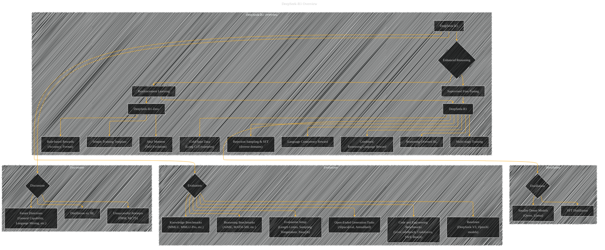

# DeepSeek-R1: Incentivizing Reasoning Capability in LLMs via Reinforcement Learning
> **Disclaimer:**
>
> This document contains my personal notes on the topic,
> compiled from publicly available documentation and various cited sources.
> The materials are intended for educational purposes, personal study, and reference.
> The content is dual-licensed:
> 1. **MIT License:** Applies to all code implementations (Swift, Mermaid, and other programming languages).
> 2. **Creative Commons Attribution 4.0 International License (CC BY 4.0):** Applies to all non-code content, including text, explanations, diagrams, and illustrations.
---

## An Overview of the Paper

---

### Explanation of the Diagram

This Mermaid graph uses subgraphs to organize the different aspects of the DeepSeek-R1 model and its surrounding concepts.

*   **DeepSeek-R1 Overview:** This subgraph encompasses the core components of DeepSeek-R1.  The nodes represent concepts, and the arrows indicate the flow or relationship between them. The use of subgraphs visually organizes the concepts, making it easier to understand the overall structure.

*   **Distillation:** This subgraph focuses on the distillation process.  It shows how knowledge is transferred from the larger DeepSeek-R1 model to smaller models.

*   **Evaluation:** This subgraph illustrates the evaluation process, outlining the types of benchmarks and baselines used for comparison.

*   **Discussion:** This subgraph summarizes the key points of discussion in the paper, such as the comparison between distillation and reinforcement learning, the analysis of unsuccessful attempts, and future research directions.

---
**Licenses:**

- **MIT License:**   - Full text in [LICENSE](LICENSE) file.
- **Creative Commons Attribution 4.0 International:**  - Legal details in [LICENSE-CC-BY](LICENSE-CC-BY) and at [Creative Commons official site](http://creativecommons.org/licenses/by/4.0/).

---