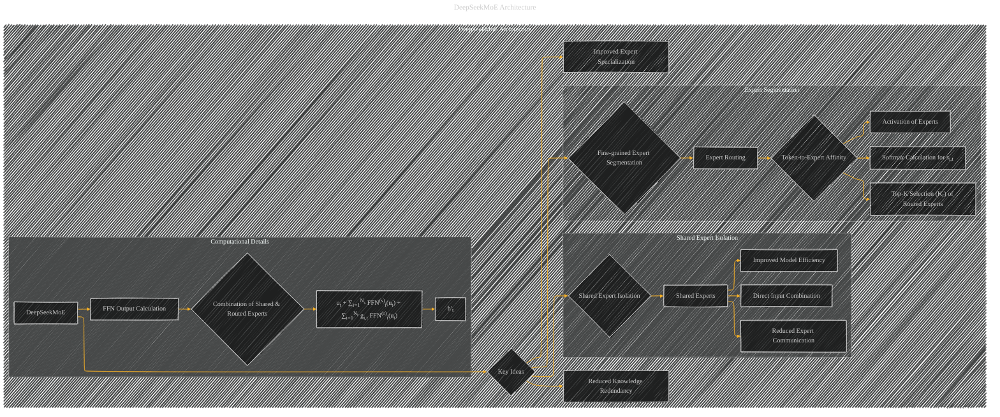

# DeepSeek MoE Architecture Details
> **Disclaimer:**
>
> This document contains my personal notes on the topic,
> compiled from publicly available documentation and various cited sources.
> The materials are intended for educational purposes, personal study, and reference.
> The content is dual-licensed:
> 1. **MIT License:** Applies to all code implementations (Swift, Mermaid, and other programming languages).
> 2. **Creative Commons Attribution 4.0 International License (CC BY 4.0):** Applies to all non-code content, including text, explanations, diagrams, and illustrations.
---

----

### Explanation of DeepSeekMoE Architecture

* **DeepSeekMoE:**  This custom architecture aims for improved expert specialization and reduced redundancy compared to conventional MoE architectures.

* **Fine-grained Expert Segmentation:**  DeepSeekMoE divides experts into smaller, more specialized groups, leading to improved knowledge acquisition and potentially better understanding of specific tasks.  This is represented by the "Expert Routing" and the "Token-to-Expert Affinity" subgraphs.

* **Shared Expert Isolation:** DeepSeekMoE incorporates shared experts to reduce redundancy and potential conflicts between knowledge domains that routed experts may have. The shared experts are likely a set of general-purpose or foundation experts, while the routed experts are more specialized.

* **Token-to-Expert Affinity:** The model learns an affinity between each token and each expert. This affinity, denoted as *si,t*, guides the selection of experts for a given token. The softmax calculation helps in selecting the most relevant expert from the pool of available experts. The *Top-K Selection* step prioritizes the most relevant experts.

* **Computational Details:**  The entire process of combining inputs from shared and routed experts to produce the final FFN output is illustrated.  The primary input is token *ut*.

**Important Notes:**

* **Ns:** Number of shared experts.
* **Nr:** Number of routed experts.
* **Kr:** Number of activated routed experts per token.
* **FFN(s)i(ut) & FFN(r)i(ut):** FFN operations for shared and routed experts, respectively.  The particular implementation may not be fully specified but is likely standard Feed-Forward Network layers.
* **gi,t:** The gate value for the i-th expert, determining how much the output of the i-th expert contributes to the overall token output.

---
**Licenses:**

- **MIT License:**   - Full text in [LICENSE](LICENSE) file.
- **Creative Commons Attribution 4.0 International:**  - Legal details in [LICENSE-CC-BY](LICENSE-CC-BY) and at [Creative Commons official site](http://creativecommons.org/licenses/by/4.0/).

---