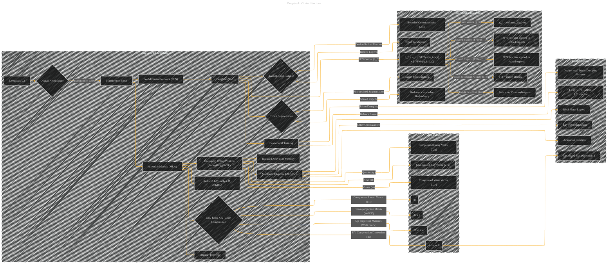

# DeepSeek V2 Architecture Details
> **Disclaimer:**
>
> This document contains my personal notes on the topic,
> compiled from publicly available documentation and various cited sources.
> The materials are intended for educational purposes, personal study, and reference.
> The content is dual-licensed:
> 1. **MIT License:** Applies to all code implementations (Swift, Mermaid, and other programming languages).
> 2. **Creative Commons Attribution 4.0 International License (CC BY 4.0):** Applies to all non-code content, including text, explanations, diagrams, and illustrations.
---

----

### Explanation

This diagram details the architecture of DeepSeek V2, focusing on the key components and their interrelationships.  It uses subgraphs to organize the complexities of MLA and DeepSeekMoE, providing a clear visual representation of their individual parts and how they interact.  The use of `<<subgraph>>` allows for better visualization and hierarchical organization of the architecture.  The diagram includes various components and parameters (e.g., `dc`, `dh`, `n_h`, etc.) that are critical to the understanding of the model's design choices.

---
**Licenses:**

- **MIT License:**   - Full text in [LICENSE](LICENSE) file.
- **Creative Commons Attribution 4.0 International:**  - Legal details in [LICENSE-CC-BY](LICENSE-CC-BY) and at [Creative Commons official site](http://creativecommons.org/licenses/by/4.0/).

---