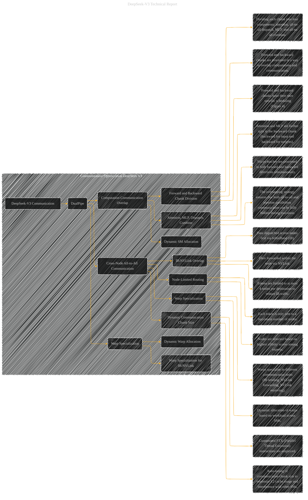

# Communication Optimization During Training for DeepSeek V3
> **Disclaimer:**
>
> This document contains my personal notes on the topic,
> compiled from publicly available documentation and various cited sources.
> The materials are intended for educational purposes, personal study, and reference.
> The content is dual-licensed:
> 1. **MIT License:** Applies to all code implementations (Swift, Mermaid, and other programming languages).
> 2. **Creative Commons Attribution 4.0 International License (CC BY 4.0):** Applies to all non-code content, including text, explanations, diagrams, and illustrations.
---

## Communication Optimization DeepSeek V3 - A Diagrammatic Guide

----

### Explanation

This Mermaid graph focuses on DeepSeek-V3's communication optimization during training.

* **Subgraph:**  Organizes the communication aspects into a distinct section.
* **Key Concepts:**  Highlights core elements like DualPipe, computation-communication overlap, and cross-node all-to-all communication.  It also emphasizes warp specialization and dynamic chunk size adjustments.
* **Relationships:**  Clearly illustrates how different optimization techniques (e.g., DualPipe) relate to the overall communication strategy (e.g., using both IB and NVLink).
* **Details:**  Provides more specifics about the methodology: division of chunks, component separation (attention, MLP, dispatch, combine), and dynamic resource allocation.

This is a high-level representation.  To be even more comprehensive, you would need to include specific details from the figures (e.g., Figure 4, which shows the overlapping execution) within the graph and potentially use different diagram types (like flowcharts) to show the precise scheduling details.  Also consider including specific performance metrics and comparisons with other methods.

---
**Licenses:**

- **MIT License:**   - Full text in [LICENSE](LICENSE) file.
- **Creative Commons Attribution 4.0 International:**  - Legal details in [LICENSE-CC-BY](LICENSE-CC-BY) and at [Creative Commons official site](http://creativecommons.org/licenses/by/4.0/).

---