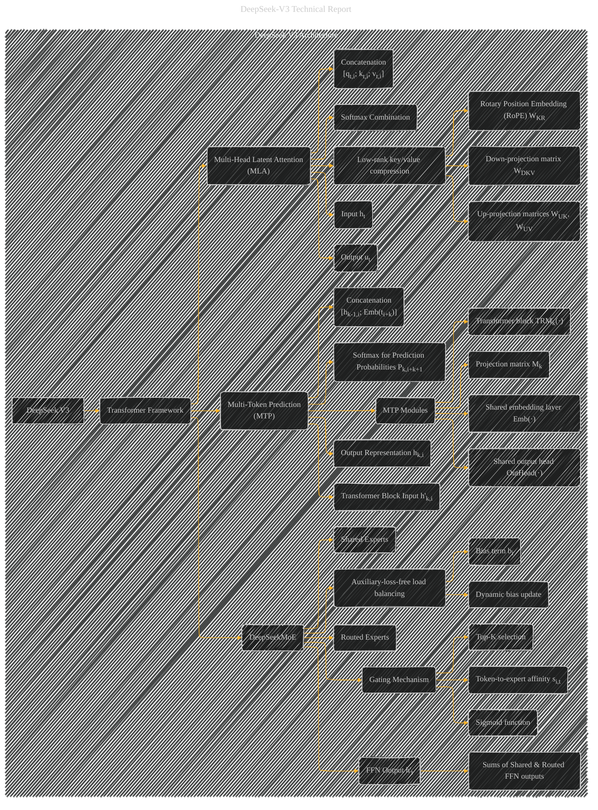

# DeepSeek V3 Architecture
> **Disclaimer:**
>
> This document contains my personal notes on the topic,
> compiled from publicly available documentation and various cited sources.
> The materials are intended for educational purposes, personal study, and reference.
> The content is dual-licensed:
> 1. **MIT License:** Applies to all code implementations (Swift, Mermaid, and other programming languages).
> 2. **Creative Commons Attribution 4.0 International License (CC BY 4.0):** Applies to all non-code content, including text, explanations, diagrams, and illustrations.
---

## DeepSeek V3 Architecture - A Diagrammatic Guide

DOI:[10.13140/RG.2.2.22614.56640](http://dx.doi.org/10.13140/RG.2.2.22614.56640)

---

### Explanation

This Mermaid diagram visualizes the DeepSeek V3 architecture. It's a high-level representation, with further details possible within each subgraph.

* **Transformer Framework:** The core foundation, represented by `B(Transformer Framework)`.
* **MLA (Multi-Head Latent Attention):**  The `C` subgraph details MLA's workings.  Nodes like `C2` and `C2a-c` show the low-rank compression and RoPE integration.  Key steps like concatenation and softmax are included.  There's an implicit relationship with the Transformer block, implied by its position in the overall architecture.
* **DeepSeekMoE:**  `D` subgraph details the MoE part.  Shows the separation of shared and routed experts.  The crucial gating mechanism is emphasized, with the use of affinity scores, sigmoid, and Top-K selection.  Also, the dynamic bias update is included as a critical part of load balancing.
* **Multi-Token Prediction (MTP):**  The `E` subgraph shows the MTP architecture, including the sequential prediction, shared layers, linear projection, and final softmax.  The sequential prediction of multiple tokens and the maintained causal chain is highlighted.

---

### Further Considerations

* **Relationships:** The arrows visually connect the different components and their flow.  For instance, the output of MLA (ut) feeds into the input of the DeepSeekMoE layer.
* **Hyperparameters:**  Adding labels to nodes (e.g., "dc = 512" for the compression dimension) or using a separate table will further enhance the diagram's detail and clarity.
* **Mathematical Equations:**  Incorporating the core equations (1-15, etc.) within the diagram as annotations will be very beneficial. This will create a more informative diagram.

---
**Licenses:**

- **MIT License:**   - Full text in [LICENSE](LICENSE) file.
- **Creative Commons Attribution 4.0 International:**  - Legal details in [LICENSE-CC-BY](LICENSE-CC-BY) and at [Creative Commons official site](http://creativecommons.org/licenses/by/4.0/).

---