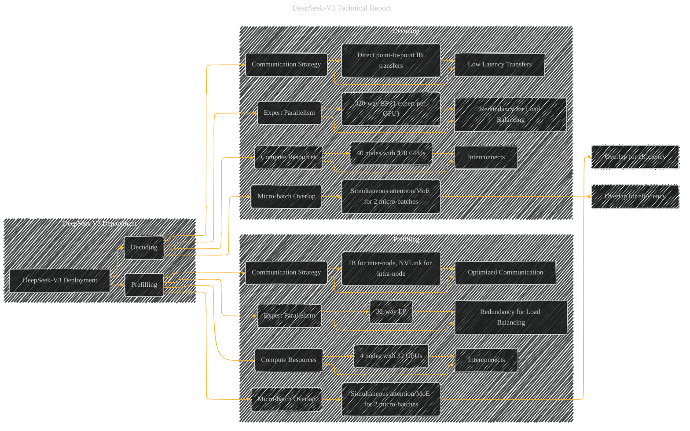

# DeepSeek V3 Deployment
> **Disclaimer:**
>
> This document contains my personal notes on the topic,
> compiled from publicly available documentation and various cited sources.
> The materials are intended for educational purposes, personal study, and reference.
> The content is dual-licensed:
> 1. **MIT License:** Applies to all code implementations (Swift, Mermaid, and other programming languages).
> 2. **Creative Commons Attribution 4.0 International License (CC BY 4.0):** Applies to all non-code content, including text, explanations, diagrams, and illustrations.
---

## DeepSeek V3 Deployment - A Diagrammatic Guide

---

### Explanation

This Mermaid diagram visualizes the DeepSeek-V3 deployment strategy, highlighting the differences between prefilling and decoding.  It's organized into two main subgraphs: "Prefilling" and "Decoding". Each subgraph focuses on the specific resource allocation, expert parallelism, and communication strategy employed for each stage.

* **Subgraphs:** This structure clearly separates the two deployment stages, making it easier to compare the differences and similarities in their strategies.

* **Nodes:** Each box represents a key component or concept related to the deployment. For example, "Compute Resources" details the number of nodes and GPUs.  "Expert Parallelism" specifies the number of experts per GPU. "Communication Strategy" illustrates the methods used for inter-node and intra-node communication.

* **Arrows:** Connect related components, showing the flow of data and the relationship between different parts of the deployment. For example, arrows connect "Compute Resources" to "Expert Parallelism" to illustrate that the hardware supports the parallel processing of experts.

* **Detailed Components:**  The subgraphs further break down the key components and the techniques used for efficient deployment. This provides a more granular understanding of the strategies used.

* **Overlap:**  The diagram highlights the key optimization of overlapping computations and communications within a stage, and between the stages, as a key factor in boosting efficiency. This is a vital aspect for reducing latency and improving throughput.

---
**Licenses:**

- **MIT License:**   - Full text in [LICENSE](LICENSE) file.
- **Creative Commons Attribution 4.0 International:**  - Legal details in [LICENSE-CC-BY](LICENSE-CC-BY) and at [Creative Commons official site](http://creativecommons.org/licenses/by/4.0/).

---