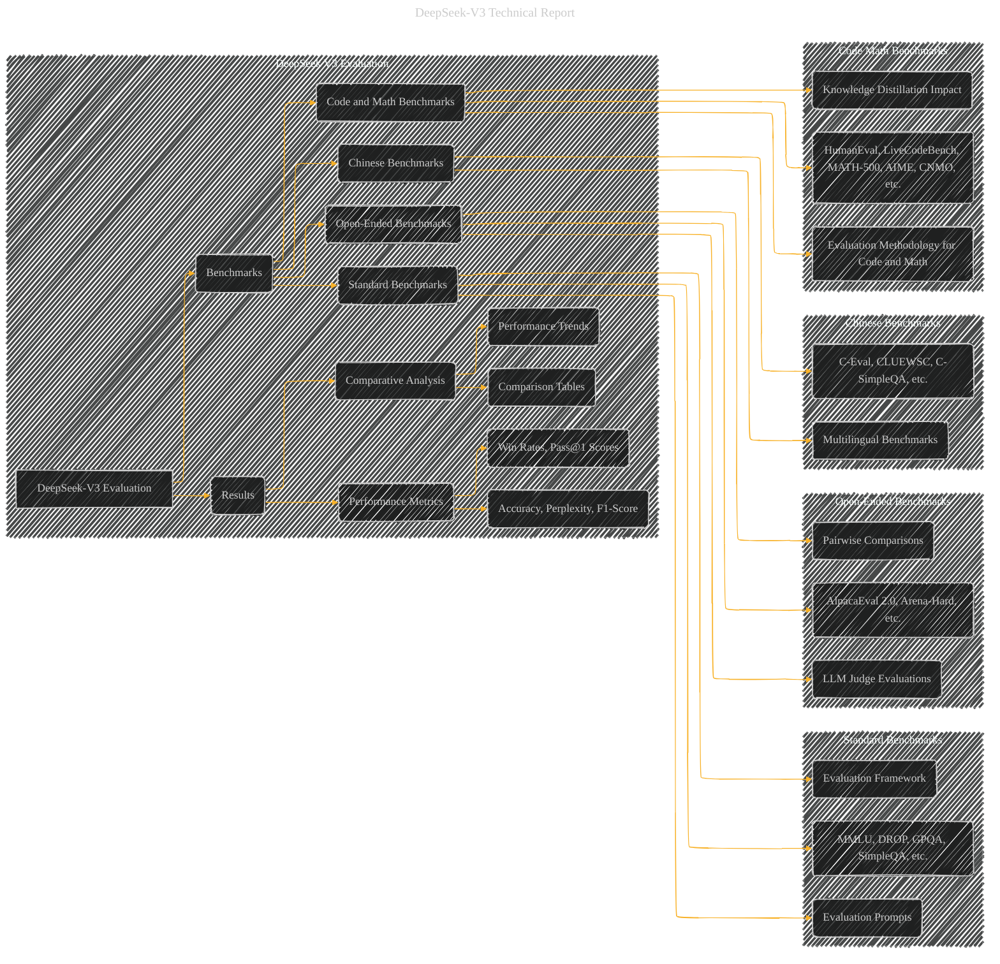

# DeepSeek V3 Evaluation
> **Disclaimer:**
>
> This document contains my personal notes on the topic,
> compiled from publicly available documentation and various cited sources.
> The materials are intended for educational purposes, personal study, and reference.
> The content is dual-licensed:
> 1. **MIT License:** Applies to all code implementations (Swift, Mermaid, and other programming languages).
> 2. **Creative Commons Attribution 4.0 International License (CC BY 4.0):** Applies to all non-code content, including text, explanations, diagrams, and illustrations.
---

## DeepSeek V3 Evaluation - A Diagrammatic Guide

DOI:[10.13140/RG.2.2.10451.08485](http://dx.doi.org/10.13140/RG.2.2.10451.08485)

---

### Explanation

This Mermaid graph provides a structured representation of the DeepSeek-V3 evaluation process.  It's organized to reflect the different types of benchmarks used and the overall results.

* **Subgraphs:** The graph uses subgraphs to categorize the different benchmark types, making the diagram more organized and easier to understand.
* **Nodes:** Each box represents a key element of the evaluation, whether it's a specific benchmark, the evaluation methodology, or a result representation.
* **Arrows:** Arrows connect related concepts, illustrating the flow from benchmarks to results and the comparative analysis.
* **Detailed Breakdown:** The structure allows for a more nuanced understanding of the evaluation process.  For example, the "Standard Benchmarks" subgraph is further divided into elements like evaluation prompts and framework.
* **Comparative Analysis:**  The "Results" subgraph focuses on the comparative analysis aspects. It includes specific elements like comparison tables and performance trends, highlighting how DeepSeek-V3 performs against other models.
* **Performance Metrics:** The graph includes crucial performance metrics such as accuracy, perplexity, F1-score, win rates, and Pass@1 scores.

---
**Licenses:**

- **MIT License:**   - Full text in [LICENSE](LICENSE) file.
- **Creative Commons Attribution 4.0 International:**  - Legal details in [LICENSE-CC-BY](LICENSE-CC-BY) and at [Creative Commons official site](http://creativecommons.org/licenses/by/4.0/).

---