# DeepSeek V3 Overview
> **Disclaimer:**
>
> This document contains my personal notes on the topic,
> compiled from publicly available documentation and various cited sources.
> The materials are intended for educational purposes, personal study, and reference.
> The content is dual-licensed:
> 1. **MIT License:** Applies to all code implementations (Swift, Mermaid, and other programming languages).
> 2. **Creative Commons Attribution 4.0 International License (CC BY 4.0):** Applies to all non-code content, including text, explanations, diagrams, and illustrations.
---

## DeepSeek V3 Overview - A Diagrammatic Guide

```mermaid
---
title: "DeepSeek-V3 Technical Report"
config:
  layout: elk
  look: handDrawn
  theme: dark
---
%%%%%%%% Mermaid version v11.4.1-b.14
%%%%%%%% Available curve styles include the following keywords:
%% basis, bumpX, bumpY, cardinal, catmullRom, linear, monotoneX, monotoneY, natural, step, stepAfter, stepBefore.
%%{
  init: {
    "graph": { "htmlLabels": false, 'curve': 'natural' },
    'fontFamily': 'Fantasy',
    'themeVariables': {
      'primaryColor': '#BB2528',
      'primaryTextColor': '#f529',
      'primaryBorderColor': '#7C0000',
      'lineColor': '#F8B229',
      'secondaryColor': '#006100',
      'tertiaryColor': '#fff'
    }
  }
}%%
graph LR
    subgraph DeepSeek_V3_Overview["DeepSeek V3 Overview"]
        A[DeepSeek-V3 Overview] --> B(Architecture)
        A --> C(Training)
        A --> D(Evaluation)
        A --> E(Post-Training)
        A --> F(Deployment)
        A --> G(Training Costs)
        A --> H(Contributions)

        style H fill:#ccf3,stroke:#333,stroke-width:2px
        
    end

    subgraph Architecture
        B(Architecture) --> B1("Multi-Head Latent Attention<br>(MLA)")
        B --> B2("DeepSeekMoE")
        B --> B3("Multi-Token Prediction<br>(MTP)")
        
        B1 --> B1a("Low-rank key/value compression")
        B1 --> B1b("Rotary Position Embedding<br>(RoPE)")
        B1 --> B1c("Concatenation of latent vectors")
        B2 --> B2a("Shared Experts")
        B2 --> B2b("Routed Experts")
        B2 --> B2c("Gating Mechanism")
        B2 --> B2d("Auxiliary-loss-free load balancing")
        B3 --> B3a("Sequential multi-token prediction")
        B3 --> B3b("Causal chain maintained")
        B3 --> B3c("MTP modules with shared embedding/output head")

    end
    
    subgraph Training
        C(Training) --> C1("FP8 Mixed Precision")
        C --> C2("DualPipe Pipeline Parallelism")
        C --> C3("Communication Optimization")
        C --> C4("Memory Optimization")

        C1 --> C1a("Fine-grained quantization<br>(tile/block-wise)")
        C1 --> C1b("High-precision accumulation<br>(FP32 registers)")
        C1 --> C1c("Optimized GEMM kernels")
        C2 --> C2a("Forward/backward computation overlap")
        C2 --> C2b("Reduced pipeline bubbles")
        C3 --> C3a("Customized IB/NVLink kernels")
        C3 --> C3b("Warp specialization")
        C4 --> C4a("Recomputation of RMSNorm/MLA up-projections")
        C4 --> C4b("Exponential Moving Average (EMA) in CPU")
        C4 --> C4c("Shared embedding/output head for MTP")
    end
    
    subgraph Evaluation
        D(Evaluation) --> D1(Benchmarks)
        D --> D2(Results)
        D1 --> D1a("MMLU, DROP, HumanEval, etc.")
        D1 --> D1b("Multilingual/English/Chinese")
        D2 --> D2a("Table/Figure comparisons")

    end

    subgraph PostTraining
        E(Post-Training) --> E1("Supervised Fine-Tuning (SFT)")
        E --> E2("Reinforcement Learning<br>(RL)")
        E --> E3(Knowledge Distillation)

        E1 --> E1a(Instruction Tuning Data)
        E1 --> E1b(SFT Data Curating/Rejection Sampling)
        E2 --> E2a("Rule-based Reward Model")
        E2 --> E2b("Model-based Reward Model")
        E2 --> E2c("Group Relative Policy Optimization<br>(GRPO)")
        E3 --> E3a("Distillation from DeepSeek-R1")
    end
    
    subgraph Deployment
        F(Deployment) --> F1(Prefilling)
        F --> F2(Decoding)

        F1 --> F1a("Redundant Expert Deployment")
        F1 --> F1b("Micro-batch Overlap")
        F2 --> F2a("Single Expert per GPU")
        F2 --> F2b("IB/NVLink Communication")
        F2 --> F2c("Micro-batch Overlap")
    end

    subgraph TrainingCosts
        G(Training Costs) --> G1("2.788M H800 GPU Hours")
        G --> G2("$5.576M<br>(estimated)")
    end

```

DOI:[10.13140/RG.2.2.25970.00968](http://dx.doi.org/10.13140/RG.2.2.25970.00968)

----

### Explanation of Changes and Improvements

* **Clearer Structure:** The overview is more focused and hierarchical.  Subgraphs now more clearly group related concepts.
* **Specific Components:** Each component in the model (MLA, DeepSeekMoE, etc.) is now broken down into its constituent parts.
* **Detailed Relationships:** Arrows explicitly connect architecture components to their implications (e.g., MLA to reduced KV cache).
* **Training Costs:**  The diagram now includes a subgraph for training costs, which is a crucial aspect of the paper.
* **Evaluation Benchmarks:**  The "Evaluation" subgraph is streamlined and clarifies the evaluation process.
* **Post-Training:** The "Post-Training" subgraph is structured to show how different aspects of post-training interact, making the relationships more explicit.
* **Deployment:** The "Deployment" subgraph is separated for better visualization, and each key technique (redundancy, overlap) is now more prominent.
* **Contributions:** A subgraph for contributions summarizes the model's innovative aspects.

This improved diagram provides a more complete and informative overview of DeepSeek-V3, focusing on the key architectural choices, training strategies, and evaluation results, following the reference structure and the provided document content.  You can now add specific data, figures, or tables from the paper to flesh out the details of each component within the subgraphs. Remember to add labels and annotations as needed.

---
**Licenses:**

- **MIT License:**   - Full text in [LICENSE](LICENSE) file.
- **Creative Commons Attribution 4.0 International:**  - Legal details in [LICENSE-CC-BY](LICENSE-CC-BY) and at [Creative Commons official site](http://creativecommons.org/licenses/by/4.0/).

---