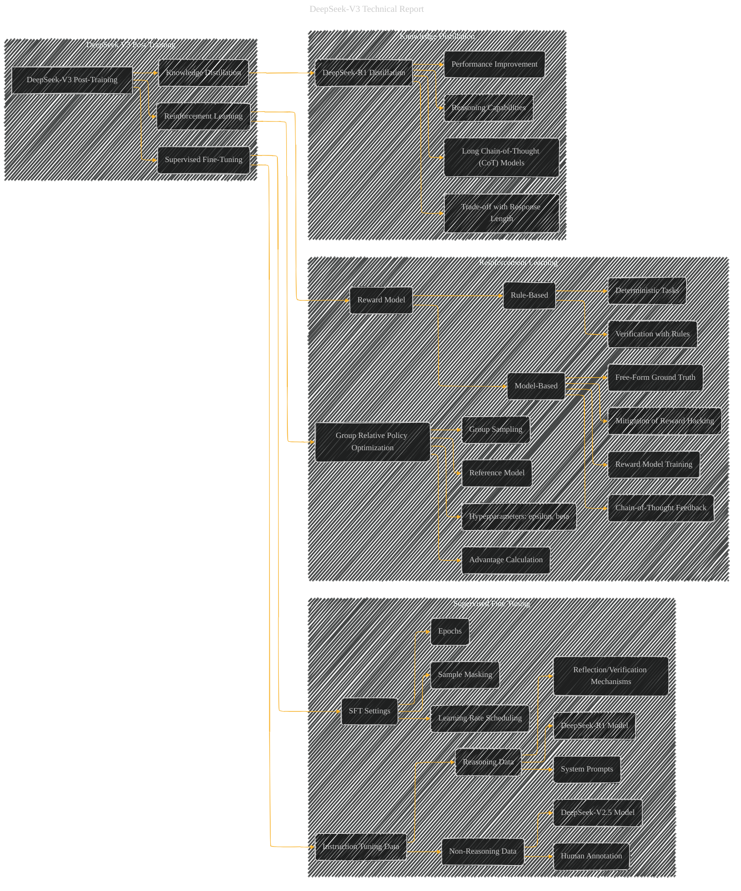

# DeepSeek V3 Post-Training
> **Disclaimer:**
>
> This document contains my personal notes on the topic,
> compiled from publicly available documentation and various cited sources.
> The materials are intended for educational purposes, personal study, and reference.
> The content is dual-licensed:
> 1. **MIT License:** Applies to all code implementations (Swift, Mermaid, and other programming languages).
> 2. **Creative Commons Attribution 4.0 International License (CC BY 4.0):** Applies to all non-code content, including text, explanations, diagrams, and illustrations.
---

## DeepSeek V3 Post-Training - A Diagrammatic Guide

---

### Explanation

This Mermaid diagram provides a more detailed breakdown of the DeepSeek-V3 post-training stages, expanding on the previous, higher-level graph.

* **Subgraphs:** The diagram uses subgraphs to group related concepts, making it more organized and readable.
* **Nodes and Relationships:** The nodes represent key components (like "Instruction Tuning Data," "Reward Model") and the arrows show their relationships (e.g., how reasoning data is generated or how RL influences the model).
* **Detailing Sub-components:**  Crucially, this graph breaks down the data generation process for SFT, the mechanics of the reward models, and the specific details of the knowledge distillation process.
* **Clearer Representation:** It clarifies the specific data used, the optimization methods, and the evaluation metrics used in each phase.

---
**Licenses:**

- **MIT License:**   - Full text in [LICENSE](LICENSE) file.
- **Creative Commons Attribution 4.0 International:**  - Legal details in [LICENSE-CC-BY](LICENSE-CC-BY) and at [Creative Commons official site](http://creativecommons.org/licenses/by/4.0/).

---