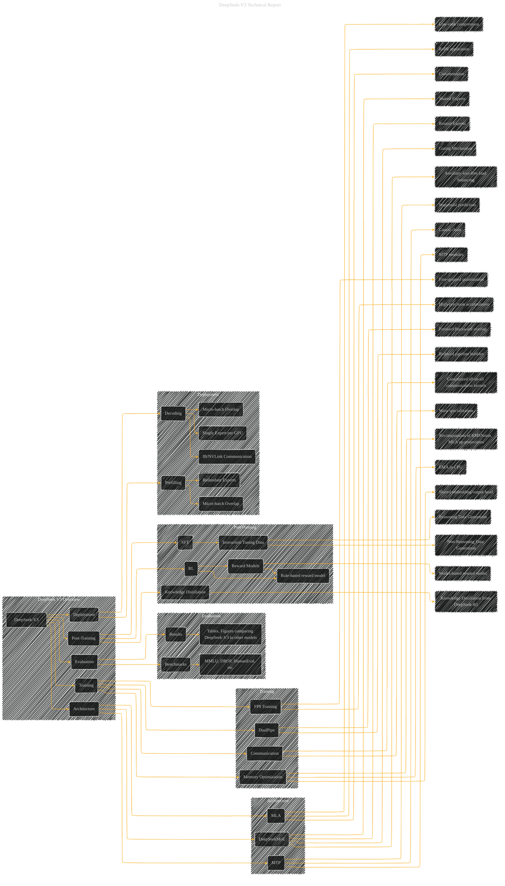

# DeepSeek-V3 Technical Report
> **Disclaimer:**
>
> This document contains my personal notes on the topic,
> compiled from publicly available documentation and various cited sources.
> The materials are intended for educational purposes, personal study, and reference.
> The content is dual-licensed:
> 1. **MIT License:** Applies to all code implementations (Swift, Mermaid, and other programming languages).
> 2. **Creative Commons Attribution 4.0 International License (CC BY 4.0):** Applies to all non-code content, including text, explanations, diagrams, and illustrations.
---

## DeepSeek-V3 Technical Report - Paper Overview

----

### Explanation

This Mermaid graph provides a high-level overview of the DeepSeek-V3 model.  It's structured using subgraphs to organize the key components (Architecture, Training, Evaluation, etc.).  Each box represents a key concept and sub-boxes further break down the sub-components.  This is a starting point; you'd need to add more detail using further sub-boxes and relationships as needed.

* **Use of subgraphs:** This structure provides a more organized and manageable way to visualize complex systems like DeepSeek-V3.  Each concept is compartmentalized, helping with readability and understanding of specific aspects.
* **Arrows:**  Connect related concepts, like showing how the architecture leads to efficient training, or how evaluation results are derived from the model.
* **Detailed Components:**  The graph breaks down the components of the model and the techniques used for efficient training and inference, allowing for more specific visualization within the sub-components.

---
**Licenses:**

- **MIT License:**   - Full text in [LICENSE](LICENSE) file.
- **Creative Commons Attribution 4.0 International:**  - Legal details in [LICENSE-CC-BY](LICENSE-CC-BY) and at [Creative Commons official site](http://creativecommons.org/licenses/by/4.0/).

---