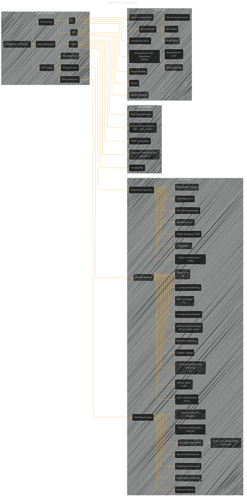

# DeepSeek V3 Training
> **Disclaimer:**
>
> This document contains my personal notes on the topic,
> compiled from publicly available documentation and various cited sources.
> The materials are intended for educational purposes, personal study, and reference.
> The content is dual-licensed:
> 1. **MIT License:** Applies to all code implementations (Swift, Mermaid, and other programming languages).
> 2. **Creative Commons Attribution 4.0 International License (CC BY 4.0):** Applies to all non-code content, including text, explanations, diagrams, and illustrations.
---

## DeepSeek V3 Training - A Diagrammatic Guide

DOI:[10.13140/RG.2.2.36036.33921](http://dx.doi.org/10.13140/RG.2.2.36036.33921)

---

### Explanation

This Mermaid graph provides a more detailed representation of the DeepSeek-V3 training process, breaking down the pre-training, context extension, and post-training stages.  The graph now includes more specific details about the data construction, hyperparameters, and the various training steps involved in each stage.

* **Subgraphs:**  Organize training stages (Pre-training, Context Extension, Post-training) for better readability and comprehension.
* **Nodes and Relationships:** Explicitly show the connections between the different components of the training pipeline.
* **Detailed Components:**  Break down hyperparameters (e.g., learning rate scheduling) and training steps (e.g., document packing, sample masking).
* **Data Flow:**  The graph visually represents how data flows through the different stages of the training process.

---
**Licenses:**

- **MIT License:**   - Full text in [LICENSE](LICENSE) file.
- **Creative Commons Attribution 4.0 International:**  - Legal details in [LICENSE-CC-BY](LICENSE-CC-BY) and at [Creative Commons official site](http://creativecommons.org/licenses/by/4.0/).

---