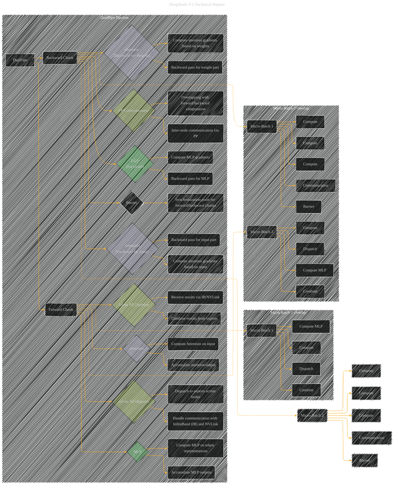

# DualPipe Pipeline Parallelism During Training for DeepSeek V3
> **Disclaimer:**
>
> This document contains my personal notes on the topic,
> compiled from publicly available documentation and various cited sources.
> The materials are intended for educational purposes, personal study, and reference.
> The content is dual-licensed:
> 1. **MIT License:** Applies to all code implementations (Swift, Mermaid, and other programming languages).
> 2. **Creative Commons Attribution 4.0 International License (CC BY 4.0):** Applies to all non-code content, including text, explanations, diagrams, and illustrations.
---

## DualPipe Pipeline - A Diagrammatic Guide

-----

### Explanation

This Mermaid diagram visualizes the DualPipe pipeline during training for DeepSeek-V3.  It's designed to illustrate the overlapping of computation and communication across forward and backward chunks of the pipeline.

* **Subgraphs:**  The `DualPipe_Pipeline` subgraph encapsulates the core structure.  The `Micro_Batch_1_Overlap` and `Micro_Batch_2_Overlap` subgraphs illustrate the crucial aspect of processing multiple micro-batches concurrently.

* **Nodes:** The diagram uses boxes for pipeline stages (`Attention`, `All-to-All Dispatch`, `MLP`, `All-to-All Combine`, and for backward chunks the specific backward phases).  Nodes like `Micro-Batch 1` and `Micro-Batch 2` show the processing of multiple micro-batches in parallel.

* **Edges:** Directed edges show the data flow through the pipeline stages.  Note the overlapping of forward and backward computation/communication, indicated by arrows connecting stages between micro-batches 1 and 2. This highlights the key feature of DualPipe's design.  The `Barrier` nodes represent synchronization points.

* **Emphasis on Overlap:** The arrangement of edges connecting the forward and backward chunks within each micro-batch shows the overlapping operations (e.g., attention computation with backward communication).  The style differentiates the stages to make the overlap clear.

* **Communication Handling:**  Nodes like `All-to-All Dispatch` and `All-to-All Combine` are highlighted, indicating that communication operations are also handled concurrently with computation.

This diagram provides a visual representation of how DualPipe, through its overlapping mechanisms, aims to reduce the training time and enhance the efficiency of the DeepSeek-V3 model.  To further enhance the diagram, you could include figures to illustrate the timing of operations or tables detailing the resources allocated to each task (e.g., number of SMs, bandwidths used).  Remember to add text annotations to the boxes to clarify the specific operations performed in each stage.

---
**Licenses:**

- **MIT License:**   - Full text in [LICENSE](LICENSE) file.
- **Creative Commons Attribution 4.0 International:**  - Legal details in [LICENSE-CC-BY](LICENSE-CC-BY) and at [Creative Commons official site](http://creativecommons.org/licenses/by/4.0/).

---