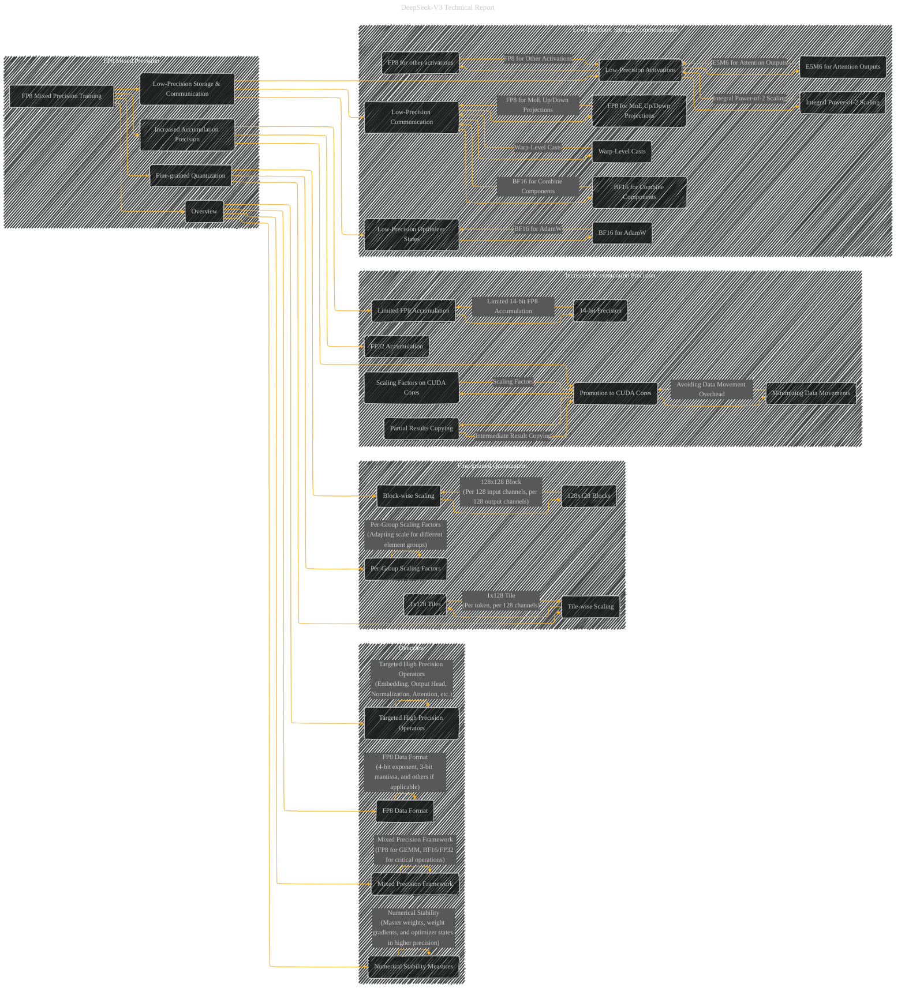

# FP8 Mixed Precision During Training for DeepSeek V3
> **Disclaimer:**
>
> This document contains my personal notes on the topic,
> compiled from publicly available documentation and various cited sources.
> The materials are intended for educational purposes, personal study, and reference.
> The content is dual-licensed:
> 1. **MIT License:** Applies to all code implementations (Swift, Mermaid, and other programming languages).
> 2. **Creative Commons Attribution 4.0 International License (CC BY 4.0):** Applies to all non-code content, including text, explanations, diagrams, and illustrations.
---

## FP8 Mixed Precision During Training - A Diagrammatic Guide

---

### Explanation

This Mermaid graph provides a more focused view of FP8 mixed precision training in DeepSeek V3.  It builds upon the previous overview by diving deeper into the specific techniques and their interconnections.

*   **Subgraphs:** Organizes the components of FP8 training into logical groups, making the diagram easier to read and navigate.
*   **Arrows:** Connects different techniques to highlight their relationships and dependencies.
*   **Specific Details:** Includes detailed elements like "Tile-wise Scaling," "Block-wise Scaling," "FP32 Accumulation," and "Low-Precision Optimizer States."  This level of detail directly reflects the specific techniques described in the DeepSeek-V3 report.
*   **Relationships:**  Shows how the various FP8 techniques are integrated into the overall mixed precision framework and how they interact with other parts of the model (like the MoE architecture).

----

### How to use this as a starting point

This is a starting point; you would need to add more detail, using more sub-boxes and relationships, to fully represent the FP8 training details from the original document.  You could also add details of specific operators where FP8 is used or avoided, and figures and tables to enhance the clarity.  Remember to add labels, textual descriptions, and inline equations within the nodes to clarify the concepts and specific methods.

---
**Licenses:**

- **MIT License:**   - Full text in [LICENSE](LICENSE) file.
- **Creative Commons Attribution 4.0 International:**  - Legal details in [LICENSE-CC-BY](LICENSE-CC-BY) and at [Creative Commons official site](http://creativecommons.org/licenses/by/4.0/).

---