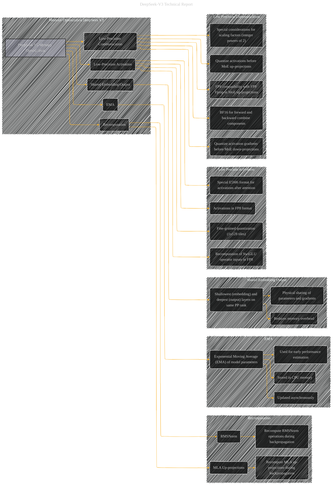

# Memory Optimization During Training for DeepSeek V3s
> **Disclaimer:**
>
> This document contains my personal notes on the topic,
> compiled from publicly available documentation and various cited sources.
> The materials are intended for educational purposes, personal study, and reference.
> The content is dual-licensed:
> 1. **MIT License:** Applies to all code implementations (Swift, Mermaid, and other programming languages).
> 2. **Creative Commons Attribution 4.0 International License (CC BY 4.0):** Applies to all non-code content, including text, explanations, diagrams, and illustrations.
---

## Memory Optimization DeepSeek V3 - A Diagrammatic Guide

---

### Explanation

This Mermaid graph outlines the key memory optimization strategies used during DeepSeek V3 training, based on the provided text.

*   **Subgraphs:** Organize related optimization techniques into distinct sections.
*   **Nodes:** Each box represents a specific technique or concept related to memory optimization.
*   **Arrows:** Show the relationships between the optimization strategies.  For example, the arrow from "Recomputation" to "Shared Embedding/Output" indicates that recomputation reduces the need for storing intermediate results, freeing up memory.
*   **Details:** Each node includes a brief description of the technique or a quote directly from the text for clarity.

---

### Key Enhancements

*   **Recomputation:**  The model recomputes intermediate activations during backpropagation, eliminating the need to store them in memory. This is a major memory-saving technique.
*   **EMA in CPU:**  Storing the Exponential Moving Average (EMA) of parameters in CPU memory reduces GPU memory footprint.
*   **Shared Embedding/Output:** Sharing the shallowest and deepest layers of the model within a single pipeline rank minimizes memory usage.
*   **Low-Precision Activation:**  The model quantizes activations and inputs to the SwiGLU operator to FP8, reducing the memory consumption of activations in the model.  Special cases, like activations after attention operators, use a customized E5M6 format to maintain high-precision training.
*   **Low-Precision Communication:** Quantizing activations before MoE up-projections, and activation gradients before MoE down-projections to FP8, reduces the memory and communication overhead in the MoE training process, while keeping critical components in BF16 to ensure numerical stability.

---

### Further Considerations

*   **Visual Enhancements:** You can use different colors or shapes to highlight different parts of the memory optimization process.
*   **Relationships to Other Parts:** Add edges to connect this optimization strategy to the overall DeepSeek-V3 architecture and training framework. For example, add an edge from "Recomputation" to "DualPipe" to show how the recomputation strategy aligns with the DualPipe algorithm's use of pipeline parallelism.
*   **Quantitative Data:** Include specific memory reduction percentages (if available) or approximate values in the nodes to make the diagram even more informative.

---
**Licenses:**

- **MIT License:**   - Full text in [LICENSE](LICENSE) file.
- **Creative Commons Attribution 4.0 International:**  - Legal details in [LICENSE-CC-BY](LICENSE-CC-BY) and at [Creative Commons official site](http://creativecommons.org/licenses/by/4.0/).

---