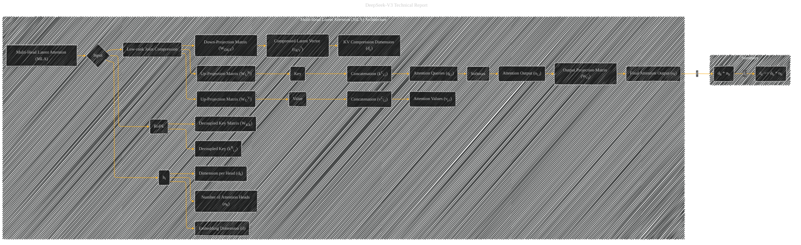

# Multi-Head Latent Attention (MLA) Architecture
> **Disclaimer:**
>
> This document contains my personal notes on the topic,
> compiled from publicly available documentation and various cited sources.
> The materials are intended for educational purposes, personal study, and reference.
> The content is dual-licensed:
> 1. **MIT License:** Applies to all code implementations (Swift, Mermaid, and other programming languages).
> 2. **Creative Commons Attribution 4.0 International License (CC BY 4.0):** Applies to all non-code content, including text, explanations, diagrams, and illustrations.
---

## Multi-Head Latent Attention (MLA) Architecture - A Diagrammatic Guide

---

### Explanation

This Mermaid diagram visualizes the Multi-Head Latent Attention (MLA) architecture, aligning with the provided text.

* **Input (B):**  The attention input for the 𝑡-th token (ht).
* **Low-rank Joint Compression (G):** This is a core step.  It represents the process of reducing the dimensionality of keys and values.
* **Matrices (H, K, M):** Show the down-projection and up-projection matrices, crucial for the low-rank compression.
* **Compressed Latent Vectors (I):** The compressed representation of keys and values.
* **Rotary Position Embedding (RoPE) (O):**  Explicitly shows RoPE as a separate operation applied to the keys.
* **Decoupled Keys/Values (P,Q):** Shows the decoupled keys and values generated via RoPE.
* **Concatenation (R,S):** Represents the concatenation of the compressed latent vectors and RoPE-embedded keys and values.
* **Attention Queries (T), Attention Values (U):** The diagram highlights the queries and values used in the attention calculation.
* **Softmax (V):** The core attention step where the similarity between queries and keys is calculated.
* **Output Projection (X):** The final transformation of the attention outputs.
* **Final Attention Output (Y):** The output of the MLA mechanism, which is a crucial input to the next layer.
* **Summary (AA):** A small subgraph to emphasize the crucial dimension reduction achieved by MLA (dc << dh * nh).

**Important Considerations for Further Detail:**

* **Inline Equations:**  Include equations (1) through (11) from the original text as inline equations within the relevant nodes for precise representation.  This will add clarity.
* **Visual Cues:** Use colors (e.g., different shades of blue for different vectors) to differentiate the different vectors and matrices.
* **Layer Numbers:** Include layer numbers (e.g., 'Attention Layer L') to explicitly relate this component to the overall network architecture.
* **Connections:**  Clearly show the connections between the different components, such as the flow of input (ht) and the production of the output (ut).

---
**Licenses:**

- **MIT License:**   - Full text in [LICENSE](LICENSE) file.
- **Creative Commons Attribution 4.0 International:**  - Legal details in [LICENSE-CC-BY](LICENSE-CC-BY) and at [Creative Commons official site](http://creativecommons.org/licenses/by/4.0/).

---