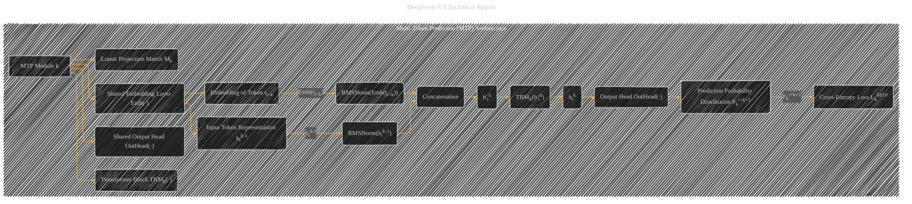

# Multi-Token Prediction (MTP) Architecture
> **Disclaimer:**
>
> This document contains my personal notes on the topic,
> compiled from publicly available documentation and various cited sources.
> The materials are intended for educational purposes, personal study, and reference.
> The content is dual-licensed:
> 1. **MIT License:** Applies to all code implementations (Swift, Mermaid, and other programming languages).
> 2. **Creative Commons Attribution 4.0 International License (CC BY 4.0):** Applies to all non-code content, including text, explanations, diagrams, and illustrations.
---

## Multi-Token Prediction (MTP) Architecture - A Diagrammatic Guide

---

### Explanation of the MTP Module (k)

* **Shared Embedding Layer (Emb(·))**: This layer is shared across all MTP modules and the main model. It converts input tokens into vector representations of a fixed dimension (d).
* **Shared Output Head (OutHead(·))**:  Also shared, this layer maps the output of the MTP module to logits (raw scores) for the vocabulary, and then applies the Softmax function to compute the probability distribution for the k-th additional predicted token.
* **Transformer Block (TRMk(·))**: A standard Transformer block, operating on the combined representation at each prediction depth.
* **Linear Projection Matrix (Mk):** A matrix that linearly projects the combined representation from the (k-1)th and kth depths.
* **Input Token Representation (hik-1):**  The hidden state representation of the i-th input token at the (k-1)th prediction depth.  This is the output of the main model or the previous MTP module.
* **Embedding of Token (Emb(ti+k))**: The embedding of the (i+k)-th token.
* **RMSNorm Operations:**  Normalization operations (RMSNorm) applied to both the input token representation and the embedded token at each step.
* **Concatenation:** The outputs of the RMSNorm operations are concatenated to create the combined representation (h'ik).
* **Output Representation (hik):** The output representation of the i-th token at the kth prediction depth after passing through the Transformer block.
* **Prediction Probability Distribution (Pki+k+1):** The probability distribution over the vocabulary for the (i+k+1)th token.

* **Cross-Entropy Loss (LkMTP):**  The cross-entropy loss associated with predicting the k-th additional token for a given input token at a given prediction depth.

---

### Key Relationships

* **Shared Resources:** The embedding layer and output head are shared across all modules. This is a significant aspect of the architecture.
* **Sequential Prediction:** The graph emphasizes the sequential nature of the MTP process, with each module (k) building on the previous one's output.
* **Causal Chain:**  Each MTP module maintains the causal chain of predictions, differing from the independent prediction method used in some prior work.

---
**Licenses:**

- **MIT License:**   - Full text in [LICENSE](LICENSE) file.
- **Creative Commons Attribution 4.0 International:**  - Legal details in [LICENSE-CC-BY](LICENSE-CC-BY) and at [Creative Commons official site](http://creativecommons.org/licenses/by/4.0/).

---