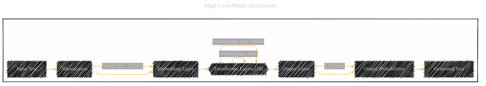
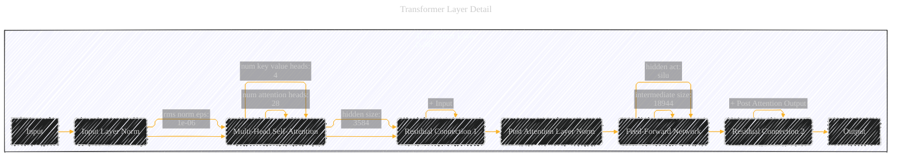
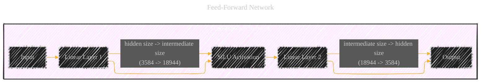
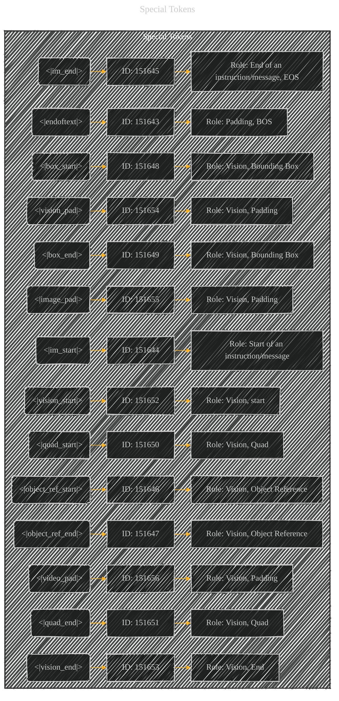
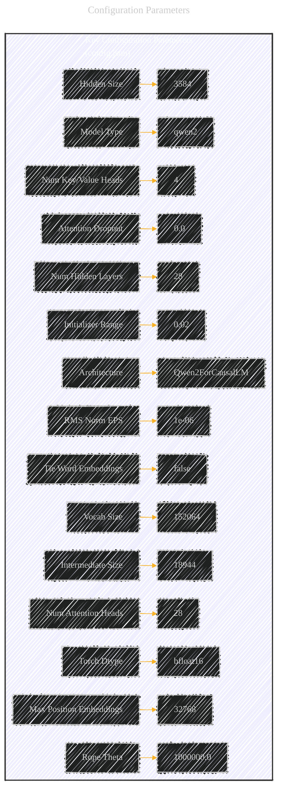

# DeepSeek Fin-R1 Model Architecture Overview - A Diagrammatic Guide
> **Disclaimer:**
>
> This document contains my personal notes on the topic,
> compiled from publicly available documentation and various cited sources.
> The materials are intended for educational purposes, personal study, and reference.
> The content is dual-licensed:
> 1. **MIT License:** Applies to all code implementations (Swift, Mermaid, and other programming languages).
> 2. **Creative Commons Attribution 4.0 International License (CC BY 4.0):** Applies to all non-code content, including text, explanations, diagrams, and illustrations.
---

Below is a collection of diagrams provides a comprehensive overview of the Fin-R1 model's architecture, special tokens, and configuration. It breaks down the complex structure into understandable visual components, explaining the function of each part and how they interact.

Here's a breakdown of the diagrams I'll create, and then the diagrams themselves:

1.  **High-Level Model Architecture:**  This will show the main components (embedding layer, transformer layers, output layer) and their relationships.
2.  **Transformer Layer Detail:**  This will zoom in on a single transformer layer, showing the multi-head attention, feed-forward network, and layer normalization.
3.  **Multi-Head Attention Mechanism:** This will illustrate how the attention mechanism works within a single head, and how multiple heads are combined.
4.  **Feed-Forward Network:** This shows the structure of the FFN within a transformer layer.
5.  **Special Tokens:** This diagram will list the special tokens and their IDs, highlighting their roles.
6.  **Configuration Parameters:** A summary diagram presenting the main configuration settings.
7. **Generation Configuration:** Show the process for generation, engaging with your readers, and strategies for tokens.

---

## 1. High-Level Model Architecture

**Explanation:**

*   **Input Text:** The raw text input to the model.
*   **Tokenization:**  The process of converting the input text into a sequence of tokens (represented by numerical IDs). The `vocab_size` of 152064 from `config.json` indicates the total number of unique tokens the model can handle (including special tokens).
*   **Embedding Layer:**  Transforms each token ID into a high-dimensional vector (the embedding). The `hidden_size` of 3584 is the dimensionality of these embeddings.
*   **Transformer Layers:** The core of the model.  The `config.json` specifies 28 identical layers.  Each layer refines the representation of the input sequence.  Key parameters here include `hidden_size`, `intermediate_size` (for the feed-forward network), and `num_attention_heads`.
*   **Output Layer:**  A linear layer (often called the "LM Head") that projects the final hidden state of each token to a vector of size `vocab_size`.
*   **Output Probabilities:**  A softmax function is applied to the output layer's activations to produce a probability distribution over the vocabulary for each token position.
*   **Generated Text:**  The final output, produced by sampling from the output probabilities (or using other decoding methods like beam search).

---

## 2. Transformer Layer Detail

**Explanation:**

*   **Input:**  The output from the previous layer (or the embedding layer for the first transformer layer).
*   **Input Layer Norm:**  Applies layer normalization (`rms_norm_eps: 1e-06`) to the input. This helps stabilize training.
*   **Multi-Head Self-Attention:**  The core attention mechanism.  This allows the model to attend to different parts of the input sequence when processing each token.  Key parameters:
    *   `num_attention_heads`: 28 (each head learns a different attention pattern).
    *   `num_key_value_heads`: 4 (This is a Qwen2 specific detail, and it's related to Grouped-Query Attention, which is used to improve efficiency).
    *   `hidden_size`: 3584 (the dimension of the queries, keys, and values).
*   **Residual Connection 1:**  Adds the original input to the output of the attention mechanism.  This helps with gradient flow during training (mitigating the vanishing gradient problem).
*   **Post Attention Layer Norm:** Another layer normalization applied after the attention and residual connection.
*   **Feed-Forward Network (FFN):**  A fully connected network that processes each token's representation independently.
    *   `intermediate_size`: 18944 (the hidden size of the FFN).
    *   `hidden_act`: "silu" (the activation function used in the FFN).
*   **Residual Connection 2:** Adds the output of the Layer Norm to the output of the FFN.
*   **Output:** The refined representation of the input sequence, passed to the next transformer layer.

---

## 3. Multi-Head Attention Mechanism

**Explanation:**

1.  **Input:** The output from the Input Layer Norm.
2.  **Linear Projections:** The input is projected into three separate matrices: Queries (Q), Keys (K), and Values (V).  This is done *for each attention head*.  Because `num_key_value_heads` is 4, and `num_attention_heads` is 28, the keys and values are shared across groups of 7 heads (28 / 4 = 7).  This is Grouped-Query Attention.
3.  **Attention Heads:** The Q, K, and V matrices are split into multiple "heads".  Each head performs scaled dot-product attention independently.
4.  **Scaled Dot-Product Attention (within each head):**
    *   Compute the dot product of the query with all keys.
    *   Divide by the square root of the key dimension (to stabilize gradients).
    *   Apply a softmax function to obtain attention weights.
    *   Multiply the values by the attention weights and sum them up.
5.  **Concatenation:** The outputs of all attention heads are concatenated.
6.  **Output Projection:**  A final linear layer projects the concatenated output to the desired `hidden_size`.
7. **Output:** The final result.

---

## 4. Feed-Forward Network

**Explanation:**

*   **Input:**  The output from the Post Attention Layer Norm.
*   **Linear Layer 1:**  Projects the input from `hidden_size` (3584) to `intermediate_size` (18944).  This is `gate_proj` and `up_proj` in the `model.safetensors.index.json`.
*   **SiLU Activation:**  Applies the SiLU (Sigmoid Linear Unit) activation function.  This introduces non-linearity.
*   **Linear Layer 2:** Projects the output back down from `intermediate_size` (18944) to `hidden_size` (3584). This is `down_proj` in the `model.safetensors.index.json`.
*   **Output:** The result of the FFN.

---

## 5. Special Tokens

**Explanation:**

This diagram lists the key special tokens used by the Fin-R1 model, derived from `added_tokens.json`, `special_tokens_map.json`, and `tokenizer_config.json`.  These tokens have specific meanings to the model and control its behavior.  The roles are inferred from their names and common usage in similar models. The diagram connects the special tokens with their respective IDs and roles.

---

## 6. Configuration Parameters

**Explanation:**
This diagram summarizes the most important configuration parameters from `config.json`.  These parameters define the size, shape, and behavior of the model.

---

## 7. Generation Configuration

```mermaid
---
title: "Generation Configuration"
author: "Cong Le"
version: "1.0"
license(s): "MIT, CC BY 4.0"
copyright: "Copyright (c) 2025 Cong Le. All Rights Reserved."
config:
  layout: elk
  look: handDrawn
  theme: dark
---
%%%%%%%% Mermaid version v11.4.1-b.14
%%%%%%%% Toggle theme value to `base` to activate the initilization below for the customized theme version.
%%%%%%%% Available curve styles include the following keywords:
%% basis, bumpX, bumpY, cardinal, catmullRom, linear, monotoneX, monotoneY, natural, step, stepAfter, stepBefore.
%%{
  init: {
    "graph": { "htmlLabels": true, 'curve': 'natural' },
    'fontFamily': 'Fantasy',
    'themeVariables': {
      'primaryColor': '#ffff',
      'primaryTextColor': '#55ff',
      'primaryBorderColor': '#7c2',
      'lineColor': '#F8B229',
      'secondaryColor': '#006100',
      'tertiaryColor': '#fff'
    }
  }
}%%
graph LR
    subgraph Generation_Configuration["Generation Configuration"]
    style Generation_Configuration fill:#fbf3,stroke:#333,stroke-width:1px;
    direction LR
        A[Start] --> B{Do Sample}
        B -- Yes --> C[Temperature]
        C --> C1[0.7]
        C1 --> D[Top-k]
        D --> D1[20]
        D1 --> E[Top-p]
        E --> E1[0.8]
        E1 --> F[Repetition Penalty]
        F --> F1[1.05]
        F1 --> G[EOS Token ID]
        G --> G1["151645, 151643"]
        G1 --> H[Pad Token ID]
        H --> H1[151643]
        H1 --> I[End]
    end
```

**Explanation:**

This diagram displays the key configuration parameters from the `generation_config.json` for text generation, providing a clear overview of the decoding strategy.

*    **Start:** Indicates the beginning of the generation process.
*    **Do Sample:** Set to "Yes," meaning the model will use sampling for generation rather than deterministic methods.
*    **Temperature:** Set to 0.7, controlling the randomness of the output. Lower values make the output more deterministic, while higher values increase randomness.
*    **Top-k:** Set to 20, limiting the sampling to the 20 most likely tokens at each step.
*    **Top-p:** Set to 0.8, further filtering the sampling to the smallest set of tokens whose cumulative probability exceeds 0.8.
*   **Repetition Penalty:** Set to 1.05, a slight penalty to discourage the model from repeating the same tokens too often.
*   **EOS Token ID:** Specifies the end-of-sequence token IDs (151645 and 151643), signaling the end of generation.
*   **Pad Token ID**: set to `151643`.
*   **End:** Represents the conclusion of the generation process.

---
**Licenses:**

- **MIT License:**   - Full text in [LICENSE](LICENSE) file.
- **Creative Commons Attribution 4.0 International:**  - Legal details in [LICENSE-CC-BY](LICENSE-CC-BY) and at [Creative Commons official site](http://creativecommons.org/licenses/by/4.0/).

---