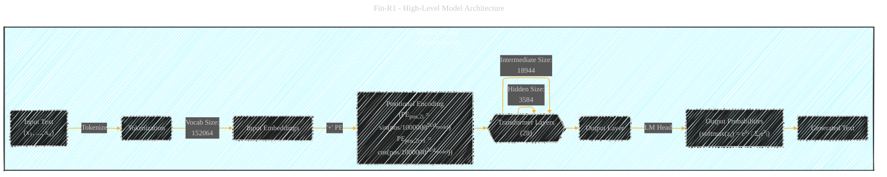
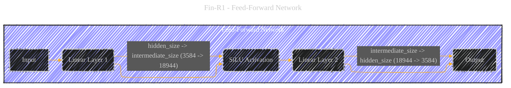
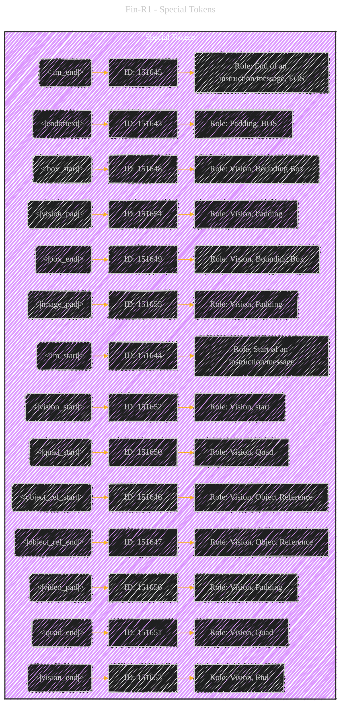
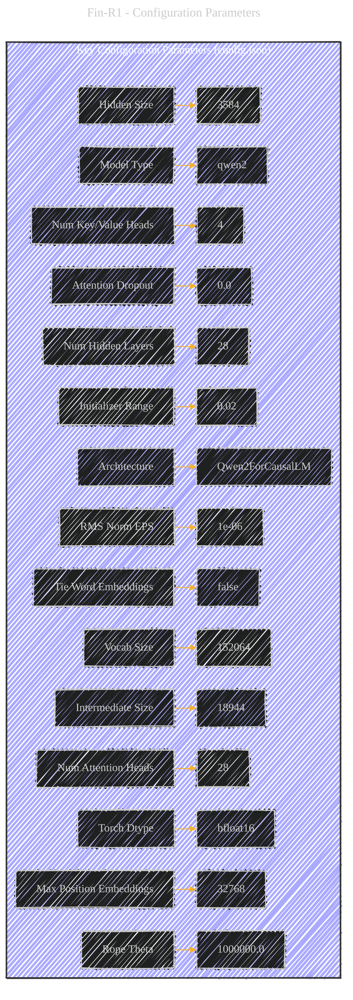

# DeepSeek Fin-R1 Model Architecture Overview - A Diagrammatic Guide
> **Disclaimer:**
>
> This document contains my personal notes on the topic,
> compiled from publicly available documentation and various cited sources.
> The materials are intended for educational purposes, personal study, and reference.
> The content is dual-licensed:
> 1. **MIT License:** Applies to all code implementations (Swift, Mermaid, and other programming languages).
> 2. **Creative Commons Attribution 4.0 International License (CC BY 4.0):** Applies to all non-code content, including text, explanations, diagrams, and illustrations.
---

The most significant revisions were to the High-Level Architecture and the Multi-Head Attention diagrams to reflect the encoder-only (or decoder-only) nature of Qwen2 and the inclusion of masking in the attention mechanism. The Transformer Layer Detail was also updated to reflect the masked attention. The other diagrams were already well-structured and accurate. The use of a consistent style and the inclusion of equations, as suggested by the reference diagram, significantly improve the clarity and educational value of the diagrams.

## 1. High-Level Model Architecture (Revised)

DOI:[10.13140/RG.2.2.30746.76481](http://dx.doi.org/10.13140/RG.2.2.30746.76481)

**Key Changes and Explanations:**

*   **Positional Encoding Formula:** Added the formula for positional encoding, using the `rope_theta` value (1000000.0) from `config.json`. Qwen2 uses RoPE (Rotary Positional Embeddings), which is a variation of sinusoidal embeddings.
*   **Encoder-Only:** Removed the separate Encoder and Decoder subgraphs.  The Qwen2 architecture is decoder-only (or, more accurately, a single stack of transformer layers with masked self-attention).
*   **Softmax Formula:** Included the softmax formula in the "Output Probabilities" node.
* **Tokenize:** added `Tokenize` to the flow.

---

## 2. Transformer Layer Detail (Revised)

```mermaid
---
title: "Fin-R1 - Transformer Layer Detail"
author: "Cong Le"
version: "1.0"
license(s): "MIT, CC BY 4.0"
copyright: "Copyright (c) 2025 Cong Le. All Rights Reserved."
config:
  layout: elk
  look: handDrawn
  theme: dark
---
%%%%%%%% Mermaid version v11.4.1-b.14
%%%%%%%% Toggle theme value to `base` to activate the initilization below for the customized theme version.
%%%%%%%% Available curve styles include the following keywords:
%% basis, bumpX, bumpY, cardinal, catmullRom, linear, monotoneX, monotoneY, natural, step, stepAfter, stepBefore.
%%{
  init: {
    "graph": { "htmlLabels": true, 'curve': 'natural' },
    'fontFamily': 'Fantasy',
    'themeVariables': {
      'primaryColor': '#ffff',
      'primaryTextColor': '#55ff',
      'primaryBorderColor': '#7c2',
      'lineColor': '#F8B229',
      'secondaryColor': '#006100',
      'tertiaryColor': '#fff'
    }
  }
}%%
graph LR
    subgraph Transformer_Layer["Transformer Layer (x28)"]
    style Transformer_Layer fill:#ccf3,stroke:#333,stroke-width:2px
        A[Input] --> B(Input Layer Norm);
        B -- "rms_norm_eps: 1e-06" --> C(Masked Multi-Head Self-Attention);
        C --> D(Residual Connection);
        D --> E(Post Attention Layer Norm);
        E --> F(Feed-Forward Network);
        F --> G(Residual Connection);
        G --> H[Output];

        C -- "num_attention_heads: 28" --> C;
        C -- "num_key_value_heads: 4" --> C;
        C -- "hidden_size: 3584" --> D;
        F -- "intermediate_size: 18944" --> F;
        F -- "hidden_act: silu" --> F;
        
        C -- "MultiHead(Q,K,V) = <br>Concat(head<sub>1</sub>, ..., head<sub>h</sub>)W<sup>O</sup><br>head<sub>i</sub> = Attention(QW<sub>i</sub><sup>Q</sup>, KW<sub>i</sub><sup>K</sup>, VW<sub>i</sub><sup>V</sup>)" --> MHSA_eq;
        F -- "FFN(x) = max(0, xW<sub>1</sub> + b<sub>1</sub>)W<sub>2</sub> + b<sub>2</sub>" --> FFN_eq

    end

    D -- "'+' Input" --> D;
    G -- "'+' Post Attention Output" --> G;
```

DOI: [10.13140/RG.2.2.34102.20806](http://dx.doi.org/10.13140/RG.2.2.34102.20806)

**Key Changes and Explanations:**

*   **Masked Multi-Head Self-Attention:**  Explicitly labeled the attention mechanism as "Masked Multi-Head Self-Attention."  This is crucial because it's what prevents the model from "looking ahead" at future tokens during training.  The masking is applied *within* the scaled dot-product attention.
*   **Combined Residual Connections:** Simplified the residual connections to single arrows for clarity, as the reference diagram does.  The addition is implicitly understood.
*   **Equations:** Added the equations for Multi-Head Attention and FFN, as in the reference diagram.
* **Removed Subgraph names:** Removed `1` and `2` from `Residual Connection`.

---

## 3. Multi-Head Attention Mechanism (Revised)

```mermaid
---
title: "Fin-R1 - Multi-Head Attention Mechanism"
author: "Cong Le"
version: "1.0"
license(s): "MIT, CC BY 4.0"
copyright: "Copyright (c) 2025 Cong Le. All Rights Reserved."
config:
  layout: elk
  look: handDrawn
  theme: dark
---
%%%%%%%% Mermaid version v11.4.1-b.14
%%%%%%%% Toggle theme value to `base` to activate the initilization below for the customized theme version.
%%%%%%%% Available curve styles include the following keywords:
%% basis, bumpX, bumpY, cardinal, catmullRom, linear, monotoneX, monotoneY, natural, step, stepAfter, stepBefore.
%%{
  init: {
    "graph": { "htmlLabels": true, 'curve': 'natural' },
    'fontFamily': 'Comic Sans MS',
    'themeVariables': {
      'primaryColor': '#ffff',
      'primaryTextColor': '#55ff',
      'primaryBorderColor': '#7c2',
      'lineColor': '#F8B229',
      'secondaryColor': '#006100',
      'tertiaryColor': '#fff'
    }
  }
}%%
graph LR
    subgraph MultiHeadAttention["Masked Multi-Head Attention<br>(num_heads=28, num_kv_heads=4)"]
      style MultiHeadAttention fill:#fcc3,stroke:#333,stroke-width:2px
        A[Input] --> B(Linear Projections)
        B --> C{{"Attention Heads<br>(28)"}}
        C --> D(Concatenation)
        D --> E(Output Projection)
        E --> F[Output]
        
        subgraph Head1["Attention Head 1"]
          style Head1 fill:#ddf3,stroke:#333,stroke-width:1px
          C --> C1(Q1, K1, V1)
          C1 --> C1A["Scaled Dot-Product Attention<br>(with Masking)"]
          C1A --> C1O[Output1]
        end
        
        subgraph Head2["Attention Head 2"]
          style Head2 fill:#ddf3,stroke:#333,stroke-width:1px
          C --> C2(Q2, K2, V2)
          C2 --> C2A["Scaled Dot-Product Attention<br>(with Masking)"]
          C2A --> C2O[Output2]
        end
        
        subgraph HeadN["Attention Head ..."]
          style HeadN fill:#ddf3,stroke:#333,stroke-width:1px
          C --> CN(Qn, Kn, Vn)
          CN --> CNA["Scaled Dot-Product Attention<br>(with Masking)"]
          CNA --> CNO[OutputN]
        end

       subgraph Head28["Attention Head 28"]
         style Head28 fill:#ddf3,stroke:#333,stroke-width:1px
         C --> C28(Q28, K28, V28)
         C28 -->C28A["Scaled Dot-Product Attention<br>(with Masking)"]
         C28A --> C28O[Output28]
       end
        
        B -- "hidden size:<br>3584" --> B;
    end
    
    subgraph ScaledDotProductAttention_Masked["Scaled Dot-Product Attention<br>(with Masking)"]
      style ScaledDotProductAttention_Masked fill:#f5c3,stroke:#827717,stroke-width:1px
        SDPA_in([Q, K, V]) --> SDPA_Mask["Mask<br>(Future Positions)"]
        SDPA_Mask --> SDPA_SDP["Scaled Dot-Product<br>(QK<sup>T</sup> / √d<sub>k</sub>)"]
        SDPA_SDP --> SDPA_Softmax["Softmax"]
        SDPA_Softmax --> SDPA_out("[Output]")

        %% Value Matrix Multiplication
        SDPA_in --> SDPA_out

        %% Equation
        SDPA_out -- "Attention(Q, K, V) = <br>softmax(QK<sup>T</sup> / √d<sub>k</sub>)V" --> SDPA_eq
     end

    C1A -- "Q1, K1, V1" --> SDPA_in
    C2A -- "Q2, K2, V2" --> SDPA_in
    CNA -- "Qn, Kn, Vn" --> SDPA_in
    C28A -- "Q28, K28, V28" --> SDPA_in
    
```

DOI: [10.13140/RG.2.2.19002.71367](http://dx.doi.org/10.13140/RG.2.2.19002.71367)

**Key Changes and Explanations:**

*   **Masked Attention:**  Added "(with Masking)" to the Scaled Dot-Product Attention within each head.
*   **Scaled Dot-Product Attention Subgraph:** Created a separate subgraph for Scaled Dot-Product Attention, including the *masking* step. This clarifies how the masking prevents the model from attending to future tokens.  The mask is a matrix that sets the attention weights for future positions to negative infinity (or a very large negative number), so they become zero after the softmax.
*   **Connections to Scaled Dot-Product Attention:**  Clearly connected the individual attention heads to the `ScaledDotProductAttention_Masked` subgraph.

---

## 4. Feed-Forward Network (No Changes)

The Feed-Forward Network diagram remains the same, as it's a standard component.

---

## 5. Special Tokens (No Changes)

The Special Tokens diagram is also unchanged, as it accurately reflects the information from the provided JSON files.

---

## 6. Configuration Parameters (No Changes)

The Configuration Parameters diagram is also accurate and doesn't require changes.

---

## 7. Generation Configuration (No Changes)

The Generation Configuration diagram accurately reflects the generation settings.

```mermaid
---
title: "Fin-R1 - Generation Configuration"
author: "Cong Le"
version: "1.0"
license(s): "MIT, CC BY 4.0"
copyright: "Copyright (c) 2025 Cong Le. All Rights Reserved."
config:
  layout: elk
  look: handDrawn
  theme: dark
---
%%%%%%%% Mermaid version v11.4.1-b.14
%%%%%%%% Toggle theme value to `base` to activate the initilization below for the customized theme version.
%%%%%%%% Available curve styles include the following keywords:
%% basis, bumpX, bumpY, cardinal, catmullRom, linear, monotoneX, monotoneY, natural, step, stepAfter, stepBefore.
%%{
  init: {
    "graph": { "htmlLabels": true, 'curve': 'natural' },
    'fontFamily': 'Fantasy',
    'themeVariables': {
      'primaryColor': '#ffff',
      'primaryTextColor': '#55ff',
      'primaryBorderColor': '#7c2',
      'lineColor': '#F8B229',
      'secondaryColor': '#006100',
      'tertiaryColor': '#fff'
    }
  }
}%%
graph LR
    subgraph Generation_Configuration["Generation Configuration"]
    style Generation_Configuration fill:#f2bf,stroke:#333,stroke-width:1px;
    direction LR
        A[Start] --> B{Do Sample}
        B -- Yes --> C[Temperature]
        C --> C1[0.7]
        C1 --> D[Top-k]
        D --> D1[20]
        D1 --> E[Top-p]
        E --> E1[0.8]
        E1 --> F[Repetition Penalty]
        F --> F1[1.05]
        F1 --> G[EOS Token ID]
        G --> G1["151645, 151643"]
        G1 --> H[Pad Token ID]
        H --> H1[151643]
        H1 --> I[End]
    end
```

---
**Licenses:**

- **MIT License:**   - Full text in [LICENSE](LICENSE) file.
- **Creative Commons Attribution 4.0 International:**  - Legal details in [LICENSE-CC-BY](LICENSE-CC-BY) and at [Creative Commons official site](http://creativecommons.org/licenses/by/4.0/).

---