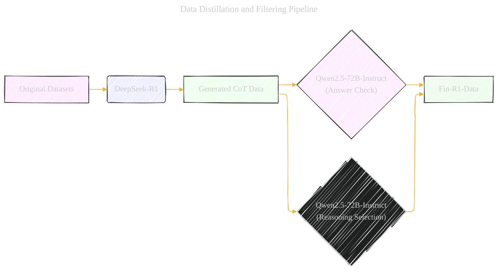
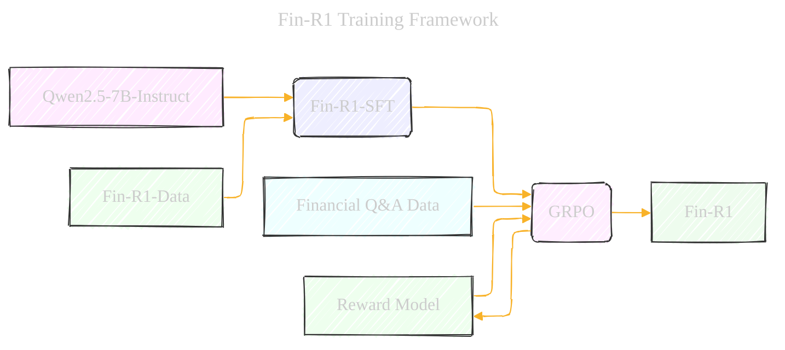
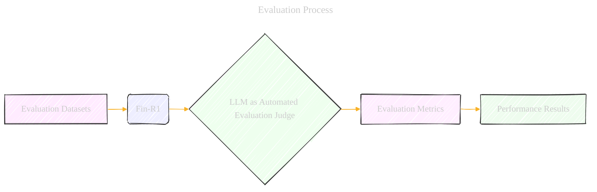

# Fin-R1: A Large Language Model for Financial Reasoning through Reinforcement Learning
> **Disclaimer:**
>
> This document contains my personal notes on the topic,
> compiled from publicly available documentation and various cited sources.
> The materials are intended for educational purposes, personal study, and reference.
> The content is dual-licensed:
> 1. **MIT License:** Applies to all code implementations (Swift, Mermaid, and other programming languages).
> 2. **Creative Commons Attribution 4.0 International License (CC BY 4.0):** Applies to all non-code content, including text, explanations, diagrams, and illustrations.
---

## I. Key Concepts Mapped to the Graphical Model Structure

### 1. Data Distillation and Filtering Pipeline

    *   **Type:** Directed Acyclic Graph / Bayesian Network.  The process has a clear direction.
    *   **Nodes:**
        *   Original Datasets (Ant\_Finance, FinanceIQ, FinPEE, etc.)
        *   DeepSeek-R1 (Data Distillation Model)
        *   Generated CoT Data
        *   Qwen2.5-72B-Instruct (LLM Judge for Answer Check)
        *   Qwen2.5-72B-Instruct (LLM Judge for Reasoning Selection)
        *   Fin-R1-Data (High-Quality Dataset)
    *   **Edges:**
        *   "Original Datasets" -> "DeepSeek-R1": Represents the distillation process.
        *   "DeepSeek-R1" -> "Generated CoT Data":  Model output.
        *   "Generated CoT Data" -> "Qwen2.5-72B-Instruct (Answer Check)": Answer evaluation process.
        *   "Generated CoT Data" -> "Qwen2.5-72B-Instruct (Reasoning Selection)": Reasoning trajectory evaluation.
        *   "Qwen2.5-72B-Instruct (Answer Check)" -> "Fin-R1-Data":  Filtering based on answer correctness.
        *   "Qwen2.5-72B-Instruct (Reasoning Selection)" -> "Fin-R1-Data": Filtering based on reasoning quality.
    *   **Factorization (Simplified):** `p(Fin-R1-Data | Original Datasets, DeepSeek-R1, Qwen2.5-72B-Instruct) = p(Generated CoT Data | Original Datasets, DeepSeek-R1) * p(Fin-R1-Data | Generated CoT Data, Qwen2.5-72B-Instruct)`

### 2. Fin-R1 Training Framework

    *   **Type:** Directed Acyclic Graph / Bayesian Network
    *   **Nodes:**
        *   Qwen2.5-7B-Instruct (Base Model)
        *   Fin-R1-Data (Training Data)
        *   Fin-R1-SFT (Supervised Fine-Tuned Model)
        *   GRPO (Reinforcement Learning Algorithm)
        *   Reward Model (Format Reward, Accuracy Reward)
        *   Fin-R1 (Final Model)
    *   **Edges:**
        *   "Qwen2.5-7B-Instruct" -> "Fin-R1-SFT": SFT pre-training process.
        *   "Fin-R1-Data" -> "Fin-R1-SFT": SFT process driven by data
        *   "Fin-R1-SFT" -> "GRPO":  Starting point for reinforcement learning.
        *   "Financial Q&A Data" -> "GRPO": driving the optimization
        *   "GRPO" -> "Reward Model": Reinforcement signal to the reward model.
        *   "Reward Model" -> "GRPO": Feedback for policy improvement.
        *   "GRPO" -> "Fin-R1": Optimized financial reasoning model.
    *   **Factorization (Simplified):** `p(Fin-R1 | Qwen2.5-7B-Instruct, Fin-R1-Data, GRPO, Reward Model) = p(Fin-R1-SFT | Qwen2.5-7B-Instruct, Fin-R1-Data) * p(Fin-R1 | Fin-R1-SFT, GRPO, Reward Model)`

### 3. Evaluation Process

    *   **Type:** Directed Acyclic Graph
    *   **Nodes:**
        *   Evaluation Datasets (FinQA, ConvFinQA, Ant-Finance, TFNS, Finance-Instruct-500K)
        *   Fin-R1 (Model Under Evaluation)
        *   LLM as Automated Evaluation Judge (e.g., GPT-4o, Qwen2.5-72B-Instruct)
        *   Evaluation Metrics (Accuracy, F1-Score, etc.)
        *   Performance Results
    *   **Edges:**
        *   "Evaluation Datasets" -> "Fin-R1": Model application on benchmark datasets.
        *   "Fin-R1" -> "LLM as Automated Evaluation Judge": Automated response assessment
        *   "LLM as Automated Evaluation Judge" -> "Evaluation Metrics": Measuring performance against benchmarks.
        *   "Evaluation Metrics" -> "Performance Results": Summarized benchmark scores.
    *   **Factorization (Simplified):** `p(Performance Results | Evaluation Datasets, Fin-R1, LLM as Automated Evaluation Judge) = p(Responses | Evaluation Datasets, Fin-R1) * p(Evaluation Metrics | Responses, LLM as Automated Evaluation Judge) * p(Performance Results | Evaluation Metrics)`

---

## II. Mermaid Code Examples

Here are the mermaid code for a couple of the concepts we have:

### 1. Data Distillation and Filtering Pipeline

### 2. Fin-R1 Training Framework

### 3. Evaluation Process

**Explanation of the Diagrams:**

*   **Nodes:** Represent components in the pipeline (data, models, processes).
*   **Edges:** Show the flow of information or actions.
*   **Styles:** Can be used to distinguish between types of nodes (e.g., data vs. models).

---
**Licenses:**

- **MIT License:**   - Full text in [LICENSE](LICENSE) file.
- **Creative Commons Attribution 4.0 International:**  - Legal details in [LICENSE-CC-BY](LICENSE-CC-BY) and at [Creative Commons official site](http://creativecommons.org/licenses/by/4.0/).

---