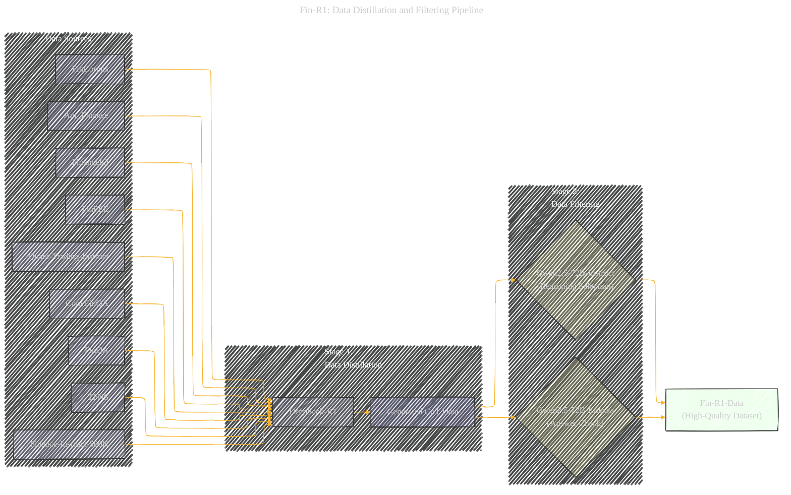
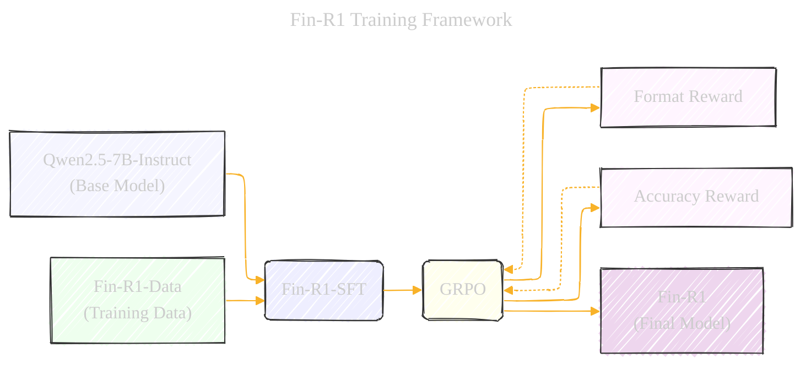
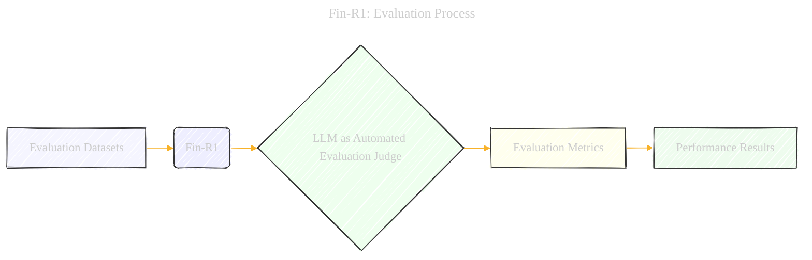

# Fin-R1: A Large Language Model for Financial Reasoning through Reinforcement Learning
> **Disclaimer:**
>
> This document contains my personal notes on the topic,
> compiled from publicly available documentation and various cited sources.
> The materials are intended for educational purposes, personal study, and reference.
> The content is dual-licensed:
> 1. **MIT License:** Applies to all code implementations (Swift, Mermaid, and other programming languages).
> 2. **Creative Commons Attribution 4.0 International License (CC BY 4.0):** Applies to all non-code content, including text, explanations, diagrams, and illustrations.
---

## A Diagrammatic Guide

### 1. Data Distillation and Filtering Pipeline

---

### 2. Fin-R1 Training Framework

### 3. Evaluation Process

**Key Improvements and Explanations:**

*   **Subgraphs:**  Used to visually group related components (Data Sources, Data Distillation, etc.) in the Data Pipeline.
*   **Labels:** Descriptive labels are essential for understanding the diagrams.  Use parentheses or other notations to add extra info.
*   **Styling:** Different colors help to distinguish between types of nodes (e.g., data sources, models, processes).
*   **Directionality:** Arrows clearly show the flow of data and the sequence of operations.
*   **Reward Loop (Training Framework):**  The dashed arrow in the training diagram (E -.-> D and F -.-> D) emphasize that the reward model provides *feedback* to the GRPO algorithm.
*   **Simplified Factors (For more details check out tutorial)** Each diagram shows the factorization relationship between each stages.

---
**Licenses:**

- **MIT License:**   - Full text in [LICENSE](LICENSE) file.
- **Creative Commons Attribution 4.0 International:**  - Legal details in [LICENSE-CC-BY](LICENSE-CC-BY) and at [Creative Commons official site](http://creativecommons.org/licenses/by/4.0/).

---