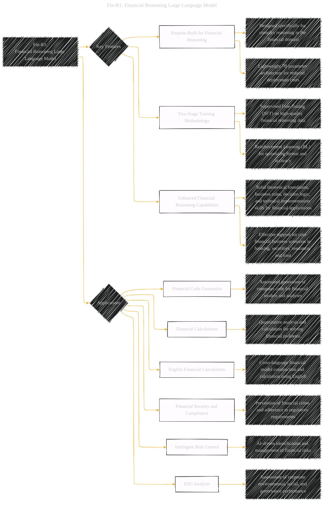
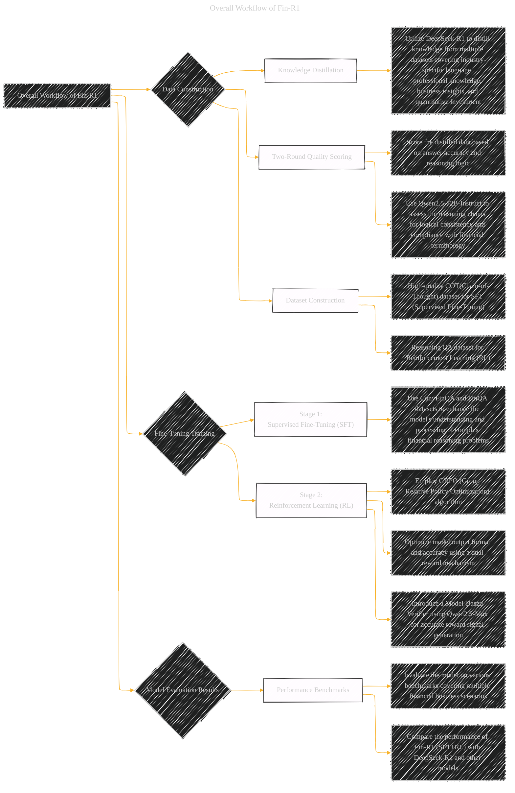
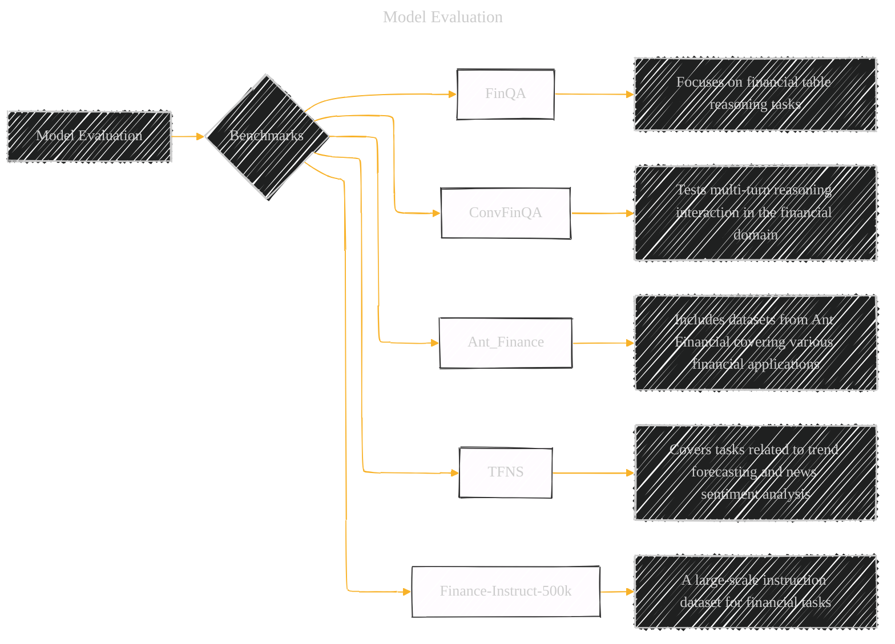

# Fin-R1: A Large Language Model for Financial Reasoning through Reinforcement Learning
> **Disclaimer:**
>
> This document contains my personal notes on the topic,
> compiled from publicly available documentation and various cited sources.
> The materials are intended for educational purposes, personal study, and reference.
> The content is dual-licensed:
> 1. **MIT License:** Applies to all code implementations (Swift, Mermaid, and other programming languages).
> 2. **Creative Commons Attribution 4.0 International License (CC BY 4.0):** Applies to all non-code content, including text, explanations, diagrams, and illustrations.
---

## A Diagrammatic Guide

### Fin-R1: Financial Reasoning Large Language Model

**Explanation:**
*   **Fin-R1: Financial Reasoning Large Language Model:** Represents the core concept.
*   **Key Features:** High-level functionalities and benefits.
*   **Applications:** Real-world scenarios where Fin-R1 can be applied.

---

### Overall Workflow of Fin-R1

**Explanation:**
*   **Overall Workflow of Fin-R1:** The entire process of data preparation, training, and evaluation.
*   **Data Construction:** Steps involved in creating a high-quality financial dataset.
*   **Fine-Tuning Training:** Detailed breakdown of the two-stage training process.
*   **Model Evaluation Results:** The results of testing and comparing the model against other baselines.

---

### Fin-R1 Data Distribution

**Explanation:**
*   **Fin-R1 Data Distribution:**  How the training data is organized into specific categories.
*   **Four Key Modules:** Categories that the training data falls into.

---

### Model Evaluation

**Explanation:**
*   **Model Evaluation:**  The procedure and specific datasets used to evaluate the model's performance.
*   **Benchmarks:**  Different test datasets utilized in the model's evaluation.

---
**Licenses:**

- **MIT License:**   - Full text in [LICENSE](LICENSE) file.
- **Creative Commons Attribution 4.0 International:**  - Legal details in [LICENSE-CC-BY](LICENSE-CC-BY) and at [Creative Commons official site](http://creativecommons.org/licenses/by/4.0/).

---