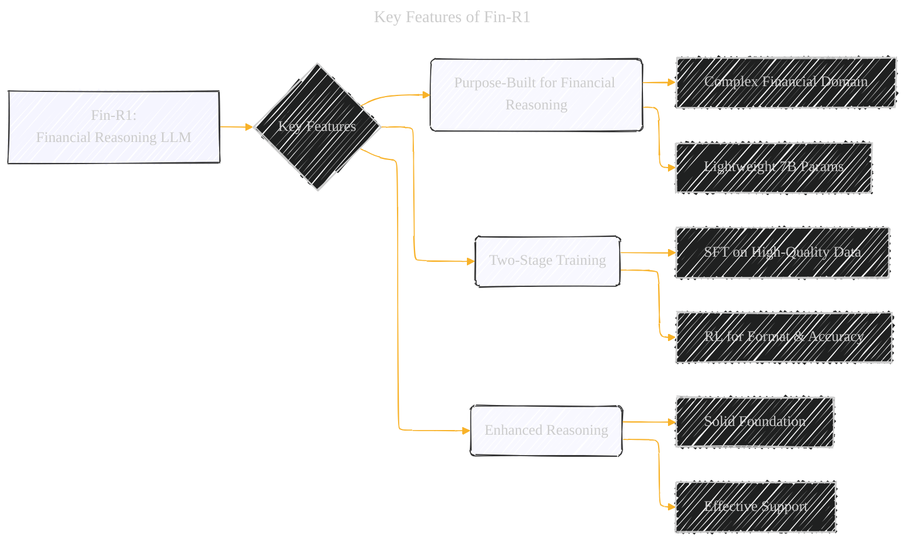
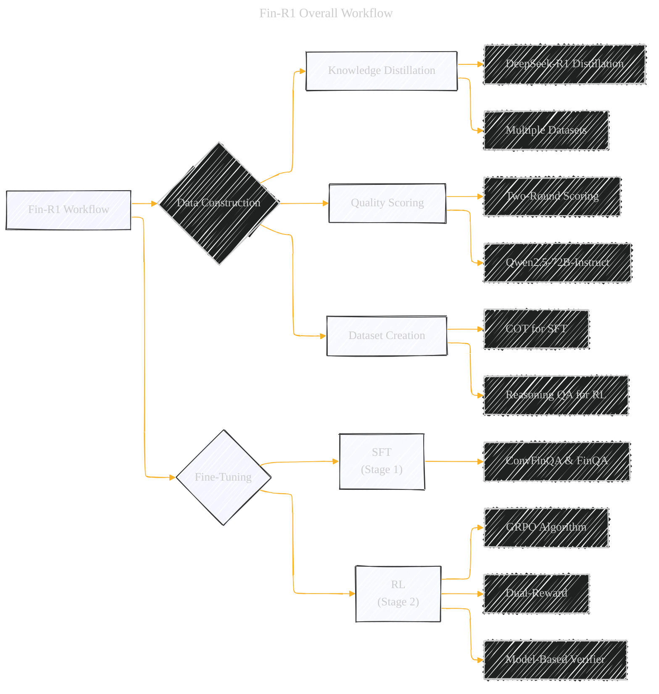

# Fin-R1: A Large Language Model for Financial Reasoning through Reinforcement Learning
> **Disclaimer:**
>
> This document contains my personal notes on the topic,
> compiled from publicly available documentation and various cited sources.
> The materials are intended for educational purposes, personal study, and reference.
> The content is dual-licensed:
> 1. **MIT License:** Applies to all code implementations (Swift, Mermaid, and other programming languages).
> 2. **Creative Commons Attribution 4.0 International License (CC BY 4.0):** Applies to all non-code content, including text, explanations, diagrams, and illustrations.
---

## Key Features of Fin-R1

## Fin-R1 Overall Workflow

## Fin-R1 Data Distribution

## Model Evaluation Benchmarks

Key improvements applied:

*   **Styling:** Consistent styling (fill colors, borders) for visual appeal and readability.
*   **Conciseness:** Shortened labels while retaining essential information.
*   **Structure:** Diagrams maintain the hierarchical structure of the concepts.
*   **Arrow Flow:** Clear directional flow to represent relationships between steps or categories.
*   **Diagram Choice:** Used `graph TD` for directional flow and clear hierarchical relationships.

---
**Licenses:**

- **MIT License:**   - Full text in [LICENSE](LICENSE) file.
- **Creative Commons Attribution 4.0 International:**  - Legal details in [LICENSE-CC-BY](LICENSE-CC-BY) and at [Creative Commons official site](http://creativecommons.org/licenses/by/4.0/).

---