# Block-Sparse FlashAttention
> **Disclaimer:**
>
> This document contains my personal notes on the topic,
> compiled from publicly available documentation and various cited sources.
> The materials are intended for educational purposes, personal study, and reference.
> The content is dual-licensed:
> 1. **MIT License:** Applies to all code implementations (Swift, Mermaid, and other programming languages).
> 2. **Creative Commons Attribution 4.0 International License (CC BY 4.0):** Applies to all non-code content, including text, explanations, diagrams, and illustrations.
---

## Block-Sparse FlashAttention - A Diagrammatic Guide

```mermaid
---
title: "FlashAttention - Fast and Memory-Efficient Exact Attention with IO-Awareness"
config:
  layout: elk
  look: handDrawn
  theme: dark
---
%%%%%%%% Available curve styles include the following keywords:
%% basis, bumpX, bumpY, cardinal, catmullRom, linear, monotoneX, monotoneY, natural, step, stepAfter, stepBefore.
%%{
  init: {
    "flowchart": { "htmlLabels": false, 'curve': 'linear' },
    'fontFamily': 'Fantasy',
    'themeVariables': {
      'primaryColor': '#BB2528',
      'primaryTextColor': '#f529',
      'primaryBorderColor': '#7C0000',
      'lineColor': '#F8B229',
      'secondaryColor': '#006100',
      'tertiaryColor': '#fff'
    }
  }
}%%
graph TD
    subgraph Block_Sparse_FlashAttention_Overview["Block-Sparse FlashAttention Overview"]
        A[Block-Sparse FlashAttention] --> B{Core Idea}
        B --> C[Sparse Attention with Tiling]
        B --> D[Recomputation with Sparsity Mask]
        B -- Reduced HBM Accesses --> E[Faster Runtime]
        B -- Improved Memory Efficiency --> F[Lower Memory Footprint]
    end
    
    subgraph Memory_Hierarchy["Memory Hierarchy"]
        H[GPU Memory Hierarchy] --> I(SRAM)
        I -- High Bandwidth, Small Size --> J(HBM)
        J -- High Bandwidth, Larger Size --> K(DRAM)
        K -- Slowest, Largest Size --> L(Main Memory)

        style I fill:#f9f3,stroke:#333,stroke-width:1px
        style J fill:#ccf3,stroke:#333,stroke-width:1px
        style K fill:#ccf3,stroke:#333,stroke-width:1px
        style L fill:#ccf3,stroke:#333,stroke-width:1px
    end

    subgraph Standard_Attention["Standard Attention"]
        M[Standard Attention] --> N(QK<sup>T</sup>)
        N -- Matrix Multiplication --> O(S)
        O -- Matrix S --> P("softmax(S)")
        P -- Softmax --> Q(P)
        Q -- Matrix P --> R(PV)
        R -- Matrix Multiplication --> S(O)
        S -- Output --> T["O(N<sup>2</sup>) Memory Footprint"]
        S -- O(N<sup>2</sup>) HBM Accesses --> U[Slow Runtime]
    end

    subgraph Block_Sparse_Attention_Algorithm["Block-Sparse Attention Algorithm"]
        V[Block-Sparse Attention Algorithm] --> W(Input Matrices Q, K, V)
        W --> X(Division into Blocks)
        X --  Block Sparsity Mask --> Y(Computation on Non-zero Blocks)
        Y --> Z(Softmax on Non-zero Blocks)
        Z --> AA(O)
        AA -- Output --> AB["O(N log N) or O(N√N) HBM Accesses, depending on sparsity"]
        AA -- Linear Memory Footprint --> AC[Efficient Memory Usage]
        style V fill:#f9f3,stroke:#333,stroke-width:1px
    end

    subgraph Complexity_Analysis["Complexity Analysis"]
        AD[Complexity Analysis] --> AE(IO Complexity Reduction)
        AE --> AF("Proportionate to Sparsity")
        AE --> AG("Θ(N log N) or Θ(N√N)")
        style AD fill:#ccf3,stroke:#333,stroke-width:1px
    end

    subgraph Experimental_Results["Experimental Results"]
        AH[Experiments] --> AI(Runtime Comparisons)
        AI --> AJ(Block-Sparse FlashAttention vs FlashAttention)
        AI --> AK(Block-Sparse FlashAttention vs Other Approximate Methods)
        AI -- Significant Speedups --> AL[Faster Training]
        
        AH --> AM(Memory Footprint Comparisons)
        AM --> AN(Block-Sparse FlashAttention vs Other Approximate Methods)
        AM -- Linear Memory Scaling --> AO[Efficient Memory]
    end

```

----

### Explanation

This Mermaid diagram focuses on Block-Sparse FlashAttention, highlighting its core components and relationships.  It uses the same structure as the previous overview but specifically focuses on the aspects relevant to the sparse version.  Subgraphs clearly delineate different concepts, making the diagram more targeted and easier to understand.

* **Block-Sparse Attention Overview:** This subgraph summarizes the key ideas of block-sparse FlashAttention.

* **Memory Hierarchy:** Shows the memory levels, essential context for understanding the algorithm's efficiency.

* **Standard Attention:** Provides a comparison point for the memory and runtime characteristics of standard attention, which block-sparse FlashAttention aims to improve upon.

* **Block-Sparse Attention Algorithm:**  This subgraph details the process of division into blocks, application of the sparsity mask, and computations limited to non-zero blocks.  It explicitly shows how the HBM access count is reduced by the sparsity factor.

* **Complexity Analysis:** This section emphasizes the direct link between IO complexity and sparsity.

* **Experimental Results:**  This highlights the experimental comparisons, including runtime and memory usage, showing how the performance of block-sparse FlashAttention compares to other approximate attention methods and to FlashAttention itself.

---

### Further improvements

*   **Quantitative Details:** Add specific formulas for block sizes (e.g., block size proportional to SRAM), sparsity factors, and their impact on the IO complexity equations.
*   **Visual Cues:** Use different shapes or colors for nodes representing different matrices (Q, K, V, S, P, O), sparsity masks, and other relevant concepts to increase clarity.

This refined diagram gives a more targeted view of block-sparse FlashAttention, making the key elements clearer for understanding its benefits. 

---
**Licenses:**

- **MIT License:**   - Full text in [LICENSE](LICENSE) file.
- **Creative Commons Attribution 4.0 International:**  - Legal details in [LICENSE-CC-BY](LICENSE-CC-BY) and at [Creative Commons official site](http://creativecommons.org/licenses/by/4.0/).

---