# FlashAttention Algorithm
> **Disclaimer:**
>
> This document contains my personal notes on the topic,
> compiled from publicly available documentation and various cited sources.
> The materials are intended for educational purposes, personal study, and reference.
> The content is dual-licensed:
> 1. **MIT License:** Applies to all code implementations (Swift, Mermaid, and other programming languages).
> 2. **Creative Commons Attribution 4.0 International License (CC BY 4.0):** Applies to all non-code content, including text, explanations, diagrams, and illustrations.
---

## FlashAttention Algorithm - A Diagrammatic Guide

```mermaid
---
title: "FlashAttention - Fast and Memory-Efficient Exact Attention with IO-Awareness"
config:
  layout: elk
  look: handDrawn
  theme: dark
---
%%%%%%%% Available curve styles include the following keywords:
%% basis, bumpX, bumpY, cardinal, catmullRom, linear, monotoneX, monotoneY, natural, step, stepAfter, stepBefore.
%%{
  init: {
    "flowchart": { "htmlLabels": false, 'curve': 'linear' },
    'fontFamily': 'Fantasy',
    'themeVariables': {
      'primaryColor': '#BB2528',
      'primaryTextColor': '#f529',
      'primaryBorderColor': '#7C0000',
      'lineColor': '#F8B229',
      'secondaryColor': '#006100',
      'tertiaryColor': '#fff'
    }
  }
}%%
graph LR
    subgraph FlashAttention_Algorithm["FlashAttention Algorithm"]
        A[FlashAttention] --> B("Input Matrices")
        B --> C("Q, K, V ∈ R<sup>N×d<sup>")
        
        C --> D["Block Division"]
        D --> E("Q<sub>1<sub>, ..., Q<sub>Tr<sub>, K<sub>1<sub>, ..., K<sub>Tc<sub>, V<sub>1<sub>, ..., V<sub>Tc<sub>")
        
        E --> F["Load Blocks to SRAM"]
        F --> G("K<sub>j<sub>, V<sub>j<sub> ∈ SRAM")
        
        G --> H["Inner Loop"]
        H --> I("Q<sub>i<sub>, O<sub>i<sub>, ℓ<sub>i<sub>, m<sub>i<sub> ∈ SRAM")
        
        H --> J["Compute S<sub>ij<sub> = τQ<sub>i<sub>K<sub>j<sub><sup>T<sup>"]
        
        J --> K["Apply Masking<br>(Smasked<sub>ij<sub>)"]
        
        K --> L["Compute ˜m<sub>ij<sub> = rowmax(Smasked<sub>ij<sub>)"]
        
        L --> M["Compute ˜P<sub>ij<sub> = exp(Smasked<sub>ij<sub> - ˜m<sub>ij<sub>)"]
        
        M --> N["Compute ˜ℓ<sub>ij<sub> = rowsum(˜P<sub>ij<sub>)"]
        
        N --> O["Compute m<sub>new<sub><sub>i<sub> = max(m<sub>i<sub>, ˜m<sub>ij<sub>)"]
        
        O --> P["Compute ℓ<sub>new<sub><sub>i<sub> = ℓ<sub>i<sub> + exp(˜m<sub>ij<sub> - m<sub>new<sub><sub>i<sub>)˜ℓ<sub>ij<sub>"]
        
        P --> Q["Update Output Block O<sub>i<sub>"]
        Q --> R["O<sub>i<sub> ← diag(ℓ<sub>new<sub><sub>i<sub>)<sup>-1<sup> (diag(ℓ<sub>i<sub>) exp(m<sub>i<sub> - m<sub>new<sub><sub>i<sub>)˜P<sub>ij<sub>V<sub>j<sub>)"]
        
        R --> S["Write O<sub>i<sub> back to HBM"]
        
        S --> T["Repeat for all blocks"]
        T -- "Output O ∈ R<sup>N×d<sup>" --> U["Return Output"]
    end
    
```

---

### Explanation and Contextualization

This Mermaid diagram visually outlines the FlashAttention algorithm, reflecting its core steps and the interactions between different memory levels.

* **Input Matrices (Q, K, V):**  These are the input matrices of size N x d (N = sequence length, d = head dimension).
* **Block Division:** The input matrices are split into smaller blocks (Qi, Kj, Vj) that fit into the limited size of SRAM.  The sizes of these blocks are denoted by Br and Bc.
* **Loading to SRAM:**  The blocks Kj and Vj are loaded from high-bandwidth memory (HBM) into the fast on-chip SRAM.
* **Inner Loop:** The algorithm iterates through blocks of Qi, loading them into SRAM as well.
* **Computation (Sij):** The core matrix multiplication τQiKjT is performed, computing the intermediate matrix Sij.
* **Masking (Smaskedij):**  A masking function is applied to Sij, often to handle padding or other constraints.
* **Softmax Computations (˜mij, ˜Pij, ˜ℓij):** Row-wise maximum and summation are calculated on the masked blocks to stabilize and reduce the size of computations.
* **Output Update (Oi):** The algorithm efficiently updates the output block Oi in SRAM based on the normalization constants.
* **Write Back to HBM:**  The updated output blocks Oi are written back to HBM.
* **Return Output (O):** The algorithm completes the computation and returns the final attention output O.

---

### Key Improvements and Considerations

* **Clarity:** The diagram is now more detailed and clearly shows the steps of the algorithm.
* **Memory Hierarchy:** It explicitly depicts the movement of data between HBM and SRAM, highlighting the core memory efficiency of FlashAttention.
* **Algorithm Steps:**  It includes the key computations, clearly labeling each step, using notation similar to the original algorithm description.
* **Block Sizes:** The notation of block sizes (Br, Bc) is incorporated, making the diagram more accurate.
* **Efficiency:** The diagram visually emphasizes that FlashAttention computes the softmax values incrementally, avoiding materializing the entire N x N attention matrix in HBM.

This revised diagram effectively summarizes the core operations of the FlashAttention algorithm, making it easier to grasp the key ideas behind its memory and computational efficiency. Remember that the specific block sizes (Br and Bc) are determined by the SRAM capacity, as stated in the original paper.

---
**Licenses:**

- **MIT License:**   - Full text in [LICENSE](LICENSE) file.
- **Creative Commons Attribution 4.0 International:**  - Legal details in [LICENSE-CC-BY](LICENSE-CC-BY) and at [Creative Commons official site](http://creativecommons.org/licenses/by/4.0/).

---