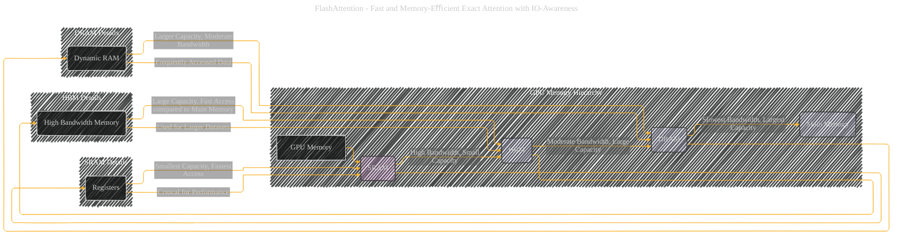

# GPU Memory Hierarchy
> **Disclaimer:**
>
> This document contains my personal notes on the topic,
> compiled from publicly available documentation and various cited sources.
> The materials are intended for educational purposes, personal study, and reference.
> The content is dual-licensed:
> 1. **MIT License:** Applies to all code implementations (Swift, Mermaid, and other programming languages).
> 2. **Creative Commons Attribution 4.0 International License (CC BY 4.0):** Applies to all non-code content, including text, explanations, diagrams, and illustrations.
---

## GPU Memory Hierarchy - A Diagrammatic Guide 

---

### Explanation of the Diagram

This Mermaid diagram illustrates the hierarchical structure of memory within a GPU, as described in the original document.  It emphasizes the crucial distinctions in bandwidth and capacity between the various levels.

* **Levels of Memory:** The diagram clearly shows the different levels of the hierarchy: SRAM, HBM, DRAM, and Main Memory.  Each level is labeled with its name.

* **Bandwidth and Capacity:** The diagram implicitly communicates the key aspect of the memory hierarchy—the trade-off between bandwidth (speed of data access) and capacity (amount of data that can be stored).

* **Color Coding:** Different colors are used to highlight the different levels, making the hierarchy readily apparent.

* **Subgraphs for Detail:**  The `SRAM_Details`, `HBM_Details`, and `DRAM_Details` subgraphs provide additional detail about the characteristics of each memory type, highlighting the role of registers within SRAM.

----

### Improvements and Adaptations

* **Quantitative Details:** To further enhance the diagram, you could include actual bandwidth values (e.g., in TB/s) and capacity values (e.g., in GB) for each level. This would be extremely helpful for visualizing the relative performance gains when an operation is moved from a slow memory level to a faster one.
* **Directionality:** The diagram could be improved by adding arrows between memory levels, indicating the flow of data between them.  This would be especially useful when discussing how data is moved for computations, such as from HBM to SRAM.

This revised diagram provides a more complete and illustrative representation of the GPU memory hierarchy as it relates to the discussed concepts. Remember that the specific values for bandwidth and capacity will depend on the particular GPU architecture being discussed.  Include those figures to make the visualization even more accurate and relevant.

---
**Licenses:**

- **MIT License:**   - Full text in [LICENSE](LICENSE) file.
- **Creative Commons Attribution 4.0 International:**  - Legal details in [LICENSE-CC-BY](LICENSE-CC-BY) and at [Creative Commons official site](http://creativecommons.org/licenses/by/4.0/).

---