# Limitations and Extensions
> **Disclaimer:**
>
> This document contains my personal notes on the topic,
> compiled from publicly available documentation and various cited sources.
> The materials are intended for educational purposes, personal study, and reference.
> The content is dual-licensed:
> 1. **MIT License:** Applies to all code implementations (Swift, Mermaid, and other programming languages).
> 2. **Creative Commons Attribution 4.0 International License (CC BY 4.0):** Applies to all non-code content, including text, explanations, diagrams, and illustrations.
---

## Limitations and Extensions - A Diagrammatic Guide

```mermaid
---
title: "FlashAttention - Fast and Memory-Efficient Exact Attention with IO-Awareness"
config:
  layout: elk
  look: handDrawn
  theme: dark
---
%%%%%%%% Available curve styles include the following keywords:
%% basis, bumpX, bumpY, cardinal, catmullRom, linear, monotoneX, monotoneY, natural, step, stepAfter, stepBefore.
%%{
  init: {
    "flowchart": { "htmlLabels": false, 'curve': 'linear' },
    'fontFamily': 'Fantasy',
    'themeVariables': {
      'primaryColor': '#BB2528',
      'primaryTextColor': '#f529',
      'primaryBorderColor': '#7C0000',
      'lineColor': '#F8B229',
      'secondaryColor': '#006100',
      'tertiaryColor': '#fff'
    }
  }
}%%
graph TD
    subgraph Limitations_and_Extensions["Limitations and Extensions"]
        A[Limitations & Extensions] --> B(CUDA Dependency)
        B -- Limited Portability --> C[Future Research]
        
        A --> D(IO-Aware Deep Learning Modules)
        D -- Generalization to Other Layers --> E[Accelerating Other Deep Learning Operations]
        
        A --> F(Multi-GPU Attention)
        F -- Inter-GPU Communication --> G[Complex IO Analysis]
        
        A --> H(Sparse MLP Layers)
        H -- Sparse but Memory-Bound --> I[IO-Awareness Crucial for Sparse Methods]
        
        A --> J(Kernel Methods)
        J -- Reducing IO Overheads --> K[Potential for Further Speedups]
        
        style A fill:#ccf3,stroke:#333,stroke-width:1px
    end
    
```

---

### Explanation and Context

This Mermaid diagram represents the "Limitations and Extensions" section, using a more streamlined and focused approach than a mind map.  The subgraph `Limitations_and_Extensions` clearly groups the related limitations and extension ideas.

* **CUDA Dependency:**  The diagram correctly identifies the reliance on CUDA for the current implementation of FlashAttention, and how this limits portability across different GPU architectures.

* **IO-Aware Deep Learning Modules:** The extension area emphasizes that the approach of prioritizing IO optimization is likely applicable to other deep learning operations besides attention.  The `E[Accelerating Other Deep Learning Operations]` node signifies this potential generalization.

* **Multi-GPU Attention:** The extension for multi-GPU attention highlights the added complexity in optimizing for memory transfers between multiple GPUs. The `G[Complex IO Analysis]` node indicates the challenging nature of such a generalization.

* **Sparse MLP Layers:** The diagram correctly notes that while sparse MLP layers can offer computational advantages, they can also become memory-bound, so IO optimization is crucial for realizing their full potential.

* **Kernel Methods:**  The diagram points out that FlashAttention's core idea, reducing memory reads/writes for low-rank operations, has potential applications in kernel machine learning, mirroring the low-rank operation in attention.

----

### Further improvements (suggestions for a more detailed diagram)

* **Specific Limitations:** You could add more specific limitations, such as the potential performance drop when SRAM size is limited, or when a particular GPU architecture doesn't support certain features.

* **Detailed Extensions:** To make the "Extensions" part more actionable, you could include a brief description of the kinds of other layers or operations that might be made more memory-efficient with a similar approach. For instance, you might suggest convolutional layers, normalization layers, or specific recurrent units.

* **Future Work:**  Clearly indicate that the authors see the need for further research in these areas, suggesting what specific questions need to be answered to take these ideas forward.

This revised diagram effectively conveys the essence of the limitations and proposed extensions while avoiding overly complex visual elements.  The connections between concepts make the diagram a helpful tool for understanding the overall ideas discussed in the original paper.

---
**Licenses:**

- **MIT License:**   - Full text in [LICENSE](LICENSE) file.
- **Creative Commons Attribution 4.0 International:**  - Legal details in [LICENSE-CC-BY](LICENSE-CC-BY) and at [Creative Commons official site](http://creativecommons.org/licenses/by/4.0/).

---