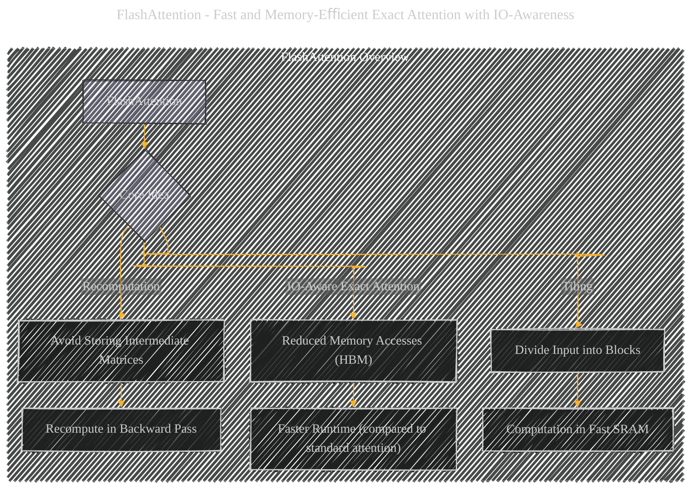
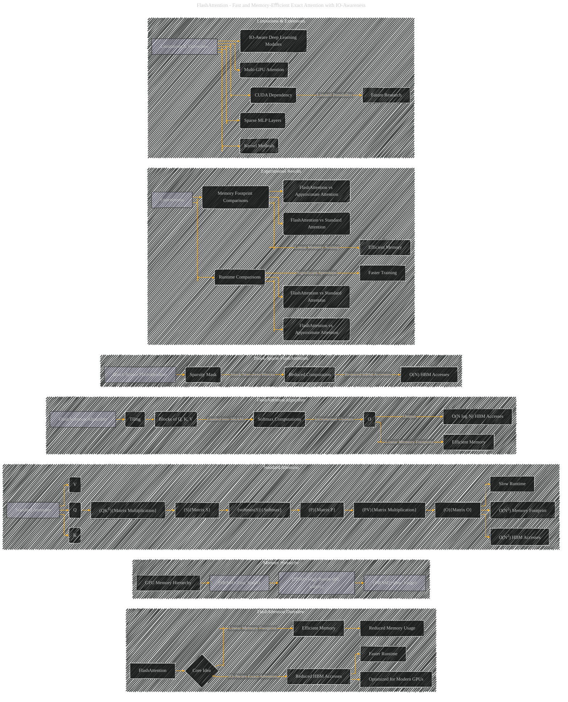

# Flash Attention
> **Disclaimer:**
>
> This document contains my personal notes on the topic,
> compiled from publicly available documentation and various cited sources.
> The materials are intended for educational purposes, personal study, and reference.
> The content is dual-licensed:
> 1. **MIT License:** Applies to all code implementations (Swift, Mermaid, and other programming languages).
> 2. **Creative Commons Attribution 4.0 International License (CC BY 4.0):** Applies to all non-code content, including text, explanations, diagrams, and illustrations.
---

### Flash Attention Overview

----

## Flash Attention

----

### Explanation

This revised Mermaid diagram uses a more concise and focused representation of FlashAttention. It retains the subgraph structure for organizing related concepts but emphasizes the key aspects of FlashAttention's design and its experimental validation.  Color coding is used to distinguish different components.

* **Conciseness:**  The diagram eliminates unnecessary detail, focusing on the core concepts.
* **Emphasis:**  Key phrases like "Reduced HBM Accesses" and "Faster Runtime" are highlighted directly in the diagram.
* **Focus on Scaling:**  The scaling behavior (e.g., O(N log N) vs. O(N2)) is explicitly shown.
* **Clarity:**  Nodes and relationships are labeled clearly, making it easier to understand the different components.

Remember, for practical use, you should replace the placeholder names (e.g., "Blocks of Q, K, V") with more specific labels that accurately reflect the content of the original document.  Add inline equations and other visual cues as needed for clarity and quantitative insight.

---
**Licenses:**

- **MIT License:**   - Full text in [LICENSE](LICENSE) file.
- **Creative Commons Attribution 4.0 International:**  - Legal details in [LICENSE-CC-BY](LICENSE-CC-BY) and at [Creative Commons official site](http://creativecommons.org/licenses/by/4.0/).

---