# Flash Attention: Fast and Memory-Efficient Exact Attention with IO-Awareness
> **Disclaimer:**
>
> This document contains my personal notes on the topic,
> compiled from publicly available documentation and various cited sources.
> The materials are intended for educational purposes, personal study, and reference.
> The content is dual-licensed:
> 1. **MIT License:** Applies to all code implementations (Swift, Mermaid, and other programming languages).
> 2. **Creative Commons Attribution 4.0 International License (CC BY 4.0):** Applies to all non-code content, including text, explanations, diagrams, and illustrations.
---

## Flash Attention - A Paper Overview

```mermaid
---
title: "FlashAttention - Fast and Memory-Efficient Exact Attention with IO-Awareness"
config:
  layout: elk
  look: handDrawn
  theme: dark
---
%%%%%%%% Available curve styles include the following keywords:
%% basis, bumpX, bumpY, cardinal, catmullRom, linear, monotoneX, monotoneY, natural, step, stepAfter, stepBefore.
%%{
  init: {
    "flowchart": { "htmlLabels": false, 'curve': 'cardinal' },
    'fontFamily': 'Fantasy',
    'themeVariables': {
      'primaryColor': '#BB2528',
      'primaryTextColor': '#f529',
      'primaryBorderColor': '#7C0000',
      'lineColor': '#F8B229',
      'secondaryColor': '#006100',
      'tertiaryColor': '#fff'
    }
  }
}%%
graph TD
    subgraph FlashAttention_Overview["FlashAttention Overview"]
        A[FlashAttention] --> B{Core Idea};
        B --> C[IO-Aware Exact Attention];
        B --> D[Tiling];
        B --> E[Recomputation];
        B -- Reduced HBM Accesses --> F[Faster Runtime];
        B -- Linear Memory Footprint --> G[Efficient Memory Usage];
    end
    
    subgraph Memory_Hierarchy["Memory Hierarchy"]
        H[GPU Memory Hierarchy] --> I(SRAM);
        I -- High Bandwidth, Small Size --> J(HBM);
        J -- High Bandwidth, Larger Size --> K(DRAM);
        K -- Slowest, Largest Size --> L(Main Memory);
        
        style I fill:#f9f3,stroke:#333,stroke-width:1px;
        style J fill:#ccf3,stroke:#333,stroke-width:1px;
        style K fill:#ccf3,stroke:#333,stroke-width:1px;
        style L fill:#ccf3,stroke:#333,stroke-width:1px;
    end
    
    subgraph Standard_Attention["Standard Attention"]
        M[Standard Attention] --> N(QK<sup>T</sup>);
        N -- Matrix Multiplication --> O(S);
        O -- Matrix S --> P("softmax(S)")
        P -- Softmax --> Q(P);
        Q -- Matrix P --> R(PV);
        R -- Matrix Multiplication --> S(O);
        S -- Output --> T["O(N<sup>2</sup>) Memory Footprint"]
        S -- O(N<sup>2</sup>) HBM Accesses --> U[Slow Runtime];
        style M fill:#ccf3,stroke:#333,stroke-width:1px;
    end
    
    subgraph FlashAttention_Algorithm["FlashAttention Algorithm"]
        V[FlashAttention Algorithm] --> W(Tiling);
        W --> X(Blocks of Q, K, V);
        X -- Loaded into SRAM --> Y(Softmax Computations);
        Y -- Incremental Updates --> Z(O);
        Z -- Output --> AA["O(N log N) HBM Accesses"]
        Z -- Linear Memory Footprint --> AB[Efficient Memory];
        style V fill:#f9f3,stroke:#333,stroke-width:1px;
    end
    
    subgraph Block_Sparse_FlashAttention["Block-Sparse FlashAttention"]
        AC[Block-Sparse FlashAttention] --> AD(Sparsity Mask)
        AD -- Mask Non-Zero Blocks --> AE(Reduced Computation)
        AE -- Reduced HBM Accesses --> AF["O(N) HBM Accesses"]
        style AC fill:#ccf3,stroke:#333,stroke-width:1px
    end
    
    subgraph Experimental_Results["Experimental Results"]
        AG[Experiments] --> AH(Runtime Comparisons)
        AH --> AI(FlashAttention vs Standard Attention)
        AH --> AJ(FlashAttention vs Approximate Attention)
        AH -- Significant Speedups --> AK[Faster Training]
        
        AG --> AL(Memory Footprint Comparisons)
        AL --> AM(FlashAttention vs Standard Attention)
        AL --> AN(FlashAttention vs Approximate Attention)
        AL -- Linear Memory Scaling --> AO[Efficient Memory]
    end
    
    subgraph Limitations_and_Extensions["Limitations and Extensions"]
        AP[Limitations & Extensions] --> AQ(CUDA Dependency)
        AQ -- Limited Portability --> AR[Future Research]
        AP --> AS(IO-Aware Deep Learning Modules)
        AP --> AT(Multi-GPU Attention)
        AP --> AU(Sparse MLP Layers)
        AP --> AV(Kernel Methods)
        
        style AP fill:#ccf3,stroke:#333,stroke-width:1px
    end
    
```

----

### Explanation of Diagram Structure

This Mermaid diagram uses subgraphs to group related concepts and employs different colors to visually differentiate the key components of FlashAttention. The diagram follows a logical flow, starting with an overview of FlashAttention and progressing through its core techniques, experimental results, limitations, and future directions. Each subgraph is further subdivided into nodes and relationships to show the specific details of each component, making the diagram easier to follow. The style attribute adds color and clarity.

---
**Licenses:**

- **MIT License:**   - Full text in [LICENSE](LICENSE) file.
- **Creative Commons Attribution 4.0 International:**  - Legal details in [LICENSE-CC-BY](LICENSE-CC-BY) and at [Creative Commons official site](http://creativecommons.org/licenses/by/4.0/).

---